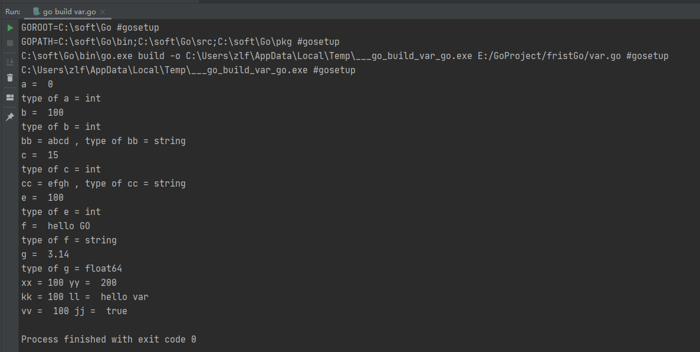
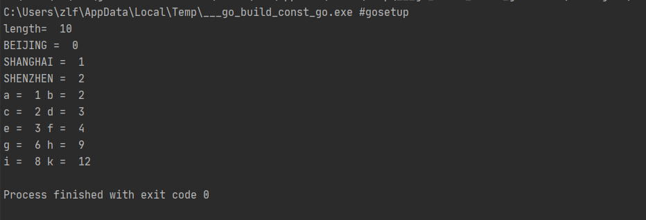
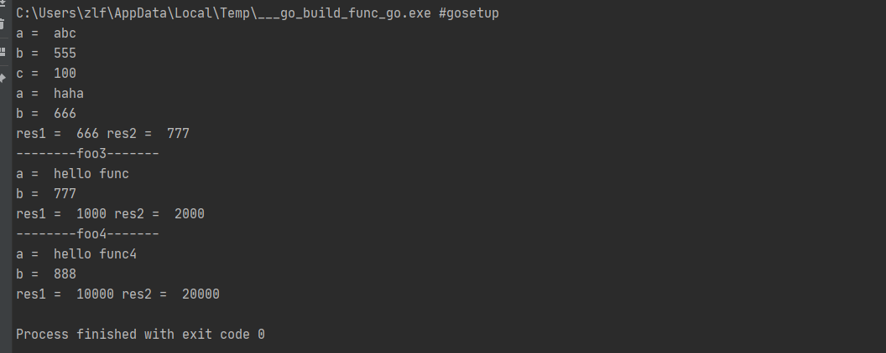
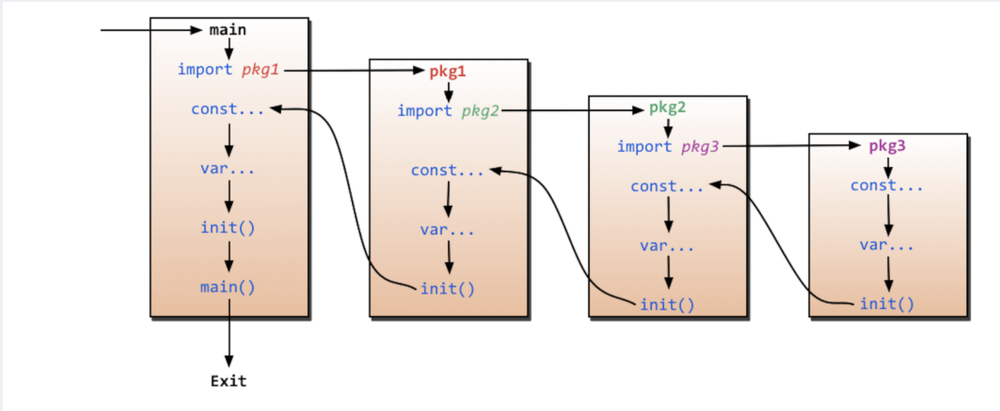
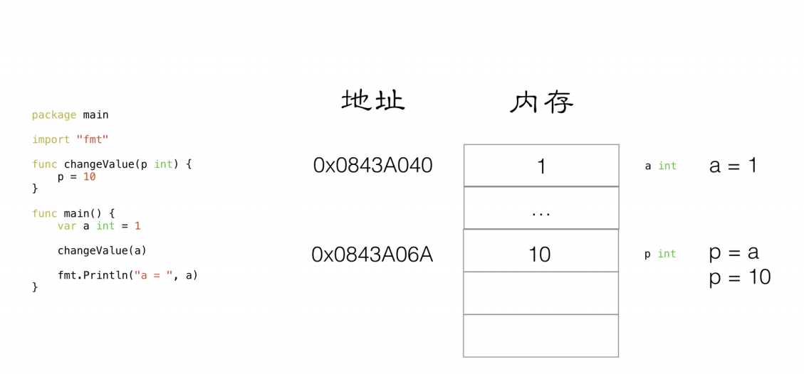
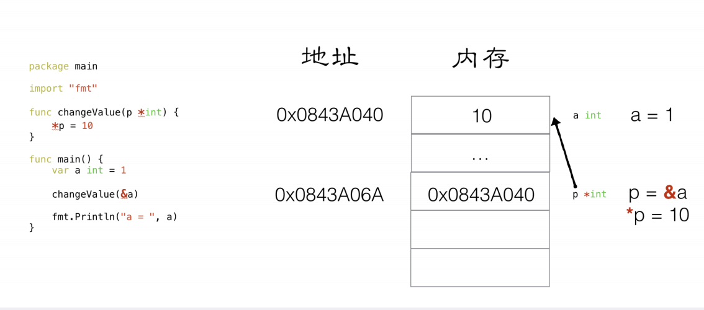
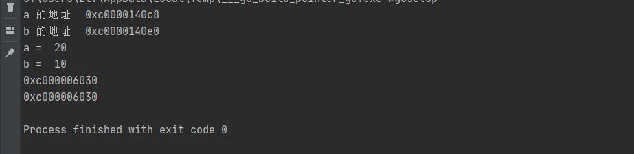
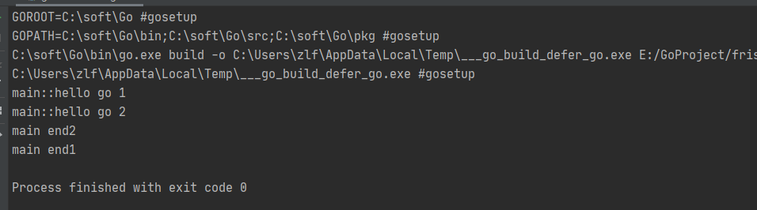
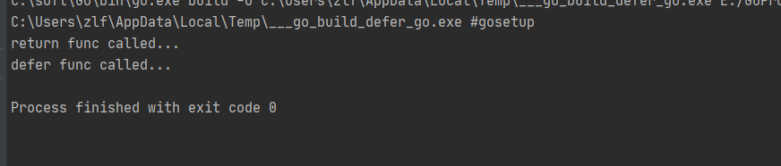

# Go 入门

## hello Go

```go

package main // 程序的包名

// 导入包
import (
	"fmt"
	"time"
)

func main() { // {} 的左边的{ 必须跟在 函数名后边 不能换行 会报错
	// golang 中的表达式 加‘;’或是不加‘;’ 不影响
	fmt.Println("hello world","xiuyuan")
	// 沉睡一秒
	time.Sleep(1 * time.Second)
}
```


## 变量

```go
package main

import (
	"fmt"
)

// 声明全局变量 方法一、方法二、方法三是可以的

var gA int =100
var gB = 200

// 用方法四 声明全局变量
// := 只能用来函数体内声明(不支持全局变量)
// gC:=300

/**
	四种变量声明的方式
 */
func main(){
	// 方法一：声明一个变量 默认的值为 0
	var a int //  var name 类型
	fmt.Println("a = ",a)
	fmt.Printf("type of a = %T\n", a) // %T 表示数据类型

	// 方法二：声明一个变量，初始化值
	var b int = 100
	fmt.Println("b = ",b)
	fmt.Printf("type of b = %T\n", b)
	var bb string = "abcd"
	fmt.Printf("bb = %s , type of bb = %T\n",bb,bb)


	//  方法三：在初始化时，可以省略数据类型，通过值自动匹配当前变量的数据类型
	var c = 15
	fmt.Println("c = ",c)
	fmt.Printf("type of c = %T\n", c)
	var cc = "efgh"
	fmt.Printf("cc = %s , type of cc = %T\n",cc,cc)

	// 方法四：（常用的方法） 省去var关键字，直接自动匹配
	e := 100
	fmt.Println("e = ",e)
	fmt.Printf("type of e = %T\n",e)

	f := "hello GO"
	fmt.Println("f = ",f)
	fmt.Printf("type of f = %T\n",f)

	g := 3.14
	fmt.Println("g = ",g)
	fmt.Printf("type of g = %T\n",g)

	// 声明多个变量
	var xx,yy int = 100,200
	fmt.Println("xx =",xx ,"yy = ",yy )

	var kk,ll = 100,"hello var"
	fmt.Println("kk =",kk ,"ll = ",ll )

	// 多行的多变量声明
	var (
		vv int = 100
		jj bool = true
	)
	fmt.Println("vv = ",vv,"jj = ",jj)
}

```




## 常量const & iota

```go
package main

import "fmt"

// const 定义枚举类型
const(
	// 可以在const() 中添加一个关键字 iota，每行的iota都会累加1，第一行的iota的默认值为0
	BEIJING = iota // iota = 0
	SHANGHAI       // iota = 1
	SHENZHEN       //iota 2
)

const(
	a,b = iota+1,iota+2 //iota=0,a = iota+1,b = iota+2,a = 1,b = 2
	c,d				// iota = 1,c = iota+1,d = iota +2 ,c = 2 ,d = 3
	e,f				// iota = 2,e = iota+1,d = iota +2, e = 3,f = 4

	g,h = iota * 2,iota * 3 //iota = 3,g = iota * 2,h = iota * 3 ,g = 6,h = 9
	i,k              //iota = 4,i = iota * 2,k = iota * 3 , i = 8,k = 12
)

func main(){
	// const 常量关键字 （只读属性）
	const length int = 10
	fmt.Println("length= ",length)
	//length = 100 //常量是不允许修改

	fmt.Println("BEIJING = ",BEIJING)
	fmt.Println("SHANGHAI = ",SHANGHAI)
	fmt.Println("SHENZHEN = ",SHENZHEN)

	fmt.Println("a = ",a,"b = " ,b)
	fmt.Println("c = ",c,"d = " ,d)
	fmt.Println("e = ",e,"f = " ,f)
	fmt.Println("g = ",g,"h = " ,h)
	fmt.Println("i = ",i,"k = " ,k)
}

```



## 函数

```go
package main

import "fmt"

// func 函数名(参数列表（参数名称 参数类型）) 返回类型 {}
func foo1(a string,b int) int{
	fmt.Println("a = ",a)
	fmt.Println("b = ",b)

	c :=100

	return c
}
// 返回多个返回值，匿名的
func foo2(a string,b int) (int,int){
	fmt.Println("a = ",a)
	fmt.Println("b = ",b)

	return 666,777
}
// 返回多个返回值，有形参名称的
func foo3(a string,b int) (r1 int,r2 int){
	fmt.Println("--------foo3-------")
	fmt.Println("a = ",a)
	fmt.Println("b = ",b)
	// r1,r2 属于形参是已经声明的，默认是0
	r1,r2  = 1000,2000

	return r1,r2
}
// 返回多个返回值，有形参名称的 都为同类型时可以省略前面的类型
func foo4(a string,b int) (r1 ,r2 int){
	fmt.Println("--------foo4-------")
	fmt.Println("a = ",a)
	fmt.Println("b = ",b)
	// r1,r2 属于形参是已经声明的，默认是0
	r1,r2  = 10000,20000

	return r1,r2
}

func main(){
	c := foo1("abc",555)

	fmt.Println("c = ",c)

	res1,res2 := foo2("haha",666)
	fmt.Println("res1 = ",res1,"res2 = ",res2)

	res1,res2 = foo3("hello func",777)
	fmt.Println("res1 = ",res1,"res2 = ",res2)

	res1,res2 = foo4("hello func4",888)
	fmt.Println("res1 = ",res1,"res2 = ",res2)
}

```



## init函数与improt导包




`导入本地包方式可以看后续的go module`

### import 导包

`import _ “fmt”` 给fmt包起⼀个别名，匿名， ⽆法使⽤当前包的⽅法，但是 会执⾏当前的包内部的init()⽅法 

`import aa “fmt” `给fmt包起⼀个别名，aa， aa.Println()来直接调⽤。

` import . “fmt” `将当前fmt包中的全部⽅法，导⼊到当前本包的作⽤中，fmt包中 的全部的⽅法可以直接使⽤API来调⽤，不需要fmt.API来调⽤


## 指针


值传递



指针传递




```go
package main

import "fmt"

// 交换两个变量的值
func swap(a ,b*int){
	temp := *a
	*a = *b
	*b = temp

}

func main(){
	a,b:=10,20
	fmt.Println("a 的地址 ",&a)
	fmt.Println("b 的地址 ",&b)
	swap(&a,&b)
	fmt.Println("a = ",a)
	fmt.Println("b = ",b)

	var p *int
	p = &a
	var pp **int //二级指针
	pp = &p
	fmt.Println(&p)
	fmt.Println(pp)
}
```




## defer

> defer 会在函数体结束后执行   
>
> 语法：defer 语句
>
> defer执行顺序 ：defer  是以压栈的方式，出栈执行，所以是先执行 end2 再 end1


```go
package main

import "fmt"

func main() {
	// 写入defer关键字 defer 会在函数体结束的最后触发
	// defer  是以压栈的方式，出栈执行，所以是先执行 end2 再 end1
 	defer fmt.Println("main end1")
 	defer fmt.Println("main end2")


	fmt.Println("main::hello go 1")
	fmt.Println("main::hello go 2")
}

```




### defer 和 return 谁先谁后

```go
package main

import "fmt"


func deferFunc() int  {
	fmt.Println("defer func called...")
	return 0
}

func returnFunc() int{
	fmt.Println("return func called...")
	return 0
}

func returnAnddefer() int {
	defer deferFunc()
	return returnFunc()
}

func main(){
	returnAnddefer()
}
```



> 工具结果可以知道 return会先于defer语句执行


## 切片slice （动态数组）与数组


> 固定数组

```go
package main

import "fmt"

// 数组形参必须指明长度 因为长度不同类型就不同 (值传递)
func printArr(myArr [10]int) {
	for index,value := range myArr{
		fmt.Println("index= ",index,"value= ",value)
	}

}

func main() {
	// 固定长度的数组
	var myArray1 [10] int
	myArray2 := [10] int{1,2,3,4}
	myArray3 := [5] int{1,2,3,4,5}

	/*
	for i:=0;i< len(myArray1);i++ {
		fmt.Println(myArray1[i])
	}

	for index,value:= range myArray2{
		fmt.Println("index = ",index,"value= ",value)
	}
*/
	fmt.Printf("myArray1 types of %T\n",myArray1)
	fmt.Printf("myArray2 types of %T\n",myArray2)
	fmt.Printf("myArray3 types of %T\n",myArray3)

	//printArr(myArray3) 报错 因为myArray3 长度为 5
	printArr(myArray1)
	printArr(myArray2)
}
```


> 动态数组 slice
>
> 格式 myArr := []int{1,2,3,4} or var myArr2[] int

```go
package main

import "fmt"
// 引用传递
func printArray(myArray []int){
	// _ 表示匿名的变量 不使用
	for _,value := range myArray{
		fmt.Println("value= ",value)
	}
	myArray[0] = 100 //修改
}

func main() {
	// slice 动态数组
	myArr := []int{1,2,3,4}
	fmt.Printf("myArray of types = %T\n",myArr)
	printArray(myArr)
	fmt.Println("==== ====")
	for _ ,value := range myArr{
		fmt.Println("value= ",value)
	}
	// 说明切片在函数传递中是引用传递 
}

```

