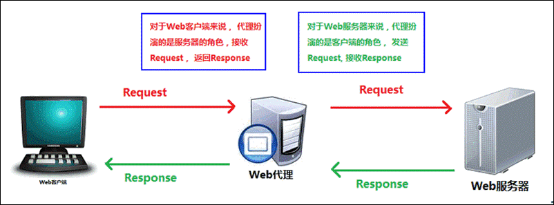
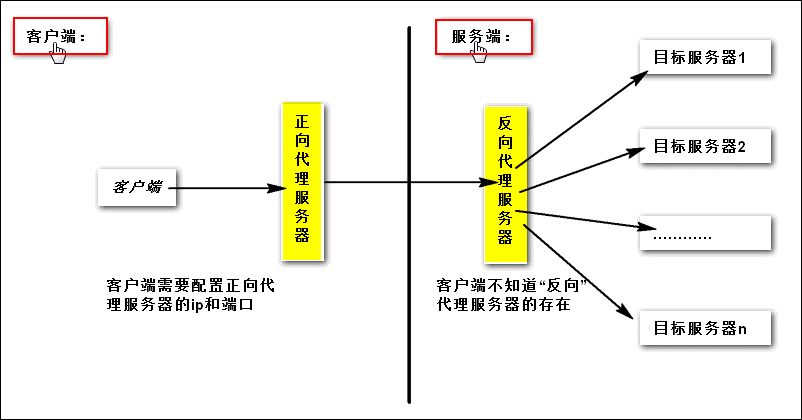
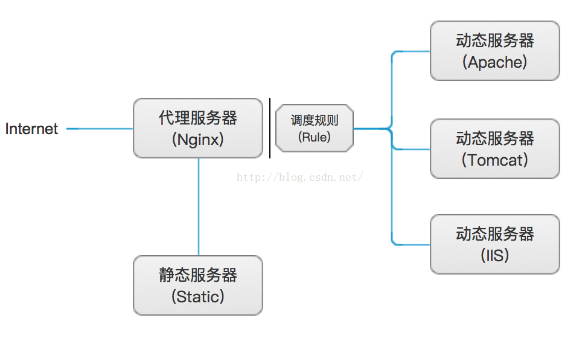
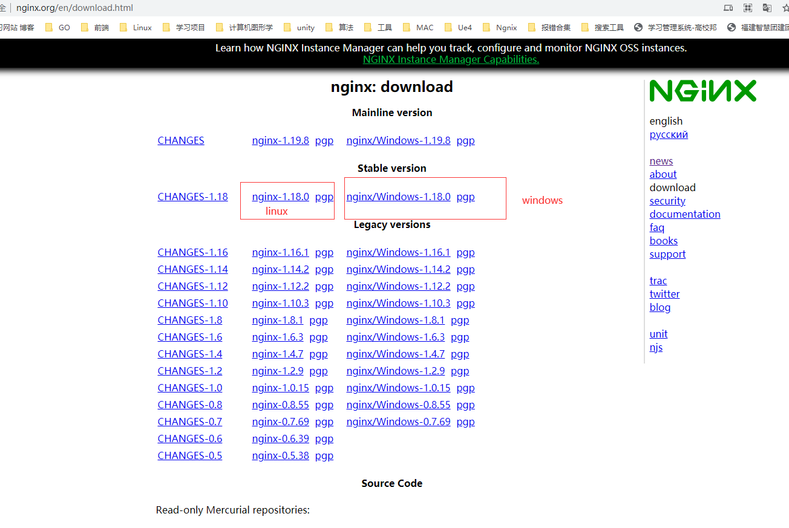
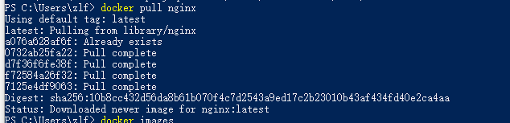
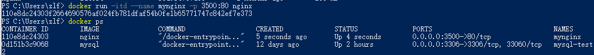
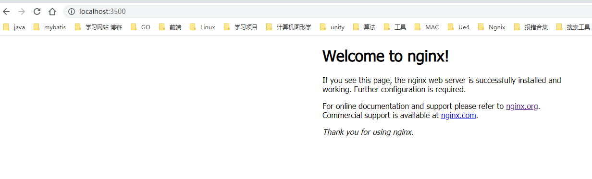
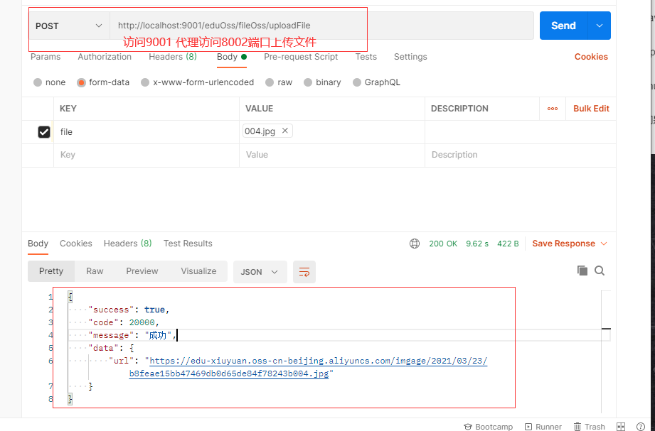

# 什么是Nginx

> Nginx("engine x")是一款是由俄罗斯的程序设计师Igor Sysoev所开发高性能的 Web和 反向代理 服务器，也是一个 IMAP/POP3/SMTP 代理服务器。在高连接并发的情况下，Nginx是Apache服务器不错的替代品。也就是说Nginx本身就可以托管网站，进行Http服务处理，也可以作为反向代理服务器使用。


# Nginx的应用场景


# 正向代理和反向代理

## 正向代理

> 首先，代理服务器一般指局域网内部的机器通过代理服务器发送请求到互联网上的服务器，代理服务器一般作用在客户端。例如：SSR翻墙软件。




## 反向代理

> 反向代理服务器作用在服务器端，它在服务器端接收客户端的请求，然后将请求分发给具体的服务器进行处理，然后再将服务器的相应结果反馈给客户端。Nginx就是一个反向代理服务器软件。反向代理正好与正向代理相反，对于客户端而言代理服务器就像是原始服务器，并且客户端不需要进行任何特别的设置。客户端向反向代理的命名空间（name-space）中的内容发送普通请求，接着反向代理将判断向何处（原始服务器）转交请求，并将获得的内容返回给客户端。




# Nginx 的特点

- 跨平台：可以在大多数Unix like 系统编译运行。而且也有Windows的移植版本。
- 配置异常简单：非常的简单，易上手。
- 非阻塞、高并发连接：数据复制时，磁盘I/O的第一阶段是非阻塞的。官方测试能支持5万并发连接，实际生产中能跑2~3万并发连接数（得益于Nginx采用了最新的epoll事件处理模型（消息队列）。
- Nginx代理和后端Web服务器间无需长连接；
- Nginx接收用户请求是异步的，即先将用户请求全部接收下来，再一次性发送到后端Web服务器，极大减轻后端Web服务器的压力。
- 发送响应报文时，是边接收来自后端Web服务器的数据，边发送给客户端。
- 网络依赖性低，理论上只要能够ping通就可以实施负载均衡，而且可以有效区分内网、外网流量。
- 支持内置服务器检测。Nginx能够根据应用服务器处理页面返回的状态码、超时信息等检测服务器是否出现故障，并及时返回错误的请求重新提交到其它节点上。
- 采用Master/worker多进程工作模式
- 此外还有内存消耗小、成本低廉（比F5硬件负载均衡器廉价太多）、节省带宽、稳定性高等特点。


# 负载均衡的理解

## 轮询

轮询方式是Nginx负载默认的方式，顾名思义，所有请求都按照时间顺序分配到不同的服务上，如果服务Down掉，可以自动剔除，如下配置后轮训10001服务和10002服务。

```bash
upstream  test-server {
       server    localhost:10001;
       server    localhost:10002;
}
```


## 权重

指定每个服务的权重比例，weight和访问比率成正比，通常用于后端服务机器性能不统一，将性能好的分配权重高来发挥服务器最大性能，如下配置后10002服务的访问比率会是10001服务的二倍。

```bash
upstream  test-server {
       server    localhost:10001 weight=1;
       server    localhost:10002 weight=2;
}
```


## iphash

每个请求都根据访问ip的hash结果分配，经过这样的处理，每个访客固定访问一个后端服务，如下配置（ip_hash可以和weight配合使用）。

```bash
upstream  test-server {
       ip_hash; 
       server    localhost:10001 weight=1;
       server    localhost:10002 weight=2;
}
```


## 最少连接

将请求分配到连接数最少的服务上。

```bash
upstream  test-server {
       least_conn;
       server    localhost:10001 weight=1;
       server    localhost:10002 weight=2;
}
```


## fair

按后端服务器的响应时间来分配请求，响应时间短的优先分配。

```bash
upstream  test-server {
       server    localhost:10001 weight=1;
       server    localhost:10002 weight=2;
       fair;  
}
```

# 动静分离

> 原理



说明：

1、代理服务器和静态服务器即为一台服务器上，这里只是为了明显区分动静分离所处服务器的不同；

2、静态服务器中，存放的资源主要是源代码文件、图片、属性、样式以及其它所有非动态的资源文件；

3、调度规则，即为代理服务器，这里是Nginx的服务器调度规则；

4、动态服务器，其种类比较繁多，可以是Apache、Tomcat、IIS以及其它Web服务器，它们一般分别隶属于一台服务器；

## 实现说明

如上图所示，当客户端访问代理服务器时：

首先，加载和显示存放在静态服务器中的静态资源，这里以html为例；

其次，如果上一步没有匹配对应的资源，我们就认为是动态访问请求，那么就直接访问参与负载均衡的服务器列表中的某一台服务器的动态操作；

最后，Nginx作为Web服务器加载静态资源（html、css、js、image），而静态资源如果需要动态获取数据，并填充到页面显示，会自动去往负载服务器获取并返回，在实现了动态分离的同时，也参与了服务器的负载均衡。


# Nginx 安装

## 下载地址

[官方下载地址](http://nginx.org/en/download.html)



## windows 安装Nginx

去上边的下载地址下载windows版安装到本地目录中即可 。

## Linux 安装Nginx

[中文官方文档下载安装教程](https://www.nginx.cn/install)

## docker 安装Nginx

1、从远程仓库拉取镜像 `docker pull nginx`



2、创建容器并启动`docker run -itd --name mynginx -p 3500:80 nginx`



3、访问效果



4、进入docker nginx 容器内部 `docker exec -it mynginx bash`


# Nginx 的常用命令

```bash
cd /usr/local/nginx/sbin/
start ./nginx #启动
./nginx -s stop #停止
./nginx -s quit  #安全退出
./nginx -s reload #重新加载配置文件
ps -aux | grep nginx #查看nginx进程
```


# Nginx实战

## nginx配置文件详解

```bash
  1 # For more information on configuration, see:
  2 #   * Official English Documentation: http://nginx.org/en/docs/
  3 #   * Official Russian Documentation: http://nginx.org/ru/docs/
  4 
  5 user nginx;
  #运行nginx的用户
  6 worker_processes auto;
  #工作进程数量，建议不要修改，保持自动
  7 error_log /var/log/nginx/error.log; 
  #错误日志文件的输出位置和输出级别
  8 pid /run/nginx.pid;
  #pid文件位置
  9 
 10 # Load dynamic modules. See /usr/share/doc/nginx/README.dynamic.
 11 include /usr/share/nginx/modules/*.conf;
 12 
 13 events {
 14     worker_connections 1024;
 		#每个进程的最大连接数，默认1024
 15 }
 16 
 17 http {
 	#HTTP配置
 18     log_format  main  '$remote_addr - $remote_user [$time_local] "$request" '
 19                       '$status $body_bytes_sent "$http_refer er" '
 20                       '"$http_user_agent" "$http_x_forwarded_for"';
 21 #日志的格式
 22     access_log  /var/log/nginx/access.log  main;
 #访问日志文件的位置
 23 
 24     sendfile            on;
 #是否调用sendfile函数来输出文件
 25     tcp_nopush          on;
 26     tcp_nodelay         on;
 #是否启用nodelay算法
 27     keepalive_timeout   65;
 #连接超时时间
 28     types_hash_max_size 2048;
 29 
 30     include             /etc/nginx/mime.types;
 #支持的文件类型
 31     default_type        application/octet-stream;
 #默认文件类型
 32 
 33     # Load modular configuration files from the /etc/nginx/conf.d directory.
 # 从/etc/nginx/conf.d目录加载模块化配置文件
 34     # See http://nginx.org/en/docs/ngx_core_module.html#include
 35     # for more information.
 36     include /etc/nginx/conf.d/*.conf;
 #引入外部配置文件，包含虚拟主机配置
 37 
 #以下为虚拟主机配置
 38     server {
 39         listen       80 default_server;
 #监听端口 80
 40         listen       [::]:80 default_server;
 41         server_name  _;
 #主机域名
 42         root         /usr/share/nginx/html;
# 默认页面路径
 43 
 44         # Load configuration files for the default server block.
 45         include /etc/nginx/default.d/*.conf;
 46 
 47         location / {
 48         }
 49 
 50         error_page 404 /404.html;
 51             location = /40x.html {
 52         }
 53 #404页面
 54         error_page 500 502 503 504 /50x.html;
 #错误的反馈页面
 55             location = /50x.html {
 56         }
 57     }
 58 
 #服务器的htttps设置
 59 # Settings for a TLS enabled server.
 # 启用TLS的服务器的设置
 60 #
 61 #    server {
 62 #        listen       443 ssl http2 default_server;
 63 #        listen       [::]:443 ssl http2 default_server;
  64 #        server_name  _;
 65 #        root         /usr/share/nginx/html;
 66 #
 67 #        ssl_certificate "/etc/pki/nginx/server.crt";
 #ssl证书路径
 68 #        ssl_certificate_key "/etc/pki/nginx/private/server.key";
 #ssl证书key
 69 #        ssl_session_cache shared:SSL:1m;
 70 #        ssl_session_timeout  10m;
 71 #        ssl_ciphers HIGH:!aNULL:!MD5;
 72 #        ssl_prefer_server_ciphers on;
 73 #
 74 #        # Load configuration files for the default server block.
 #加载默认服务器块的配置文件
 75 #        include /etc/nginx/default.d/*.conf;
 76 #
 # 一下全为错误页面配置
 77 #        location / {
 78 #        }
 79 #
 80 #        error_page 404 /404.html;
 81 #            location = /40x.html {
 82 #        }
 83 #
 84 #        error_page 500 502 503 504 /50x.html;
 85 #            location = /50x.html {
 86 #        }
 87 #    }
 88 
 89 }
 90 
```

## 实战

> 我们用两个服务，端口分别为8001和8002 ,通过设置代理9001 在访问8001和8002的服务

### 部分配置

```bash
http {
    include       mime.types;
    default_type  application/octet-stream;

    #log_format  main  '$remote_addr - $remote_user [$time_local] "$request" '
    #                  '$status $body_bytes_sent "$http_referer" '
    #                  '"$http_user_agent" "$http_x_forwarded_for"';

    #access_log  logs/access.log  main;

    sendfile        on;
    #tcp_nopush     on;

    #keepalive_timeout  0;
    keepalive_timeout  65;

     client_max_body_size 10m; # 设置请求实体大小

    #gzip  on;

    server {
        listen       9001; #转发的端口
        server_name  localhost;

        location  /edu/teacher/  {
            proxy_pass http://localhost:8001;
        }

        location /eduService/user/ {
            proxy_pass http://localhost:8001;
        }

        location  /eduOss/fileOss/ {
            proxy_pass http://localhost:8002;
        }
        # ... ...
```

### 8001 端口的部分接口


### 8002 端口的部分接口


由于8002端口有上传文件，我们需要配置文件上传的大小

```yaml
server:
  port: 8002
spring:
  application:
    name: service-oss
  profiles:
    active: dev
  servlet:
    multipart:
      enabled: true #是否启用http上传处理
      max-request-size: 100MB #最大请求文件的大小
      max-file-size: 20MB #设置单个文件最大长度
      file-size-threshold: 20MB #当文件达到多少时进行磁盘写入
## 阿里云 OSS
aliyun:
  oss:
    file:
      endpoint: oss-cn-bxxxx.aliyuncs.com # 地域节点
      keyid: LTAI5txxxxxxtpDC6Rxc4 # AccessKeyId
      keysecret: fZvVxxxxxx3jYXhMUVHOo8 # 密钥
      bucketname: edu-xxxxuan # bucket名字
```

nginx.conf 中也需要在 http{} 中设置 `client_max_body_size 10m;`


### 效果





# 说明

## 参考文章:

[Nginx动静分离实现](https://blog.csdn.net/why_2012_gogo/article/details/51407037)

[Nginx实现负载均衡](https://www.jianshu.com/p/4c250c1cd6cd)

[Nginx简介](https://blog.csdn.net/wang379275614/article/details/47777985)

