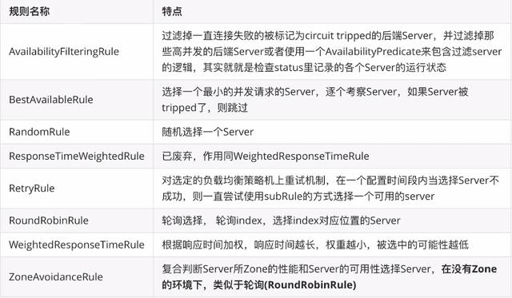

# Nacos

Nacos 致力于帮助您发现、配置和管理微服务。Nacos 提供了一组简单易用的特性集，帮助您快速实现动态服务发现、服务配置、服务元数据及流量管理。

Nacos 帮助您更敏捷和容易地构建、交付和管理微服务平台。 Nacos 是构建以“服务”为中心的现代应用架构 (例如微服务范式、云原生范式) 的服务基础设施。


# Nacos官方文档

[官方文档](https://nacos.io/zh-cn/docs/what-is-nacos.html)


# 安装nacos

[下载地址](https://github.com/alibaba/nacos/releases)

解压后，打开 /bin/startup.cmd 即可启动nacos。


打开 localhost:8848/nacos/index.html 

使用 账号：nacos 密码：nacos 即可登录


# 服务注册

## 依赖

在service-parent层导入 服务注册 的依赖,这样在该模块底下的子模块都可以用到（version在根模块中定义了版本）这里用的是

`<cloud-alibaba.version>2.1.0.RELEASE</cloud-alibaba.version>`

```xml
<!--    服务注册    -->
<dependency>
            <groupId>com.alibaba.cloud</groupId>
            <artifactId>spring-cloud-starter-alibaba-nacos-discovery</artifactId>
</dependency>
```

## 配置

在要使用nacos的service的application.yaml 中配置 服务发现的配置，这样该服务就可以找到 注册中心 的

```yaml
Spring:
  application:
    name: service-edu
  cloud:
    nacos:
      discovery:
        server-addr: localhost:8848 # nacos 服务地址
```


在要注册的服务的启动类上 添加 Spring Cloud 原生注解 @EnableDiscoveryClient 开启服务注册发现功能

```java
@SpringBootApplication
//这样她就会扫描有引入包的为com.zlf.* 的 组件 比如 common下的service-base的配置他的包前缀也是com.zlf 当他引入时就会扫描到
@ComponentScan(basePackages = {"com.zlf"}) //不加这个只能扫描 EduApplication 所在包以及之下的所有配置
@EnableDiscoveryClient // 这样就有了服务注册的能力了 通过 Spring Cloud 原生注解 @EnableDiscoveryClient 开启服务注册发现功能
public class EduApplication {
    public static void main(String[] args) {
        SpringApplication.run(EduApplication.class,args);
    }
}
```


然后启动该服务，即可载nacos网站上看到该服务了


# OpenFeign 服务调用

## 简介

> OpenFeign是一种声明式、模板化的HTTP客户端。在Spring Cloud中使用OpenFeign，可以做到使用HTTP请求访问远程服务，就像调用本地方法一样的，开发者完全感知不到这是在调用远程方法，更感知不到在访问HTTP请求。

依赖

```xml
<!--        服务调用  主要是服务的消费者使用-->
        <dependency>
            <groupId>org.springframework.cloud</groupId>
            <artifactId>spring-cloud-starter-openfeign</artifactId>
        </dependency>
```

## 配置

启动类添加注解 `@EnableFeignClients`(谁用谁添加)

```java
... ...
@EnableFeignClients
public class EduApplication {... ...}
```

## 远程调用

我们需要在消费者中创建一个接口，该接口中定义生产者的Controller方法定义（返回值、参数要一致），并且请求的注解也得一致（请求的路径要全路径）,

并且在接口上要添加 `@FeignClient` 注解并指明调用的生产者服务名称（注册在nacos中的名称）

如下： 这是消费者需要定义的

```java
import com.zlf.commonutils.vo.ResultVo;
import org.springframework.cloud.openfeign.FeignClient;
import org.springframework.web.bind.annotation.GetMapping;

/**
 * Created with IntelliJ IDEA.
 *
 * @Auther: zlf
 * @Date: 2021/03/31/21:13
 * @Description: Oss 提供给edu的远程调用
 */
@FeignClient(name = "service-oss") // nacos 中注册的服务名称
public interface OssFileService {

    @GetMapping("/eduOss/fileOss/test")
    ResultVo test();
}

```


下边的生产者的controller

```java
import com.zlf.commonutils.vo.ResultVo;
import com.zlf.oss.service.OssService;
import io.swagger.annotations.Api;
import io.swagger.annotations.ApiModelProperty;
import io.swagger.annotations.ApiOperation;
import io.swagger.annotations.ApiParam;
import org.springframework.beans.factory.annotation.Autowired;
import org.springframework.web.bind.annotation.*;
import org.springframework.web.multipart.MultipartFile;

import java.io.IOException;

/**
 * Created with IntelliJ IDEA.
 *
 * @Auther: zlf
 * @Date: 2021/03/22/20:16
 * @Description: 阿里云oss  上传文件
 */
@RestController
@RequestMapping("/eduOss/fileOss")
@CrossOrigin
@Api(tags = "oss上传接口")
public class OssController {


    @Autowired
    private OssService ossService;

    /**
    * @Description: 上传头像
    * @Param: [file]
    * @return: com.zlf.commonutils.vo.ResultVo
    * @Author: zlf
    * @Date: 2021/3/22
    */
    @PostMapping("uploadFile")
    @ApiOperation("上传文件")
    public ResultVo uploadOssFile(@ApiParam(name = "file",value = "文件") MultipartFile file) throws IOException {
        //获取上传对象
        String url = null;
        // 在 uploadFileAvatar 中 已经做了异常处理
        url = ossService.uploadFileAvatar(file);
        //  这一步已经在  uploadFileAvatar 完成了
        if(url == null) return ResultVo.error().message("文件上传失败");
        return ResultVo.ok().message("文件上传成功").data("url",url);
    }
	
    // 消费者调用的就是这个接口
    @ApiOperation("测试远程调用接口(提供调用)")
    @GetMapping("test")
    public ResultVo test(){

        return ResultVo.ok().message("测试远程调用");
    }
}

```


消费者调用生产者接口:

```java
import com.baomidou.mybatisplus.extension.plugins.pagination.Page;

import com.zlf.commonutils.vo.ResultVo;
import com.zlf.edu.entity.Teacher;
import com.zlf.edu.entity.vo.TeacherQueryVo;
import com.zlf.edu.fegin.OssFileService;
import com.zlf.edu.service.TeacherService;
import com.zlf.servicebase.exceptionHandler.GlobalException;
import io.swagger.annotations.Api;
import io.swagger.annotations.ApiOperation;
import io.swagger.annotations.ApiParam;
import org.springframework.beans.factory.annotation.Autowired;
import org.springframework.web.bind.annotation.*;


import java.util.List;
import java.util.Map;

/**
 * <p>
 * 讲师 前端控制器
 * </p>
 *
 * @author zlf
 * @since 2021-03-11
 */
@Api(tags = "讲师管理")
@RestController
@RequestMapping("/edu/teacher")
@CrossOrigin
public class TeacherController {


    @Autowired
    private TeacherService teacherService;

    @Autowired
    private OssFileService ossFileService;

   	// ... ...
    
	//  这就是远程调用
    @ApiOperation("远程调用测试")
    @GetMapping("test")
    public ResultVo test(){

        return ossFileService.test();
    }
}
```


其实我们调用的是 http://localhost:8002/eduOss/fileOss/test 服务，但是用OpenFegin之后，url就变成了 http://localhost:8001/edu/teacher/test


# 负载均衡

我们先多开几个服务


```java
import com.baomidou.mybatisplus.extension.plugins.pagination.Page;

import com.zlf.commonutils.vo.ResultVo;
import com.zlf.edu.entity.Teacher;
import com.zlf.edu.entity.vo.TeacherQueryVo;
import com.zlf.edu.fegin.OssFileService;
import com.zlf.edu.service.TeacherService;
import com.zlf.servicebase.exceptionHandler.GlobalException;
import io.swagger.annotations.Api;
import io.swagger.annotations.ApiOperation;
import io.swagger.annotations.ApiParam;
import org.springframework.beans.factory.annotation.Autowired;
import org.springframework.web.bind.annotation.*;


import java.util.List;
import java.util.Map;

/**
 * <p>
 * 讲师 前端控制器
 * </p>
 *
 * @author zlf
 * @since 2021-03-11
 */
@Api(tags = "讲师管理")
@RestController
@RequestMapping("/edu/teacher")
@CrossOrigin
public class TeacherController {


    @Autowired
    private TeacherService teacherService;

    @Autowired
    private OssFileService ossFileService;

   	// ... ...
    
	//  这就是远程调用
    @ApiOperation("远程调用测试")
    @GetMapping("test")
    public ResultVo test(){

        return ossFileService.test();
    }
}
```


```java
import com.baomidou.mybatisplus.extension.plugins.pagination.Page;

import com.zlf.commonutils.vo.ResultVo;
import com.zlf.edu.entity.Teacher;
import com.zlf.edu.entity.vo.TeacherQueryVo;
import com.zlf.edu.fegin.OssFileService;
import com.zlf.edu.service.TeacherService;
import com.zlf.servicebase.exceptionHandler.GlobalException;
import io.swagger.annotations.Api;
import io.swagger.annotations.ApiOperation;
import io.swagger.annotations.ApiParam;
import org.springframework.beans.factory.annotation.Autowired;
import org.springframework.web.bind.annotation.*;


import java.util.List;
import java.util.Map;

/**
 * <p>
 * 讲师 前端控制器
 * </p>
 *
 * @author zlf
 * @since 2021-03-11
 */
@Api(tags = "讲师管理")
@RestController
@RequestMapping("/edu/teacher")
@CrossOrigin
public class TeacherController {


    @Autowired
    private TeacherService teacherService;

    @Autowired
    private OssFileService ossFileService;

   	// ... ...
    
	//  这就是远程调用
    @ApiOperation("远程调用测试")
    @GetMapping("test")
    public ResultVo test(){

        return ossFileService.test();
    }
}
```


然后我们启动服务。


然后在 EduApplication这个消费者中访问 


发现 8003 和 8002 是默认按照`轮询策略`来访问的（第一次访问你 第二次访问我，下一次是你，再下次。。）

我们在nacos中也看到两个集群的两个


## 配置负载均衡策略

### 细粒度配置ribbon 自定义配置负载均衡策略

```yaml
## 在消费者端配置
service-oss: #  调用的提供者名称
  ribbon:
    NFLoadBalancerRuleClassName: com.netflix.loadbalancer.RandomRule # 负载均衡策略规则的名称
```




# OpenFeign 的超时控制

超时时间是1s

在 服务的提供者使用沉睡三秒，测试结果

```java
	
    @ApiOperation("测试远程调用接口(提供调用)")
    @GetMapping("test")
    public ResultVo test(){
        System.out.println("我被调用的--- --");
        log.info("我被调用了{}",port);
        try{
            // 沉睡三秒
            TimeUnit.SECONDS.sleep(3);
        }catch (InterruptedException e){
            e.printStackTrace();
        }

        return ResultVo.ok().message("测试远程调用");
    }
```


在消费者端调用报错了


提供者这边实际上是调用成功了，但是时间过久，导致消费者端主观认为没成功，他默认会重复调用尝试两次


## 配置超时策略(依旧是在消费者端配置)

```yaml
ribbon:
  MaxAutoRetries: 0 # 同一实例最大重试次数，不包括首次调用，默认 0
  MaxAutoRetriesNextServer: 1 # 重试其他实例的最大重试次数，不包括首次所选的server，默认1
```

你会发现一个实例超时只调用了一次 ，但是他重试了其他实例一次。

下面是一次超时请求


## 配置超时时长

```yaml
ribbon:
  MaxAutoRetries: 0 # 同一实例最大重试次数，不包括首次调用，默认 0
  MaxAutoRetriesNextServer: 1 # 重试其他实例的最大重试次数，不包括首次所选的server，默认1
  ConnectTimeout: 5000 # 连接建立的超时时长5s，默认1秒
  ReadTimeout: 5000  # 处理请求的超时时间5s，默认1秒
```


# 服务雪崩

```java
@ApiOperation("远程调用测试")
@GetMapping("test")
public ResultVo test(){
    log.info("test");
    // 该远程调用中  sleep了3秒  模拟长远程调用
    return ossFileService.test();
}

@ApiOperation("测试并发")
@GetMapping("test_concurrent")
public ResultVo testConcurrent(){
    //  测试并发
    log.info("test_concurrent");
    return ResultVo.ok();
}
```

## 使用JMeter测试工具

我们先配置tomcat的并发数

```yaml
server:
  port: 8001
  tomcat:
    max-threads: 10 # tomcat 的最大并发值修改为10，默认为200
```


我们需要用apache的`JMeter`工具测试并发量

[官网下载地址](https://jmeter.apache.org/download_jmeter.cgi)

由于默认是英文的，所以我们需要修改bin/jmeter.properties 配置文件：

```properties
# 修改37行的language为中文 zh-CN
language=zh_CN


# Additional locale(s) to add to the displayed list.
# The current default list is: en, fr, de, no, es, tr, ja, zh_CN, zh_TW, pl, pt_BR
# [see JMeterMenuBar#makeLanguageMenu()]
# The entries are a comma-separated list of language names
#locales.add=zu
```

然后打开bin/jmeter.bat 


### 创建线程组


### 配置线程组


### 添加取样器


### 配置取样器


 ### 配置结果树


请求的结果会显示在上边

### 测试

由于我们给项目配置的tomcat的并发数为10，但是我们配置的线程组的每秒的并发数为20。

启动：


我们开启测试，由于tomcat并发数限制，所有我们20的并发每次只能10个一组:


 这时候我们对其他接口进行访问。会发现本来只需要毫秒级别的访问，现在却非常的漫长。因为并发量高而阻塞等待了。


我们点击JMeter菜单栏的stop即可停止测试。


## 什么是服务雪崩

比如我们有三个服务，一个是订单服务 ，他要去访问商品服务，而商品服务要去访问 库存服务。

当库存服务并发量过大阻塞时，有可能会导致商品服务迟迟无法返回结果，这样导致商品服务并发的堆积，也有可能导致订单服务无法返回结果。导致服务雪崩。

> 由于服务于服务之间的依赖性，故障会传播，不可用会沿着请求调用链向上传递，会对整个微服务系统造成灾难性的严重后果。这就是服务故障的”雪崩效应“。


# 服务容错

## 容错方案

要反正雪崩的扩散，我们就要做好服务的容错：保护自己不被猪队友拖垮的一些措施。

常见的容错方案: 隔离、超时、限流、熔断、降级

### 隔离

将系统按照一定的原则划分为若干个服务模块，各个模块之间相对独立，无强依赖。当有故障发生时，能将问题和影响隔离在某个模块内部，而不是扩散风险，不波及其他模块，不影响整体的系统服务，常见的隔离方式有：**线程池隔离和信号量隔离**。


### 超时

上游服务调用下游服务时，设置一个最大响应时间，如果超过这个时间，下游服务未作出响应，就断开请求，释放掉线程。


### 限流

限制系统的输入和输出流量以达到保护系统的目的。为了保证系统的稳定运行，一旦达到的需要限制的阈值，就采取响应措施以完成限制流量的目的。


### 熔断

当下游服务因访问压力过大而响应变慢或失败，上游服务为了保护系统整体的可用性，可以暂时切断对下游服务的调用。这种牺牲局部，保全整体的措施就叫做熔断。


### 降级

降级就是为服务提供一个托底方案，一旦服务无法正常调用，就使用拖底方案。


## 容错组件

### 1、Hystrix

Hystrix是Netflix开源的一个延迟和容错组件，用于隔离访问远程系统、服务或者第三方库，防止级联失败，从而提升系统的可用性与容错性。（停更）

### 2、Resilience4J

**Resilience4j\*是一款轻量级，易于使用的容错库，其灵感来自于***Netflix Hystrix\***，但是专为***Java\*** **8**和函数式编程而设计。轻量级，因为库只使用了***Vavr\***，它没有任何其他外部依赖下。相比之下，***Netflix Hystrix\***对***Archaius\***具有编译依赖性，***Archaius\***具有更多的外部库依赖性，例如***Guava\***和***Apache Commons Configuration\***。

要使用***Resilience4j\***，不需要引入所有依赖，只需要选择你需要的。

### 3、Sentinel

Sentinel 是阿里巴巴开源的一款断路器实现，在阿里内部已经被大规模采用，非常稳定。

[官方文档](https://sentinelguard.io/zh-cn/docs/introduction.html)

#### 什么是Sentinel

Sentinel（分布式系统的流量防卫兵）是阿里开源的一套用于服务容错的综合性解决方案。它以流量为切入点，从流量控制，熔断降级，系统负载保护等多个维度来保护服务的稳定性。

#### Sentinel的特征

- 丰富的应用场景：Sentinel 承接了阿里巴巴近十年的双十一大促销的核心场景，例如秒杀、消息削峰填谷、集群流量控制、实时熔断下游不可用应用等。
- 完备的实时监控：Sentinel 提供了实时的监控功能。通过控制台可以看到接入应用的单台机器秒级数据，甚至500台以下规模的集群的汇总运行情况。
- 广泛的开源生态：Sentinel 提供开箱即用的与其他开源框架/库的整合模块，例如与SpringCloud、Dubbo、gRPC的整合。只需要引入相应的依赖并进行简单的配置即可快速地接入Sentinel。
- 完善的 扩展点：Sentinel 提供简单易用、完善的扩展接口。你可以通过实现扩展接口来快速地定制逻辑。例如定制规则管理、适配动态数据源等。


#### Sentinel的组成

核心库（Java客户端）：不依赖任何框架/库，能够运行于所有Java运行时环境，同时对Dubbo/Spring Cloud  等框架也有较好的支持。

控制台（Dashboard）：基于SpringBoot 开发，打包后直接可以运行，不需要额外的Tomcat 等应用容器。

##### Sentinel 控制台


启动Dashboard,该jar包可以从这里[ 下载](https://github.com/alibaba/Sentinel/releases)

```bash
java -jar C:\soft\Sentinel\sentinel-dashboard-1.8.1.jar
```


账号密码都是sentinel，

用户可以通过如下参数进行配置：

- `-Dsentinel.dashboard.auth.username=sentinel` 用于指定控制台的登录用户名为 `sentinel`；
- `-Dsentinel.dashboard.auth.password=123456` 用于指定控制台的登录密码为 `123456`；如果省略这两个参数，默认用户和密码均为 `sentinel`；
- `-Dserver.servlet.session.timeout=7200` 用于指定 Spring Boot 服务端 session 的过期时间，如 `7200` 表示 7200 秒；`60m` 表示 60 分钟，默认为 30 分钟；

同样也可以直接在 Spring properties 文件中进行配置。

 

##### 微服务sentinel依赖引入

```xml
<!-- 服务容错       -->
<dependency>
    <groupId>com.alibaba.cloud</groupId>
    <artifactId>spring-cloud-starter-alibaba-sentinel</artifactId>
</dependency>
```

##### spring配置

```yaml
Spring:
  cloud:
    sentinel:
      transport:
        port: 8081 # 与控制台交流的端口，随意指定一个未被使用的端口即可
        dashboard: localhost:8080 # 指定sentinel控制台服务的端口
```

这样我们访问服务就可以在控制台看到对应的监控


**QPS** 为每秒的访问量

##### 控制台运行原理

Sentinel 的控制台是一个SpringBoot 编写的程序。我们需要将我们的微服务程序注册到控制台，即在微服务中指定控制台的url地址。

并且还要开启一个跟控制台传递数据的端口（未被占用），控制台也可以通过此端口调用微服务中的监控程序获取微服务的各种信息。


##### Sentinel的功能介绍