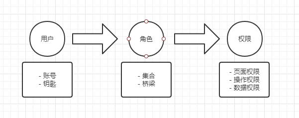
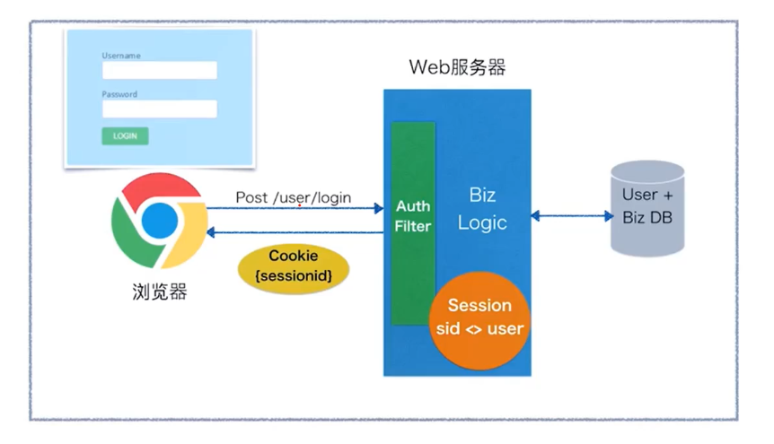
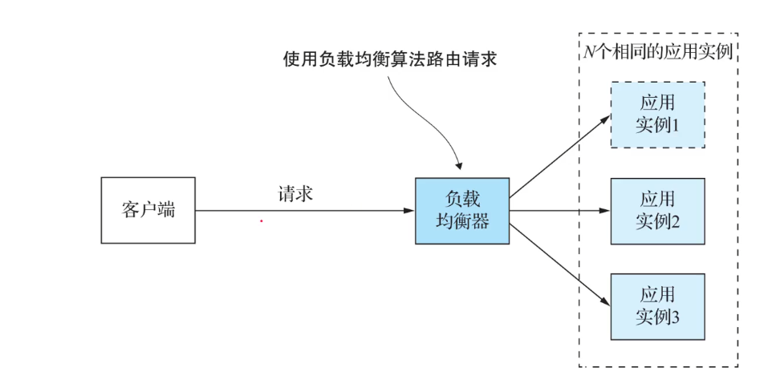
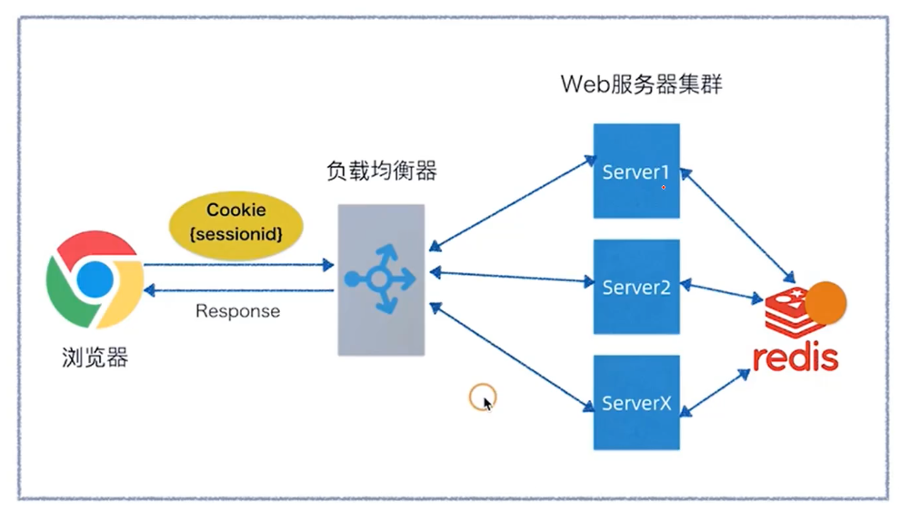
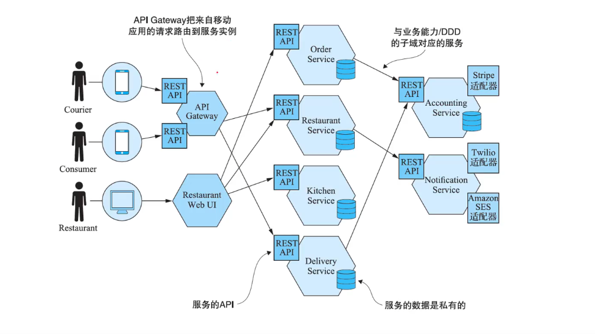
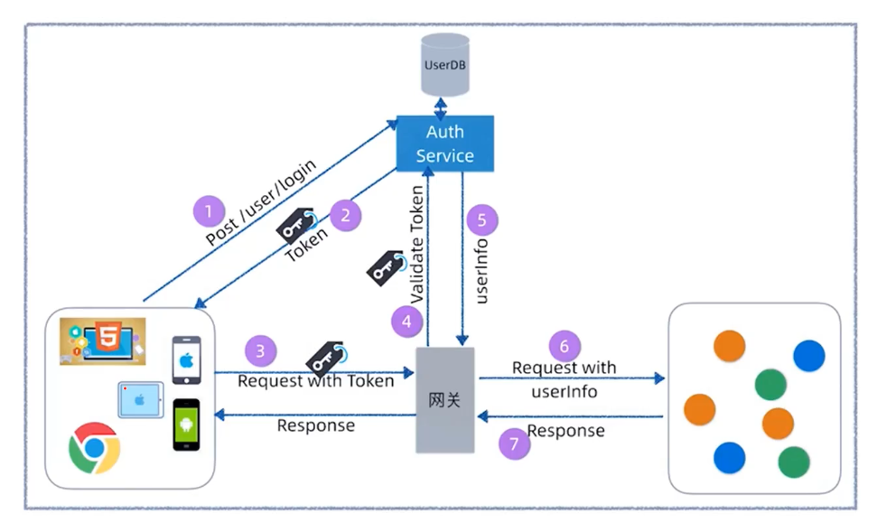

# 权限管理

> 认证（Authentication）：确认用户可以访问当前系统

> 授权（Authorization）：确认用户在当前系统下所拥有的功能权限。

权限管理主要管理以下三方面的内容

- 哪些页面要设置权限
- 哪些操作要设置权限
- 哪些数据要设置权限

权限管理最终是为了风控，即哪个部门哪个用户具有哪个权限。

## RBAC模型

RBAC （Role - Based - Access - Control）

## 架构的演进

> 单体分层式架构

 但是当用户量提升后，该架构就不行了。我们需要**提高应用程序的吞吐量和可用性**。

使用以下的架构可以解决该问题。

但是该架构有session不共享的问题。解决方法可以用session复制，但是很消耗性能。比如我们在实例1中登录，session需要传递给实例2，实例3...，实例n。

所以该方案不是很好。

单体集中式负载均衡管理

这种方式将session统一存在redis中，当然这种架构还是有瓶颈的。

> 微服务架构

微服务的权限认证架构

这种架构每次都要去 AuthService认证服务认证，比较笨重

可以采用 JWT的方式。

