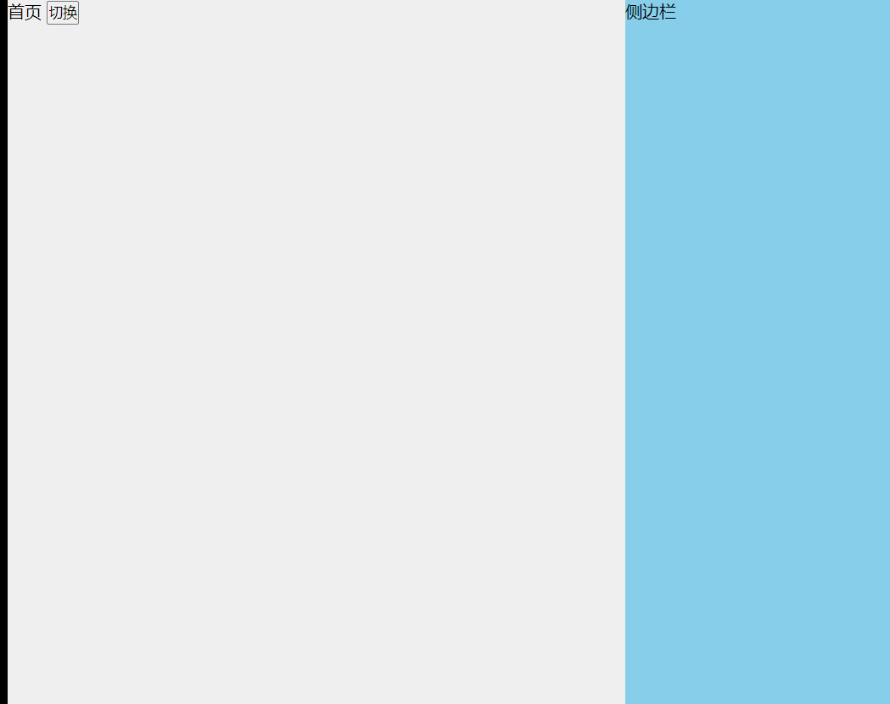

## v-if

相当于 if语句 ，当` v-if`中的变量值为 true，显示该文本，否则不显示

```html
<div id="app">
        用户名 {{name}}
        <p v-if="isVIP">VIP</p>
    </div>
    <script>
        let app = new Vue({
            el: "#app",
            data: {
                name: "xiuyuandashen",
                isVIP: true
            }
        })
    </script>
```

- **预期**：`any`

- **用法**：

  根据表达式的值的 [truthiness](https://developer.mozilla.org/zh-CN/docs/Glossary/Truthy) 来有条件地渲染元素。在切换时元素及它的数据绑定 / 组件被销毁并重建。如果元素是 `<template>`，将提出它的内容作为条件块。

  当条件变化时该指令触发过渡效果。

  当和 `v-if` 一起使用时，`v-for` 的优先级比 `v-if` 更高。详见[列表渲染教程](https://cn.vuejs.org/v2/guide/list.html#v-for-with-v-if)

- **参考**：[条件渲染 - v-if](https://cn.vuejs.org/v2/guide/conditional.html)

## v-else-if

- **类型**：`any`

- **限制**：前一兄弟元素必须有 `v-if` 或 `v-else-if`。

- **用法**：

  表示 `v-if` 的“else if 块”。可以链式调用。

  ```html
  <div v-if="type === 'A'">
    A
  </div>
  <div v-else-if="type === 'B'">
    B
  </div>
  <div v-else-if="type === 'C'">
    C
  </div>
  <div v-else>
    Not A/B/C
  </div>
  ```

- **参考**：[条件渲染 - v-else-if](https://cn.vuejs.org/v2/guide/conditional.html#v-else-if)

## v-else

- **不需要表达式**

- **限制**：前一兄弟元素必须有 `v-if` 或 `v-else-if`。

- **用法**：

  为 `v-if` 或者 `v-else-if` 添加“else 块”。

  ```html
  <div v-if="Math.random() > 0.5">
    Now you see me
  </div>
  <div v-else>
    Now you don't
  </div>
  ```

- **参考**：[条件渲染 - v-else](https://cn.vuejs.org/v2/guide/conditional.html#v-else)

## v-for

- **预期**：`Array | Object | number | string | Iterable (2.6 新增)`

- **用法**：

  基于源数据多次渲染元素或模板块。此指令之值，必须使用特定语法 `alias in expression`，为当前遍历的元素提供别名：

  ```html
  <div v-for="item in items">
    {{ item.text }}
  </div>
  ```

  另外也可以为数组索引指定别名 (或者用于对象的键)：

  ```html
  <div v-for="(item, index) in items"></div>
  <div v-for="(val, key) in object"></div>
  <div v-for="(val, name, index) in object"></div>
  ```

  `v-for` 的默认行为会尝试原地修改元素而不是移动它们。要强制其重新排序元素，你需要用特殊 attribute `key` 来提供一个排序提示：

  ```
  <div v-for="item in items" :key="item.id">
    {{ item.text }}
  </div>
  ```

  从 2.6 起，`v-for` 也可以在实现了[可迭代协议](https://developer.mozilla.org/zh-CN/docs/Web/JavaScript/Reference/Iteration_protocols#可迭代协议)的值上使用，包括原生的 `Map` 和 `Set`。不过应该注意的是 Vue 2.x 目前并不支持可响应的 `Map` 和 `Set` 值，所以无法自动探测变更。

  当和 `v-if` 一起使用时，`v-for` 的优先级比 `v-if` 更高。详见[列表渲染教程](https://cn.vuejs.org/v2/guide/list.html#v-for-with-v-if)

  `v-for` 的详细用法可以通过以下链接查看教程详细说明。

- **参考**：

  - [列表渲染](https://cn.vuejs.org/v2/guide/list.html)
  
  - [key](https://cn.vuejs.org/v2/guide/list.html#key)
  
    

## v-show

不同的是带有 `v-show` 的元素始终会被渲染并保留在 DOM 中。`v-show` 只是简单地切换元素的 CSS property `display`。

例如 如果 v-show = ”false“ 相当于 style 设置了 display = ”none“


## v-if 与 v-show 的区别

v-if：不显示时，第一次就直接不渲染，如果内容已经显示将其改为不显示，将内容直接去除。

v-show：而v-show值为false话仅仅是style中的display = ”none “。但会渲染在DOM上。反复切换内容，选择v-show。如果只是渲染一次的内容，使用v-if。

## v-bind  动态 绑定属性

- **缩写**：`:`

- **预期**：`any (with argument) | Object (without argument)`

- **参数**：`attrOrProp (optional)`

- **修饰符**：

  - `.prop` - 作为一个 DOM property 绑定而不是作为 attribute 绑定。([差别在哪里？](https://stackoverflow.com/questions/6003819/properties-and-attributes-in-html#answer-6004028))
  - `.camel` - (2.1.0+) 将 kebab-case attribute 名转换为 camelCase。(从 2.1.0 开始支持)
  - `.sync` (2.3.0+) 语法糖，会扩展成一个更新父组件绑定值的 `v-on` 侦听器。

- **用法**：

  动态地绑定一个或多个 attribute，或一个组件 prop 到表达式。

  在绑定 `class` 或 `style` attribute 时，支持其它类型的值，如数组或对象。可以通过下面的教程链接查看详情。

  在绑定 prop 时，prop 必须在子组件中声明。可以用修饰符指定不同的绑定类型。

  没有参数时，可以绑定到一个包含键值对的对象。注意此时 `class` 和 `style` 绑定不支持数组和对象。

- **示例**：

  ```html
  <!-- 绑定一个 attribute -->
  
  
  <!-- 动态 attribute 名 (2.6.0+) -->
  <button v-bind:[key]="value"></button>
  
  <!-- 缩写 -->
  
  
  <!-- 动态 attribute 名缩写 (2.6.0+) -->
  <button :[key]="value"></button>
  
  <!-- 内联字符串拼接 -->
  
  
  <!-- class 绑定 -->
  <div :class="{ red: isRed }"></div>
  <div :class="[classA, classB]"></div>
  <div :class="[classA, { classB: isB, classC: isC }]">
  
  <!-- style 绑定 -->
  <div :style="{ fontSize: size + 'px' }"></div>
  <div :style="[styleObjectA, styleObjectB]"></div>
  
  <!-- 绑定一个全是 attribute 的对象 -->
  <div v-bind="{ id: someProp, 'other-attr': otherProp }"></div>
  
  <!-- 通过 prop 修饰符绑定 DOM attribute -->
  <div v-bind:text-content.prop="text"></div>
  
  <!-- prop 绑定。“prop”必须在 my-component 中声明。-->
  <my-component :prop="someThing"></my-component>
  
  <!-- 通过 $props 将父组件的 props 一起传给子组件 -->
  <child-component v-bind="$props"></child-component>
  
  <!-- XLink -->
  <svg><a :xlink:special="foo"></a></svg>
  ```

  `.camel` 修饰符允许在使用 DOM 模板时将 `v-bind` property 名称驼峰化，例如 SVG 的 `viewBox` property：

  ```
  <svg :view-box.camel="viewBox"></svg>
  ```

  在使用字符串模板或通过 `vue-loader`/`vueify` 编译时，无需使用 `.camel`。

- **参考**：

  - [Class 与 Style 绑定](https://cn.vuejs.org/v2/guide/class-and-style.html)
  - [组件 - Props](https://cn.vuejs.org/v2/guide/components.html#通过-Prop-向子组件传递数据)
  - [组件 - `.sync` 修饰符](https://cn.vuejs.org/v2/guide/components-custom-events.html#sync-修饰符)

## v-on

- **缩写**：`@`

- **预期**：`Function | Inline Statement | Object`

- **参数**：`event`

- **修饰符**：

  - `.stop` - 调用 `event.stopPropagation()`。
  - `.prevent` - 调用 `event.preventDefault()`。
  - `.capture` - 添加事件侦听器时使用 capture 模式。
  - `.self` - 只当事件是从侦听器绑定的元素本身触发时才触发回调。
  - `.{keyCode | keyAlias}` - 只当事件是从特定键触发时才触发回调。
  - `.native` - 监听组件根元素的原生事件。
  - `.once` - 只触发一次回调。
  - `.left` - (2.2.0) 只当点击鼠标左键时触发。
  - `.right` - (2.2.0) 只当点击鼠标右键时触发。
  - `.middle` - (2.2.0) 只当点击鼠标中键时触发。
  - `.passive` - (2.3.0) 以 `{ passive: true }` 模式添加侦听器

- **用法**：

  绑定事件监听器。事件类型由参数指定。表达式可以是一个方法的名字或一个内联语句，如果没有修饰符也可以省略。

  用在普通元素上时，只能监听[**原生 DOM 事件**](https://developer.mozilla.org/zh-CN/docs/Web/Events)。用在自定义元素组件上时，也可以监听子组件触发的**自定义事件**。

  在监听原生 DOM 事件时，方法以事件为唯一的参数。如果使用内联语句，语句可以访问一个 `$event` property：`v-on:click="handle('ok', $event)"`。

  从 `2.4.0` 开始，`v-on` 同样支持不带参数绑定一个事件/监听器键值对的对象。注意当使用对象语法时，是不支持任何修饰器的。

- **示例**：

  ```html
  <!-- 方法处理器 -->
  <button v-on:click="doThis"></button>
  
  <!-- 动态事件 (2.6.0+) -->
  <button v-on:[event]="doThis"></button>
  
  <!-- 内联语句 -->
  <button v-on:click="doThat('hello', $event)"></button>
  
  <!-- 缩写 -->
  <button @click="doThis"></button>
  
  <!-- 动态事件缩写 (2.6.0+) -->
  <button @[event]="doThis"></button>
  
  <!-- 停止冒泡 -->
  <button @click.stop="doThis"></button>
  
  <!-- 阻止默认行为 -->
  <button @click.prevent="doThis"></button>
  
  <!-- 阻止默认行为，没有表达式 -->
  <form @submit.prevent></form>
  
  <!--  串联修饰符 -->
  <button @click.stop.prevent="doThis"></button>
  
  <!-- 键修饰符，键别名 -->
  <input @keyup.enter="onEnter">
  
  <!-- 键修饰符，键代码 -->
  <input @keyup.13="onEnter">
  
  <!-- 点击回调只会触发一次 -->
  <button v-on:click.once="doThis"></button>
  
  <!-- 对象语法 (2.4.0+) -->
  <button v-on="{ mousedown: doThis, mouseup: doThat }"></button>
  ```

  在子组件上监听自定义事件 (当子组件触发“my-event”时将调用事件处理器)：

  ```html
  <my-component @my-event="handleThis"></my-component>
  
  <!-- 内联语句 -->
  <my-component @my-event="handleThis(123, $event)"></my-component>
  
  <!-- 组件中的原生事件 -->
  <my-component @click.native="onClick"></my-component>
  ```

- **参考**：

  - [事件处理器](https://cn.vuejs.org/v2/guide/events.html)
  - [组件 - 自定义事件](https://cn.vuejs.org/v2/guide/components.html#监听子组件事件)

## v-once

v-once  就是被v-once修饰的{{}}不能改变

## v-html

**v-html 可以插入html语句，{{html}} 只是一个普通的文本 v-html=”html“ 则会将 变量html的内容变为html语句**

## v-model 表单输入绑定

- **预期**：随表单控件类型不同而不同。

- **限制**：

  - `<input>`
  - `<select>`
  - `<textarea>`
  - components

- **修饰符**：

  - [`.lazy`](https://cn.vuejs.org/v2/guide/forms.html#lazy) - 取代 `input` 监听 `change` 事件
  - [`.number`](https://cn.vuejs.org/v2/guide/forms.html#number) - 输入字符串转为有效的数字
  - [`.trim`](https://cn.vuejs.org/v2/guide/forms.html#trim) - 输入首尾空格过滤

- **用法**：

  在表单控件或者组件上创建`双向绑定`。细节请看下面的教程链接。

  `v-model` 会忽略所有表单元素的 `value`、`checked`、`selected` attribute 的初始值而总是将 Vue 实例的数据作为数据来源。你应该通过 JavaScript 在组件的 `data` 选项中声明初始值。

- **参考**：

  - [表单控件绑定](https://cn.vuejs.org/v2/guide/forms.html)
  - [组件 - 在输入组件上使用自定义事件](https://cn.vuejs.org/v2/guide/components-custom-events.html#将原生事件绑定到组件)

```html
<div id="app">
    输入的文本：<input type="text" v-model="message"> {{message}}<br>
    <textarea name="" id="" cols="30" rows="10" v-model="message2"></textarea>
    {{message2}}
</div>
<script>
    let vue = new Vue({
        el: "#app",
        data: {
            message: "",
            message2: ""
        }
    })
</script>
```

## 条件渲染

**条件渲染使用v-if 或者 v-show**

```html
<body>
    <div id="app">
        <div v-show="isID==1">首页</div>
        <div v-show="isID==2">新闻</div>
        <div v-show="isID==3">其他</div>
        <button @click="toyemian" data-id="1">首页</button>
        <button @click="toyemian" data-id="2">新闻</button>
        <button @click="toyemian" data-id="3">其他</button>
    </div>
    <script>
        let app = new Vue({
            el: "#app",
            data: {
                isID: 1
            },
            methods: {
                toyemian: function(e) {
                    console.log(e);
                    id = e.target.dataset.id;
                    this.isID = id;
                }
            }

        })
    </script>
</body>
```


## 列表渲染

使用v-for

```html
<body>
    <div id="app">
        <ul>
            <li v-for="item in stduents">
                <h3>姓名：{{item.name}}</h3>
                <p>年龄：{{item.age}} --- 学校：{{item.school}}</p>
            </li>
        </ul>
    </div>
</body>
<script>
    var app = new Vue({
        el: "#app",
        data: {
            stduents: [{
                name: "郭靖",
                age: 18,
                school: "北大"
            }, {
                name: "黄蓉",
                age: 17,
                school: "清华"
            }, {
                name: "萧峰",
                age: 20,
                school: "厦大"
            }]
        }
    })
</script>
```

## 计算属性

[computed对象](https://cn.vuejs.org/v2/guide/computed.html)

你可能已经注意到我们可以通过在表达式中调用方法来达到同样的效果：

```html
<p>Reversed message: "{{ reversedMessage() }}"</p>
// 在组件中
methods: {
  reversedMessage: function () {
    return this.message.split('').reverse().join('')
  }
}
```

我们可以将同一函数定义为一个方法而不是一个计算属性。两种方式的最终结果确实是完全相同的。然而，不同的是**计算属性是基于它们的响应式依赖进行缓存的**。只在相关响应式依赖发生改变时它们才会重新求值。这就意味着只要 `message` 还没有发生改变，多次访问 `reversedMessage` 计算属性会立即返回之前的计算结果，而不必再次执行函数。

这也同样意味着下面的计算属性将不再更新，因为 `Date.now()` 不是响应式依赖：

```html
computed: {
  now: function () {
    return Date.now()
  }
}
```

相比之下，每当触发重新渲染时，调用方法将**总会**再次执行函数。

我们为什么需要缓存？假设我们有一个性能开销比较大的计算属性 **A**，它需要遍历一个巨大的数组并做大量的计算。然后我们可能有其他的计算属性依赖于 **A**。如果没有缓存，我们将不可避免的多次执行 **A** 的 getter！如果你不希望有缓存，请用方法来替代。

```html
<body>
    <div id="app">
        <!--不同方式-->
        <h2>{{firstName+lastName}}</h2>
        <h2>{{fullName}}</h2>
    </div>
</body>
<script>
    var vm = new Vue({
        el: "#app",
        data: {
            firstName: "张",
            lastName: "三"
        },
        //computed 计算属性，里面的函数返回值直接可以作用至{{}}中，{{function}}相当于 {{}}了function函数的返回值
        //computed 计算属性 会缓存，除非里面的值改变了，这个比单纯的用{{}} 来计算效率高
        computed: {
            fullName: function() {
                return this.firstName + this.lastName;
            }
        }
    })
</script>
```

## 侦听器

[`watch`对象]([https://cn.vuejs.org/v2/guide/computed.html#%E4%BE%A6%E5%90%AC%E5%99%A8](https://cn.vuejs.org/v2/guide/computed.html#侦听器))

```html
<body>
    <div id="app">
        {{msg}}
        <ul>
            <li v-for="item in arr">{{item}}</li>
        </ul>
    </div>
</body>
<script>
    var vm = new Vue({
        el: "#app",
        data: {
            msg: "hello world",
            arr: ["小明", "小红", "小白"]
        },
        watch: {
            msg: function(val) {
                console.log("监听 msg -----的变化")

                //输出为改变后的值
                console.log(val)
            },
            arr: function(val) {
                console.log("监听 arr -----的变化")
                console.log(val)
            }
        }
    })
</script>
```

watch会监听对象或者属性的改变，如果改变了就触发函数。

##  class和style绑定

[class和style绑定](https://cn.vuejs.org/v2/guide/class-and-style.html)

侧边栏效果使用class

```html
<!DOCTYPE html>
<html lang="zh-CN">

<head>
    <meta charset="UTF-8">
    <meta name="viewport" content="width=device-width, initial-scale=1.0, maximum-scale=1.0, user-scalable=0,minimal-ui:ios">
    <meta http-equiv="X-UA-Compatible" content="ie=edge">
    <title>Document</title>
    <link rel="stylesheet" href="">
    <script src="./Vue/vue.js"></script>
    <style>
        * {
            margin: 0;
            padding: 0;
            box-sizing: border-box;
        }
        
        .page {
            width: 100vw;
            height: 100vh;
            background-color: #efefef;
            position: fixed;
            top: 0;
            left: 0;
        }
        
        .rMenu {
            width: 30vw;
            height: 100vh;
            background-color: skyblue;
            position: fixed;
            top: 0;
            left: 0;
            
            transform: translateX(70vw);
            transition: transform 0.7s;
        }
        
        .active {
            transform: translateX(100vw);
        }
    </style>
</head>

<body>
    <div id="app">
        <div class="page">
            首页
            <button @click="togger">切换</button>
        </div>
        <div class="rMenu" v-bind:class="{active:isShow}">侧边栏</div>
    </div>
</body>
<script>
    var vm = new Vue({
        el: '#app',
        data: {
            isShow: false
        },
        methods: {
            togger: function() {
                this.isShow = !this.isShow;
            }
        }
    })
</script>

</html>
```

侧边栏效果使用style

```html
<!DOCTYPE html>
<html lang="zh-CN">

<head>
    <meta charset="UTF-8">
    <meta name="viewport" content="width=device-width, initial-scale=1.0, maximum-scale=1.0, user-scalable=0,minimal-ui:ios">
    <meta http-equiv="X-UA-Compatible" content="ie=edge">
    <title>Document</title>
    <link rel="stylesheet" href="">
    <script src="./Vue/vue.js"></script>
    <style>
        * {
            margin: 0;
            padding: 0;
            box-sizing: border-box;
        }
        
        .page {
            width: 100vw;
            height: 100vh;
            background-color: #efefef;
            position: fixed;
            top: 0;
            left: 0;
        }
        
        .rMenu {
            width: 30vw;
            height: 100vh;
            background-color: skyblue;
            position: fixed;
            top: 0;
            left: 0;
            transform: translateX(70vw);
            transition: transform 0.7s;
        }
        /* .active {
            transform: translateX(100vw);
        } */
    </style>
</head>

<body>
    <div id="app">
        <div class="page">
            首页
            <button @click="togger2">切换</button>
        </div>
        <div class="rMenu" v-bind:style="{transform:' translateX('+leftWidth+'vw)'}">侧边栏</div>
    </div>
</body>
<script>
    var vm = new Vue({
        el: '#app',
        data: {
            isShow: false,
            leftWidth: 100
        },
        methods: {
            togger: function() {
                this.isShow = !this.isShow;
            },
            togger2: function() {
                if (this.leftWidth == 100) {
                    this.leftWidth = 70
                } else {
                    this.leftWidth = 100
                }
            }
        }
    })
</script>

</html>
```




## 事件绑定

[官方文档](https://cn.vuejs.org/v2/guide/events.html)

## 过渡动画

[官方文档](https://cn.vuejs.org/v2/guide/transitions.html)

```html
<!DOCTYPE html>
<html lang="zh-CN">

<head>
    <meta charset="UTF-8">
    <meta name="viewport" content="width=device-width, initial-scale=1.0, maximum-scale=1.0, user-scalable=0,minimal-ui:ios">
    <meta http-equiv="X-UA-Compatible" content="ie=edge">
    <title>Document</title>
    <link rel="stylesheet" href="">
    <script src="./Vue/vue.js"></script>
    <style>
        .content {
            width: 200px;
            height: 200px;
            background-color: skyblue;
        }
        
        .fade-enter-active,
        .fade-leave-active {
            transition: opacity .5s;
        }
        
        .fade-enter,
        .fade-leave-to
        /* .fade-leave-active below version 2.1.8 */
        
        {
            opacity: 0;
        }
    </style>
</head>

<body>
    <div id="app">
        <transition name="fade">
            <div v-show="isShow" class="content"></div>
        </transition>
        <button @click="isShow = !isShow">切换</button>
    </div>
</body>
<script>
    var vm = new Vue({
        el: "#app",
        data: {
            isShow: true

        }
    })
</script>

</html>
```

上边的`transition`标签中的`name`属性会在事件触发时依次给`transition`标签内的标签添加`class`类`fade-enter-active、fade-leave-active、fade-enter、fade-leave-to`。


## 生命周期 


```html
<body>
    <div id="app">
        <h1>{{msg}}</h1>
        <div v-bind:class="testclass"></div>
    </div>
</body>
<script>
    var vm = new Vue({
        el: "#app",
        data: {
            msg: "hello Vue",
            testclass: "a"
        },
        beforeCreate: function() {
            //此时数据data和事件方法methods还未绑定到实例Vue对象上
            console.log("beforeCreate");

        },
        created: function() {
            //数据data和事件方法methods绑定到实例Vue对象上
            console.log("created");

        },
        beforeMount: function() {
            //渲染页面之前，例如根据数据获取的dom对象是获取不到的
            console.log("beforeMount");
            console.log(document.querySelector(".a")) //null

        },
        mounted: function() {
            //渲染页面之后，例如根据数据获取的dom对象是可以获取到的
            console.log("mounted")
            console.log(document.querySelector(".a")) //<div class="a"></div>
        },
        methods: {
            clickEvent: function() {

            }
        },
        beforeUpdate: function() {
            //数据更改，但内容未更改之前
            console.log("beforeUpdate")
        },
        updated: function() {
            //内容已更新完毕
            console.log("updated");

        },
        beforeDestroy: function() {
            //应用销毁之前
            console.log("beforeDestroy")
        },
        destroyed: function() {
            //应用销毁之后
            console.log(" destroyed");
        }

    })
</script>
```

**当数据发生改变时，会触发两个事件`beforeUpdate`和`updated`**

## 组件

[组件基础](https://cn.vuejs.org/v2/guide/components.html)

组件相当于一个小的Vue对象，也有Vue的生命周期。

### 父组件往子组件传值

```html
<!DOCTYPE html>
<html lang="zh-CN">

<head>
    <meta charset="UTF-8">
    <meta name="viewport" content="width=device-width, initial-scale=1.0, maximum-scale=1.0, user-scalable=0,minimal-ui:ios">
    <meta http-equiv="X-UA-Compatible" content="ie=edge">
    <title>Document</title>
    <link rel="stylesheet" href="">
    <script src="./Vue/vue.js"></script>
</head>

<body>
    <div id="app">
        <!-- 将父组件的值传给子组件 v-bind:product="item" 将遍历出来的值 传给 子组件props中的product -->
        <product-com v-for="item,index in proList" v-bind:product="item"></product-com>
    </div>

</body>
<script>
    Vue.component("product-com", {
        template: `<li>
            <h3>{{product.title}}</h3>
            <h4>{{product.price}}</h4>
            <p>{{product.brief}}</p>
        </li>`,
        props: ['product'] //相当于属性列表

    })

    //根组件
    let app = new Vue({
        el: "#app",
        data: {
            proList: [{
                title: "产品1",
                price: "10",
                brief: "产品描述1"
            }, {
                title: "产品2",
                price: "10",
                brief: "产品描述2"
            }, {
                title: "产品3",
                price: "10",
                brief: "产品描述3"
            }, {
                title: "产品4",
                price: "10",
                brief: "产品描述4"
            }]
        }

    })
</script>

</html>
```

###  子组件给父组件传值

```html
<!DOCTYPE html>
<html lang="zh-CN">

<head>
    <meta charset="UTF-8">
    <meta name="viewport" content="width=device-width, initial-scale=1.0, maximum-scale=1.0, user-scalable=0,minimal-ui:ios">
    <meta http-equiv="X-UA-Compatible" content="ie=edge">
    <title>Document</title>
    <link rel="stylesheet" href="">
    <script src="./Vue/vue.js"></script>
</head>

<body>
    <div id="app">
																		
        <product-com v-for="item,index in schools" v-bind:school="item" @getschoolname="getname"></product-com>
        <h2>选中的学校是：{{schoolname}}</h2>
    </div>

</body>
<script>
    Vue.component("product-com", {
        template: `<li>
            <h3>{{school}}</h3>
           <button @click="schoolname(school)">学校</button>
        </li>`,
        props: ['school'],
        methods: {
            schoolname: function(schoolname1) {
                console.log(schoolname1)
                console.log(this)//this 中有所有的属性和方法

                //通过 $emit("事件名称",参数)
                //调用 v-on:事件名称="父组件的函数" 然后参数会传入父组件的函数中，然后就可以给父组件的属性赋值了
                //如 @getschoolname="getname"
                this.$emit("getschoolname", schoolname1)
            }
        }
    })

    //根组件
    let app = new Vue({
        el: "#app",
        data: {
            schools: ["清华", "北大"],
            schoolname: ""
        },
        methods: {
            getname: function(schoolname) {
                this.schoolname = schoolname
            }
        }

    })
</script>

</html>
```

**第二种子组件给父组件传值**

可以通过父组件给子组件传递函数对象来使子组件调用父组件的函数对象（由于this指向是固定的！）

```html
<!DOCTYPE html>
<html lang="zh-CN">

<head>
    <meta charset="UTF-8">
    <meta name="viewport" content="width=device-width, initial-scale=1.0, maximum-scale=1.0, user-scalable=0,minimal-ui:ios">
    <meta http-equiv="X-UA-Compatible" content="ie=edge">
    <title>Document</title>
    <link rel="stylesheet" href="">
    <script src="./Vue/vue.js"></script>
</head>

<body>
    <div id="app">

        <product-com v-for="item,index in schools" v-bind:school="item" :methodobject="getname"></product-com>
        <h2>选中的学校是：{{schoolname}}</h2>
    </div>

</body>
<script>
    Vue.component("product-com", {
        template: `<li>
            <h3>{{school}}</h3>
           <button @click="schoolname(school)">学校</button>
        </li>`,
        props: ['school', 'methodobject'],
        methods: {
            schoolname: function(schoolname1) {
                console.log(schoolname1)
                console.log(this) //这边的是Vuecomponent 子组件
                this.methodobject(schoolname1) //这边的this绑定的是父组件

                //通过 $emit("事件名称",参数)
                //调用 v-on:事件名称="父组件的函数" 然后参数会传入父组件的函数中，然后就可以给父组件的属性赋值了
                //this.$emit("getschoolname", schoolname1)
            }
        }
    })

    //根组件
    let app = new Vue({
        el: "#app",
        data: {
            schools: ["清华", "北大"],
            schoolname: ""
        },
        methods: {
            getname: function(schoolname) {
                console.log(this)
                this.schoolname = schoolname
                    // console.log(this.schoolname)
            }
        }

    })
</script>

</html>
```

###  通过子组件通过$parent属性找到父组件的Vue对象

**$parent 父组件 $root 根组件  $children 子组件**

```html
<!DOCTYPE html>
<html lang="zh-CN">

<head>
    <meta charset="UTF-8">
    <meta name="viewport" content="width=device-width, initial-scale=1.0, maximum-scale=1.0, user-scalable=0,minimal-ui:ios">
    <meta http-equiv="X-UA-Compatible" content="ie=edge">
    <title>Document</title>
    <link rel="stylesheet" href="">
    <script src="./Vue/vue.js"></script>
</head>

<body>
    <div id="app">

        <product-com v-for="item,index in schools" v-bind:school="item"></product-com>
        <h2>选中的学校是：{{schoolname}}</h2>
    </div>

</body>
<script>
    Vue.component("product-com", {
        template: `<li>
            <h3>{{school}}</h3>
           <button @click="schoolname(school)">学校</button>
        </li>`,
        props: ['school', 'methodobject'],
        methods: {
            schoolname: function(schoolname1) {
                console.log(schoolname1)
                console.log(this) //这边的是Vuecomponent 子组件
                //通过父组件
                this.$parent.getname(schoolname1)
            }
        }
    })

    //根组件
    let app = new Vue({
        el: "#app",
        data: {
            schools: ["清华", "北大"],
            schoolname: ""
        },
        methods: {
            getname: function(schoolname) {
                console.log(this)
                this.schoolname = schoolname
                    // console.log(this.schoolname)
            }
        }

    })
</script>

</html>
```

### 在组件上使用 v-model


```html
<!DOCTYPE html>
<html lang="zh-CN">

<head>
    <meta charset="UTF-8">
    <meta name="viewport" content="width=device-width, initial-scale=1.0, maximum-scale=1.0, user-scalable=0,minimal-ui:ios">
    <meta http-equiv="X-UA-Compatible" content="ie=edge">
    <title>Document</title>
    <link rel="stylesheet" href="">
    <script src="./Vue/vue.js"></script>
</head>

<body>
    <div id="app">
        <input-com v-model="username"></input-com>

        <h1>{{username}}</h1>
    </div>
</body>
<script>
    Vue.component("input-com", {
        template: `
            <input type="text" v-bind:value="value" @input="$emit('input',$event.target.value)" >
        `,
        props: ['value']
    })
    var app = new Vue({
        el: "#app",
        data: {
            username: ""
        },
        methods: {

        }
    })
</script>

</html>
```

下面是官方文档

当用在组件上时，`v-model` 则会这样：

```html
<custom-input
  v-bind:value="searchText"
  v-on:input="searchText = $event"
></custom-input>
```

为了让它正常工作，这个组件内的 `<input>` 必须：

- 将其 `value` attribute 绑定到一个名叫 `value` 的 prop 上
- 在其 `input` 事件被触发时，将新的值通过自定义的 `input` 事件抛出

写成代码之后是这样的：

```js
Vue.component('custom-input', {
  props: ['value'],
  template: `
    <input
      v-bind:value="value"
      v-on:input="$emit('input', $event.target.value)"
    >
  `
})
```

现在 `v-model` 就应该可以在这个组件上完美地工作起来了：

```html
<custom-input v-model="searchText"></custom-input>
```

### 插槽

和 HTML 元素一样，我们经常需要向一个组件传递内容

**新版本已经弃用了`<slot></slot>`！** 新版本使用 v-slot

在template模板中加入`<slot></slot>`，则会将在组件标签内部的html加入到`<slot></slot>`中，**`<slot></slot>`中只能使用父元素的属性！**

例如：

和 HTML 元素一样，我们经常需要向一个组件传递内容，像这样：

```html
<alert-box>
  Something bad happened.
</alert-box>
```

可能会渲染出这样的东西：

**Error!** Something bad happened.

幸好，Vue 自定义的 `<slot>` 元素让这变得非常简单：

```js
Vue.component('alert-box', {
  template: `
    <div class="demo-alert-box">
      <strong>Error!</strong>
      <slot></slot>
    </div>
  `
})
```

如你所见，我们只要在需要的地方加入插槽就行了——就这么简单！

### 动态组件

可以使用 `<component v-bind:is="组件名" ></component>`  标签来指定组件

```html
<!DOCTYPE html>
<html>

<head>
    <title>Dynamic Components Example</title>
    <script src="./Vue/vue.js"></script>
    <style>
        .tab-button {
            padding: 6px 10px;
            border-top-left-radius: 3px;
            border-top-right-radius: 3px;
            border: 1px solid #ccc;
            cursor: pointer;
            background: #f0f0f0;
            margin-bottom: -1px;
            margin-right: -1px;
        }
        
        .tab-button:hover {
            background: #e0e0e0;
        }
        
        .tab-button.active {
            background: #e0e0e0;
        }
        
        .tab {
            border: 1px solid #ccc;
            padding: 10px;
        }
    </style>
</head>

<body>
    <div id="dynamic-component-demo" class="demo">
        <button v-for="tab in tabs" v-bind:key="tab" v-bind:class="['tab-button', { active: currentTab === tab }]" v-on:click="currentTab = tab">
        {{ tab }}
      </button>
		//:is=“组件名”  属性 动态指定组件
        <component v-bind:is="currentTabComponent" class="tab"></component>
    </div>

    <script>
        Vue.component("tab-home", {
            template: "<div>Home component</div>"
        });
        Vue.component("tab-posts", {
            template: "<div>Posts component</div>"
        });
        Vue.component("tab-archive", {
            template: "<div>Archive component</div>"
        });

        new Vue({
            el: "#dynamic-component-demo",
            data: {
                currentTab: "Home",
                tabs: ["Home", "Posts", "Archive"]
            },
            computed: {
                currentTabComponent: function() {
                    return "tab-" + this.currentTab.toLowerCase();
                }
            }
        });
    </script>
</body>

</html>
```

