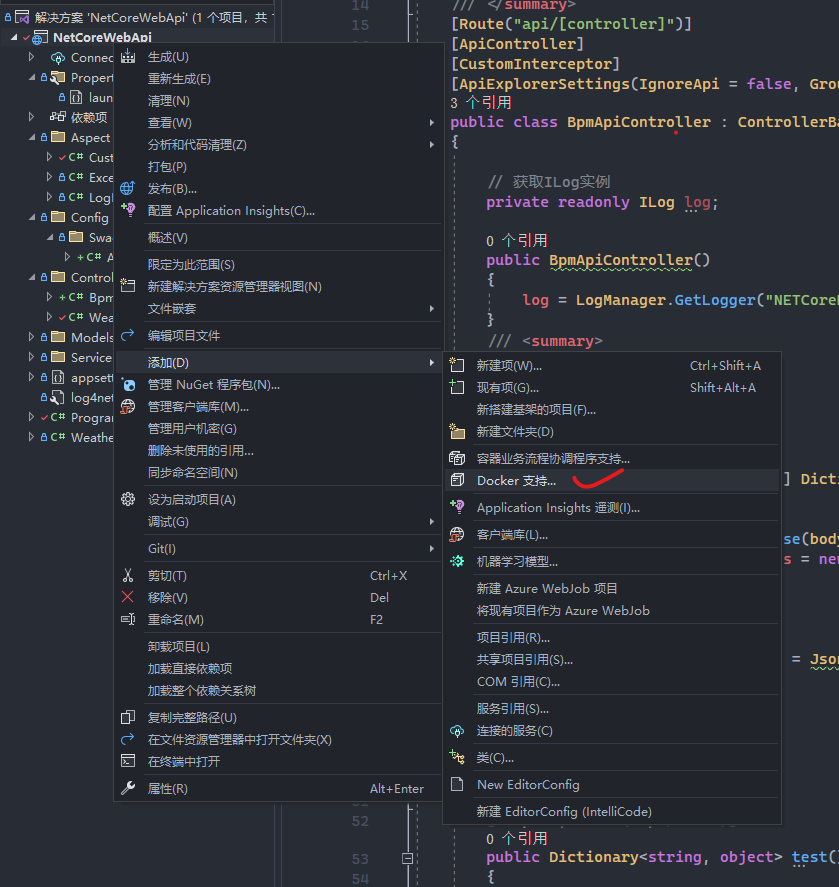
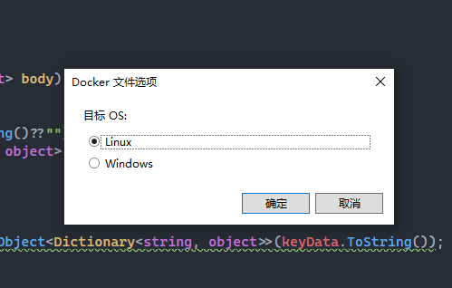
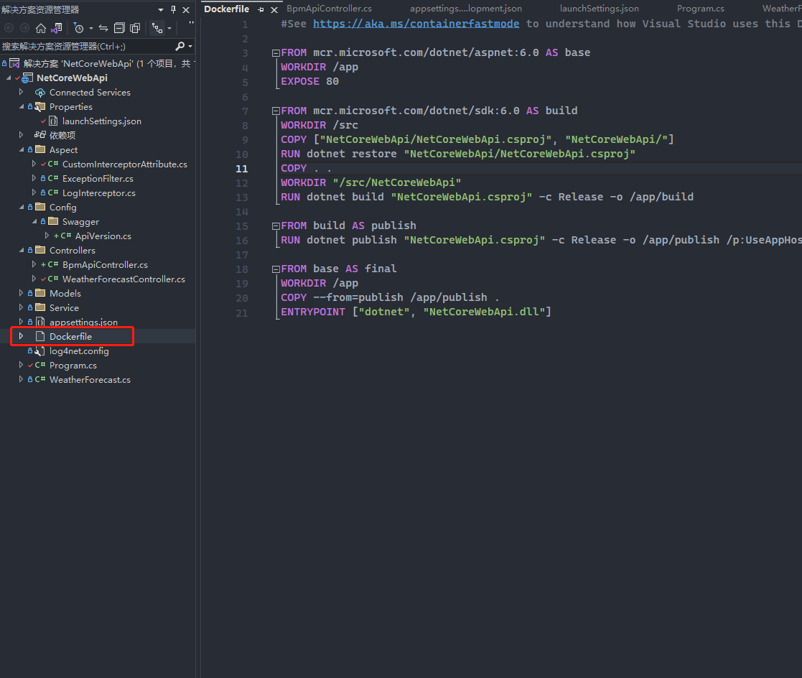
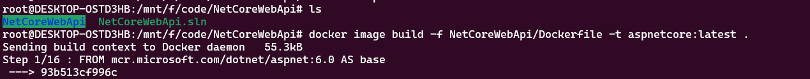
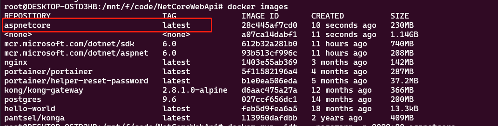
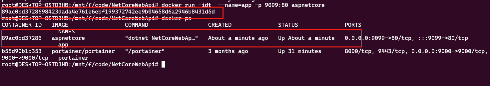
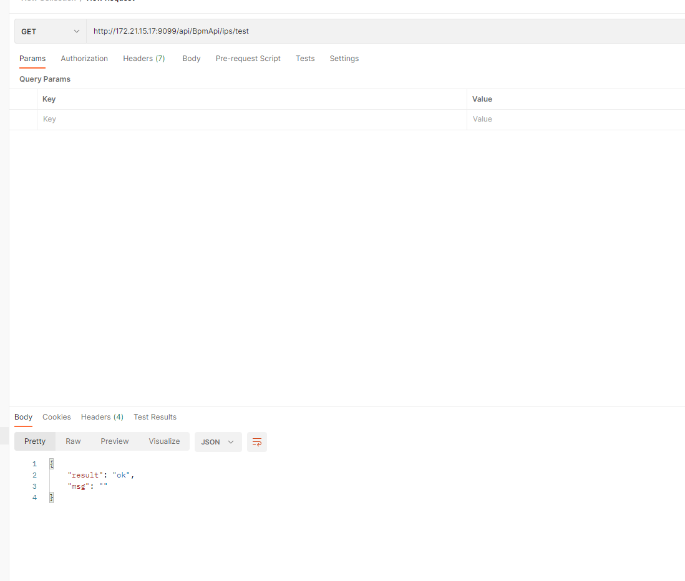

# .Net 6.0 WebApi部署docker

## 1.Visual studio 2022 对项目添加docker支持





选择目标系统为Linux，确定后会在项目根目录生成Dockerfile文件




```bash
#See https://aka.ms/containerfastmode to understand how Visual Studio uses this Dockerfile to build your images for faster debugging.

FROM mcr.microsoft.com/dotnet/aspnet:6.0 AS base
WORKDIR /app
EXPOSE 80

FROM mcr.microsoft.com/dotnet/sdk:6.0 AS build
WORKDIR /src
COPY ["NetCoreWebApi/NetCoreWebApi.csproj", "NetCoreWebApi/"]
RUN dotnet restore "NetCoreWebApi/NetCoreWebApi.csproj"
COPY . .
WORKDIR "/src/NetCoreWebApi"
RUN dotnet build "NetCoreWebApi.csproj" -c Release -o /app/build

FROM build AS publish
RUN dotnet publish "NetCoreWebApi.csproj" -c Release -o /app/publish /p:UseAppHost=false

FROM base AS final
WORKDIR /app
COPY --from=publish /app/publish .
ENTRYPOINT ["dotnet", "NetCoreWebApi.dll"]
```


## 2.部署

本项目是在ubuntu下的docker部署

将项目拷贝至ubuntu下，




```bash
# 执行该命令将项目生成镜像，镜像名称为aspnetcore 版本为latest
docker image build -f NetCoreWebApi/Dockerfile -t aspnetcore:latest .
```

下图就是生成的镜像



启动镜像生成容器

```bash
# 将容器命名为app，使用的是aspnetcore镜像，宿主机端口9099映射到容器内部的80端口
docker run -idt  --name=app -p 9099:80 aspnetcore
```



这样就启动成功了



