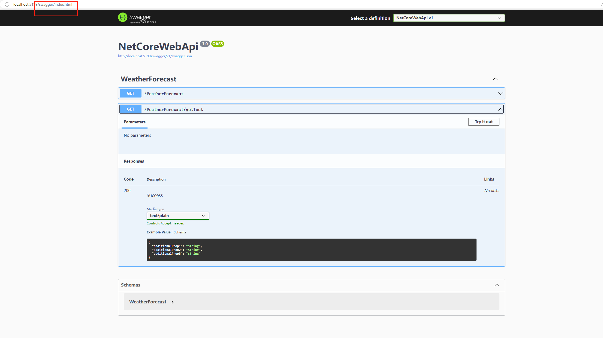
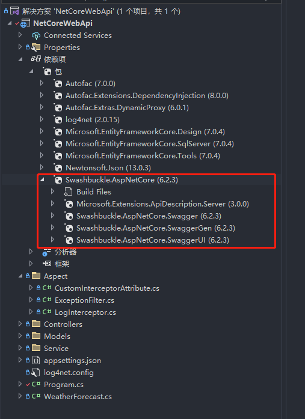
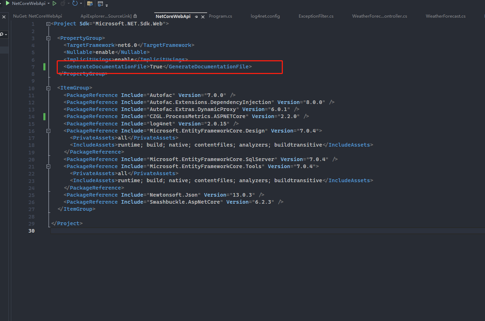
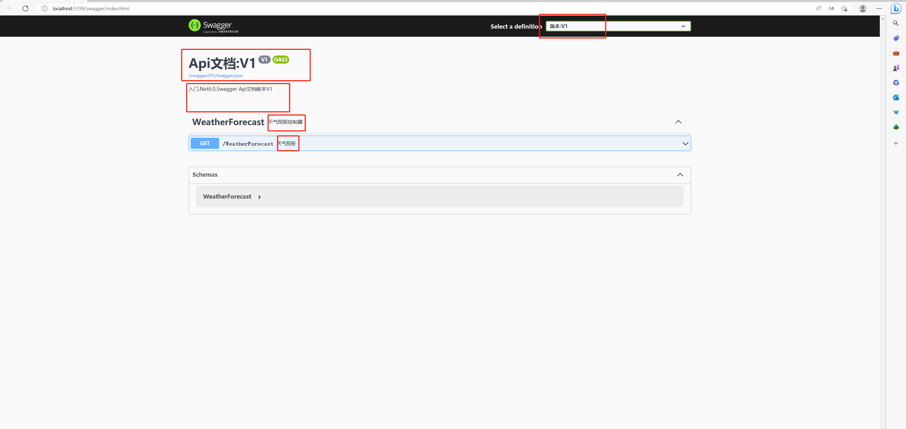
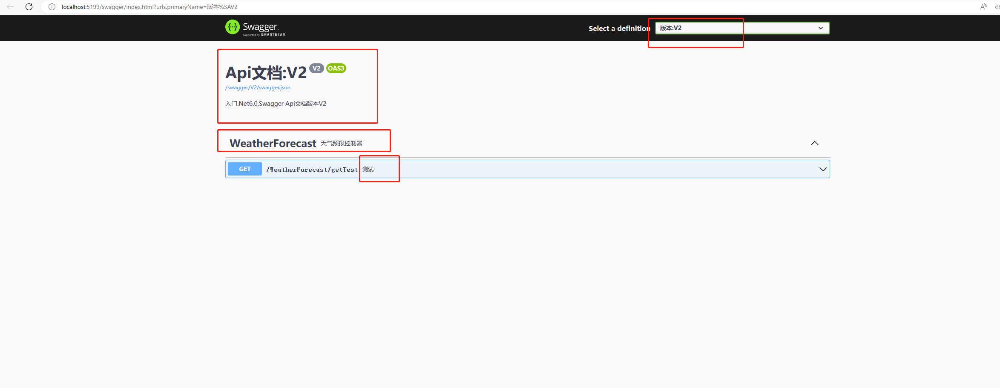
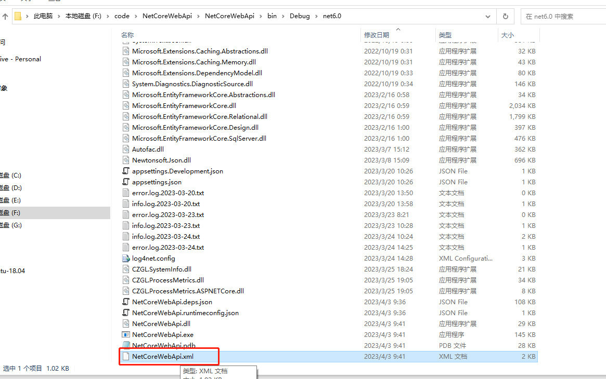
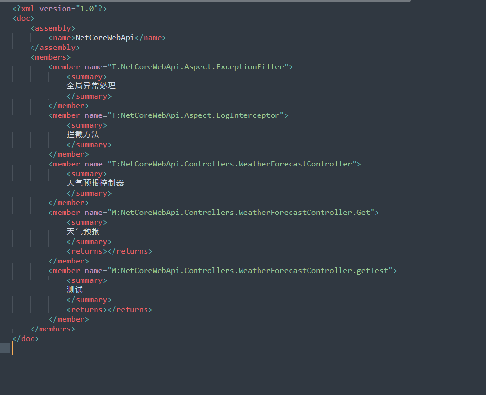
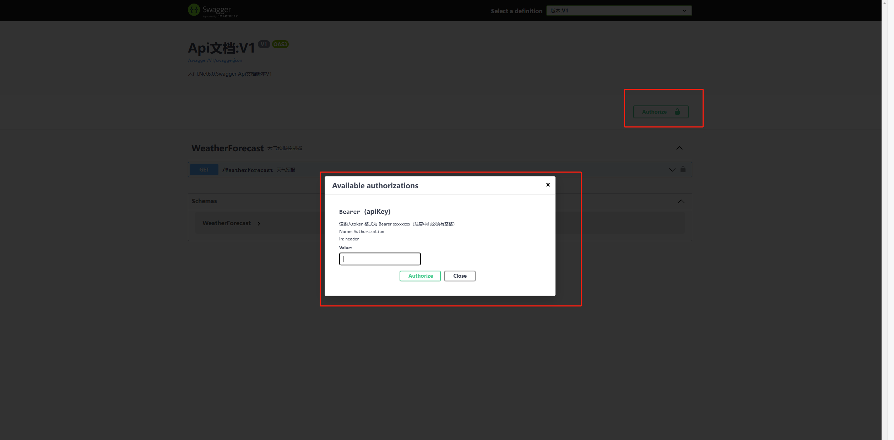

# .Net 6.0 

##  Swagger

> 在Net 6.0创建WebApi项目后，启动服务自动就会打开Swagger页面（需要在创建项目的时候启用OpenApI支持）
>
> 需要的依赖包：Swashbuckle.AspNetCore 
>
> [Swagger UI](http://localhost:5199/swagger/index.html)默认地址是/swagger/index.html





### 基本配置

```c#
builder.Services.AddEndpointsApiExplorer();
builder.Services.AddSwaggerGen();
app.UseSwagger();
app.UseSwaggerUI();
```


### 版本控制

开启文档文件生成




>  在程序入口文件 Program.cs中配置，生成swagger文档内容的格式，以及生成文档的路径以及版本

```c#
builder.Services.AddSwaggerGen(option =>
{
    #region 将控制器 方法 注释在swagger中显示
    // 注释
    var xmlFilename = $"{Assembly.GetExecutingAssembly().GetName().Name}.xml";
    // 第二个参数为是否显示控制器注释,我们选择true
    option.IncludeXmlComments(Path.Combine(AppContext.BaseDirectory, xmlFilename), true);
    #endregion

    #region 多版本的Swagger配置
    typeof(ApiVersion).GetEnumNames().ToList().ForEach(version =>
    {
        option.SwaggerDoc(version, new OpenApiInfo()
        {
            Title = $"Api文档:{version}",
            Version = version,
            Description = $"入门.Net6.0,Swagger Api文档版本{version}"
        });
    });
    #endregion
});

// Configure the HTTP request pipeline.
if (app.Environment.IsDevelopment())
{
    app.UseSwagger();
    
    #region 多版本的Swagger UI配置 如果配置多个版本这边也得配置，让生成的文件和版本对应上
    app.UseSwaggerUI(option =>
    {
        foreach(string version in typeof(ApiVersion).GetEnumNames())
        {
            option.SwaggerEndpoint($"/swagger/{version}/swagger.json", $"版本:{version}");
        }
    });
    #endregion
}
```

> 在控制器中使用
>
> ApiExplorerSettings 在控制器类上是指定整个控制器的版本，在方法上指定单独方法的版本（方法的优先级更高）
>
> 由于在入口文件配置了xml注释，所以我们使用xml注释可以在swagger文档中显示


```c#
/// <summary>
    /// 天气预报控制器
    /// </summary>
    [ApiController]
    [Route("[controller]")]
    [CustomInterceptor]
    [Intercept(typeof(LogInterceptor))]
    [ApiExplorerSettings(IgnoreApi = false, GroupName = nameof(ApiVersion.V1))]
    public class WeatherForecastController : ControllerBase
    {
        private static readonly string[] Summaries = new[]
        {
        "Freezing", "Bracing", "Chilly", "Cool", "Mild", "Warm", "Balmy", "Hot", "Sweltering", "Scorching"
    };

        private readonly ILogger<WeatherForecastController> _logger;
        
        private readonly TestContext _testContext;
        private readonly ICustomService _customService;

        // 获取ILog实例
        private readonly ILog log;

        
        public WeatherForecastController(ILogger<WeatherForecastController> logger, TestContext TestContext, ICustomService customService)
        {
            _logger = logger;
            _testContext = TestContext;
            // typeof(WeatherForecastController) 需要加这个，不然无法打印到文件
            log = LogManager.GetLogger("NETCoreRepository", typeof(WeatherForecastController));
            _customService = customService;
        }
        
        /// <summary>
        /// 天气预报
        /// </summary>
        /// <returns></returns>
        // V1
        [HttpGet(Name = "GetWeatherForecast")]
        public IEnumerable<WeatherForecast> Get()
        {
            return Enumerable.Range(1, 5).Select(index => new WeatherForecast
            {
                Date = DateTime.Now.AddDays(index),
                TemperatureC = Random.Shared.Next(-20, 55),
                Summary = Summaries[Random.Shared.Next(Summaries.Length)]
            })
            .ToArray();
        }

        /// <summary>
        /// 测试
        /// </summary>
        /// <returns></returns>
        // V2
        [HttpGet, Route("getTest"), ApiExplorerSettings(GroupName = nameof(ApiVersion.V2))]
        public Dictionary<string, object> getTest()
        {

            _customService.Call();
            Dictionary<string, object> r = new Dictionary<string, object>
            {
                { "data", _testContext.ColTests.ToList() },
                { "success", true }
            };
            //throw new Exception("设置异常...");
            log.Info(JsonConvert.SerializeObject(r));
            return r;
        }
    }
```

> 演示

V1



V2



> 注释的xml生成在 bin\Debug\net6.0下的项目名称.xml
>
> 





### 配置授权

```c#
builder.Services.AddSwaggerGen(option =>
{
    #region 将控制器 方法 注释在swagger中显示
    // 注释
    var xmlFilename = $"{Assembly.GetExecutingAssembly().GetName().Name}.xml";
    // 第二个参数为是否显示控制器注释,我们选择true
    option.IncludeXmlComments(Path.Combine(AppContext.BaseDirectory, xmlFilename), true);
    #endregion

    #region 多版本的Swagger配置
    typeof(ApiVersion).GetEnumNames().ToList().ForEach(version =>
    {
        option.SwaggerDoc(version, new OpenApiInfo()
        {
            Title = $"Api文档:{version}",
            Version = version,
            Description = $"入门.Net6.0,Swagger Api文档版本{version}"
        });
    });
    #endregion

    #region 授权，传入Token
    option.AddSecurityDefinition("Bearer", new OpenApiSecurityScheme()
    {
        Description = "请输入token,格式为 Bearer xxxxxxxx（注意中间必须有空格）",
        // Authorization  为请求头字段
        Name = "Authorization",
        In = ParameterLocation.Header,
        Type = SecuritySchemeType.ApiKey,
        BearerFormat = "JWT",
        Scheme = "Bearer"
    });
    option.AddSecurityRequirement(new OpenApiSecurityRequirement()
    {
        { 
            new OpenApiSecurityScheme{
                Reference =new OpenApiReference{
                    Type = ReferenceType.SecurityScheme,
                    Id ="Bearer"
                }
            },new string[]{ }
        }
    });
    #endregion
});
```



