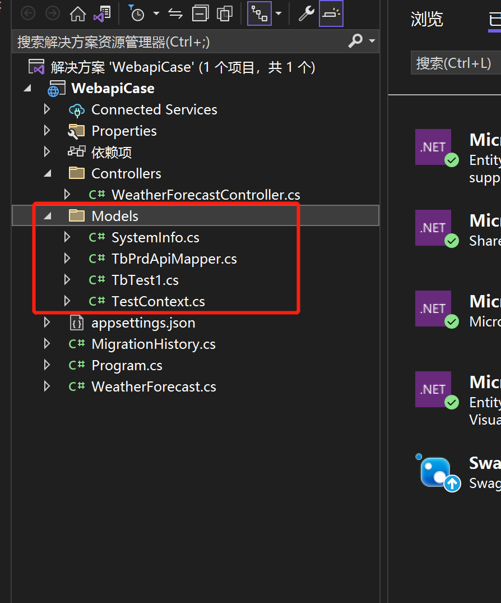

# EF core DB first

## 依赖

我使用的是visual stdio 2022 使用的是EFcore 7.0.4

在nuget中安装 

- Microsoft.EntityFrameworkCore
- Microsoft.EntityFrameworkCore.SqlServer
- Microsoft.EntityFrameworkCore.Tools 用来从数据库反向创建实体类和上下文类
- Microsoft.EntityFrameworkCore.Design 用来从数据库反向创建实体类和上下文类

在nuget控制台输入

```bash
# 从数据库反向创建实体类和上下文类在 Models 文件夹下
Scaffold-DbContext "Data Source=DESKTOP-KLFQ21D\SQLEXPRESS;Initial Catalog=test;User ID=sa;Password=123456;Persist Security Info=True;TrustServerCertificate=true" Microsoft.EntityFrameworkCore.SqlServer -OutputDir Models
```




更新了数据库后，从数据库重新更新实体和上下文

```bash
Scaffold-DbContext "Data Source=DESKTOP-KLFQ21D\SQLEXPRESS;Initial Catalog=test;User ID=sa;Password=123456;Persist Security Info=True;TrustServerCertificate=true" Microsoft.EntityFrameworkCore.SqlServer -OutputDir Models -force
```


