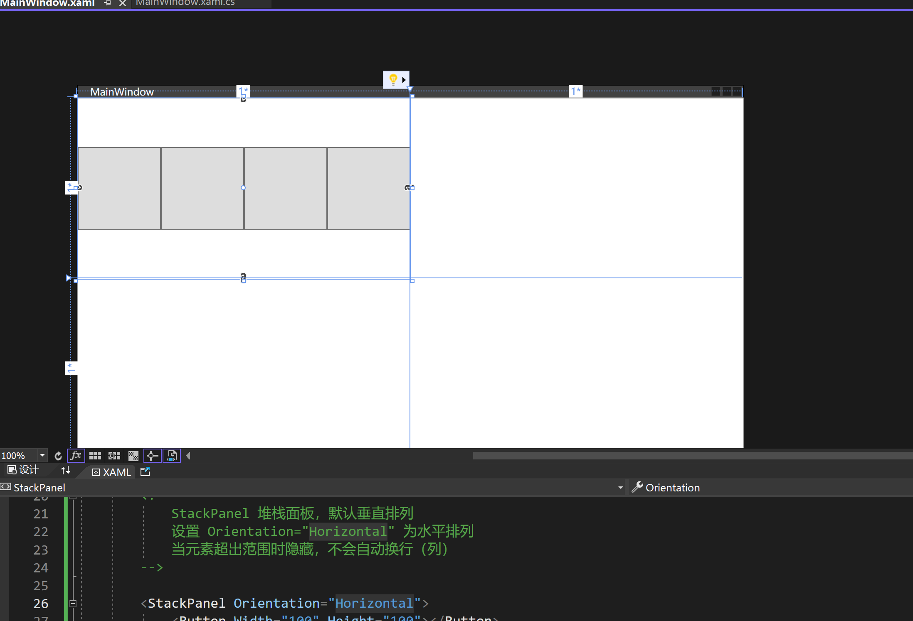
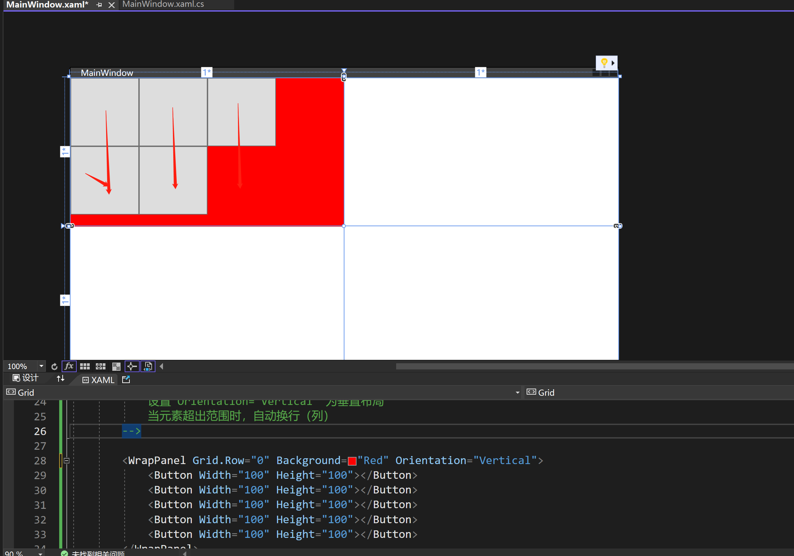

# WPF

## WPF布局基础

### Grid

Gird是一个组织行列布局的容器控件

```xaml
<Window x:Class="WpfApp1.MainWindow"
        xmlns="http://schemas.microsoft.com/winfx/2006/xaml/presentation"
        xmlns:x="http://schemas.microsoft.com/winfx/2006/xaml"
        xmlns:d="http://schemas.microsoft.com/expression/blend/2008"
        xmlns:mc="http://schemas.openxmlformats.org/markup-compatibility/2006"
        xmlns:local="clr-namespace:WpfApp1"
        mc:Ignorable="d"
        Title="MainWindow" Height="450" Width="800">
    <Grid>
        <!--
        Grid.RowDefinitions 用来定义Grid中的行布局  RowDefinition 表示一行
        RowDefinition 中 witdh height 可以设置宽度和高度 比如 height=auto 表示自适应  如果该行没有元素 auto就会隐藏该行
        Grid.ColumnDefinitions 用来定义Grid中的列布局 ColumnDefinition 表示一列
        ColumnDefinition 中 witdh height 可以设置宽度和高度 比如 witdh=auto 表示自适应  如果该列没有元素 auto就会隐藏该列
		Height=“2*” 表示占用2份
        -->
        <Grid.RowDefinitions>
            <RowDefinition Height="100"></RowDefinition>
            <RowDefinition></RowDefinition>
            <RowDefinition></RowDefinition>
        </Grid.RowDefinitions>
        <Grid.ColumnDefinitions>
            <ColumnDefinition></ColumnDefinition>
            <ColumnDefinition ></ColumnDefinition>
            <ColumnDefinition ></ColumnDefinition>
        </Grid.ColumnDefinitions>

        <!--
            Grid.Row="0" 表示元素在第一行
            Grid.RowSpan="2" 表示元素Grid.Row开始跨越2行
            Grid.Column="2" 表示元素在第三列
            Grid.ColumnSpan="1" 表示元素从Grid.Column跨越1列（相当于没跨域）
        -->
        <Border Grid.Row="0" Grid.RowSpan="2" Background="Red" Grid.Column="2" Grid.ColumnSpan="1"></Border>
    </Grid>
</Window>

```


### StackPanel

```xaml
<Window x:Class="WpfApp1.MainWindow"
        xmlns="http://schemas.microsoft.com/winfx/2006/xaml/presentation"
        xmlns:x="http://schemas.microsoft.com/winfx/2006/xaml"
        xmlns:d="http://schemas.microsoft.com/expression/blend/2008"
        xmlns:mc="http://schemas.openxmlformats.org/markup-compatibility/2006"
        xmlns:local="clr-namespace:WpfApp1"
        mc:Ignorable="d"
        Title="MainWindow" Height="450" Width="800">
    <Grid>

        <Grid.RowDefinitions>
            <RowDefinition ></RowDefinition>
            <RowDefinition></RowDefinition>
        </Grid.RowDefinitions>
        <Grid.ColumnDefinitions>
            <ColumnDefinition ></ColumnDefinition>
            <ColumnDefinition ></ColumnDefinition>
        </Grid.ColumnDefinitions>

        <!--
            StackPanel 堆栈面板，默认垂直排列 
            设置 Orientation="Horizontal" 为水平排列
            当元素超出范围时隐藏，不会自动换行（列）
        -->
        
        <StackPanel Orientation="Horizontal">
            <Button Width="100" Height="100"></Button>
            <Button Width="100" Height="100"></Button>
            <Button Width="100" Height="100"></Button>
            <Button Width="100" Height="100"></Button>
            <Button Width="100" Height="100"></Button>

        </StackPanel>

    </Grid>
</Window>

```




### WrapPanel

```xaml
<Window x:Class="WpfApp1.MainWindow"
        xmlns="http://schemas.microsoft.com/winfx/2006/xaml/presentation"
        xmlns:x="http://schemas.microsoft.com/winfx/2006/xaml"
        xmlns:d="http://schemas.microsoft.com/expression/blend/2008"
        xmlns:mc="http://schemas.openxmlformats.org/markup-compatibility/2006"
        xmlns:local="clr-namespace:WpfApp1"
        mc:Ignorable="d"
        Title="MainWindow" Height="450" Width="800">
    <Grid>

        <Grid.RowDefinitions>
            <RowDefinition ></RowDefinition>
            <RowDefinition></RowDefinition>
        </Grid.RowDefinitions>
        <Grid.ColumnDefinitions>
            <ColumnDefinition ></ColumnDefinition>
            <ColumnDefinition ></ColumnDefinition>
        </Grid.ColumnDefinitions>

        <!--
            WrapPanel 该面板默认水平布局，
            设置 Orientation="Vertical" 为垂直布局
            当元素超出范围时，自动换行（列）
        -->
        <WrapPanel Grid.Row="1" Background="Red" Orientation="Vertical">
            <Button Width="100" Height="100"></Button>
            <Button Width="100" Height="100"></Button>
            <Button Width="100" Height="100"></Button>
            <Button Width="100" Height="100"></Button>
            <Button Width="100" Height="100"></Button>
        </WrapPanel>
        
    </Grid>
</Window>

```



