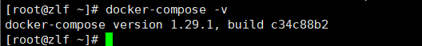
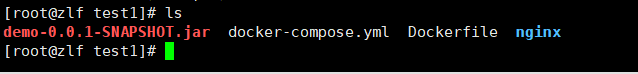
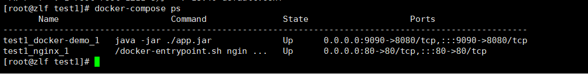
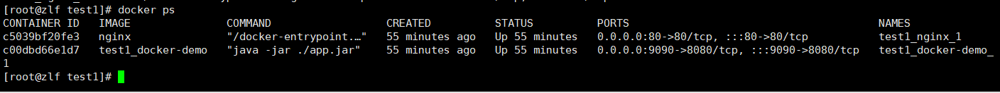
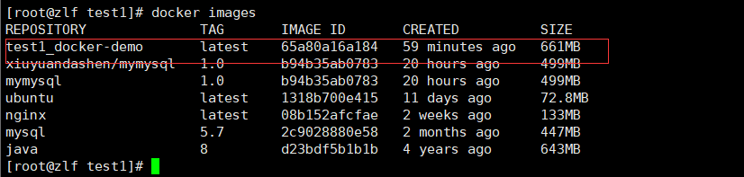
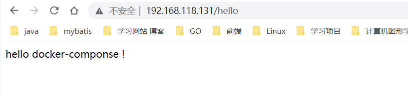
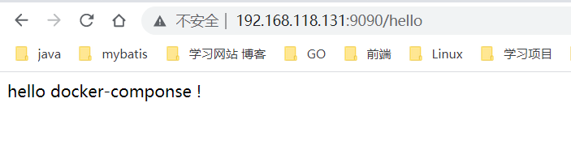

# docker-compose 安装

[官方地址github](https://github.com/docker/compose/releases)

Linux 下安装

```bash
sudo curl -L "https://github.com/docker/compose/releases/download/1.24.1/docker-compose-$(uname -s)-$(uname -m)" -o /usr/local/bin/docker-compose
```

要安装其他版本的 Compose，请替换 1.29.1 

将可执行权限应用给docker-compose

```bash
sudo chmod +x /usr/local/bin/docker-compose
```

创建软连接，在/usr/bin  下，这样可以直接访问到命令

```bash
sudo ln -s /usr/local/bin/docker-compose /usr/bin/docker-compose
```

查看版本，确定是否成功安装配置。




# docker-compose 简介

Compose 是用于定义和运行多容器 Docker 应用程序的工具。通过 Compose，您可以使用 YML 文件来配置应用程序需要的所有服务。然后，使用一个命令，就可以从 YML 文件配置中创建并启动所有服务。

也就是可以编排容器。

Compose 使用的三个步骤：

- 使用 Dockerfile 定义应用程序的环境。
- 使用 docker-compose.yml 定义构成应用程序的服务，这样它们可以在隔离环境中一起运行。
- 最后，执行 docker-compose up 命令来启动并运行整个应用程序。

# docker-compose  编排容器

首先我们准备了一个java程序，简单的helloworld

将其放在目录下，该目录还有docker-compose.yml 的配置文件，以及将jar包打包成镜像的Dockerfile，还有我们即将用到的nginx配置，这个配置是从另外一个nginx容器中导出的

```bash
# 将运行中的ng容器中的/etc/nginx/ 文件夹 拷贝至当前文件夹下的nginx/conf
docker cp ng:/etc/nginx/ ./nginx/conf 
```





我们先配置Dockerfile，比较简单

```bash
FROM java:8
VOLUME /tmp

WORKDIR /project/demo

ADD ./demo-0.0.1-SNAPSHOT.jar ./app.jar

ENTRYPOINT ["java","-jar" ,"./app.jar"]
```

 接着配置docker-compose.yml

```yaml

version: '3'
# 服务---需要构建的容器
services:
  docker-demo:
  # 表示使用当前目录下的Dockerfile 进行构建镜像
    build: ./
    # 映射端口
    ports:
      - "9090:8080"
  nginx:
  # 使用nginx镜像
    image: nginx
    # 挂载 将我们当前目录的 ./nginx/conf/nginx 挂载到 容器中的 /etc/nginx
    volumes:
      - ./nginx/conf/nginx:/etc/nginx
     # 链接  这样 在容器中就可以使用app进行于docker-demo这个容器通信 相当于ip映射
    links:
      - "docker-demo:app"
      # 映射端口
    ports:
      - "80:80"
```

然后我们使用下面命令构建镜像并启动容器  

```bash
# 构建镜像并启动容器   -d 后台启动
docker-compose up -d

# 查看日志
docker-compse logs 

```

nginx.conf

```bash
location /hello {
		# 需要使用app的内部端口
        proxy_pass http://app:8080;
    }
```







nginx 代理成功



