# 三大日志的作用
> Mysql的主从复制，事务的持久化，事务回滚，分别依靠 binlog、redo log 、undo log 来实现的

# binlog 
`binlog` 用于记录数据库执行的写入性操作(不包括查询)信息，以二进制的形式保存在磁盘中。（还有执行开始时间，结束时间，事务id等等信息）
`binlog` 是 `mysql` 的逻辑日志，并且由 `Server` 层进行记录，使用任何存储引擎的 `mysql` 数据库都会记录 `binlog` 日志。
`binlog` 是通过追加的方式进行写入的，可以通过 `max_binlog_size` 参数设置每个 `binlog` 文件的大小，当文件大小达到给定值之后，会生成新的文件来保存日志。
`binlog`文件使用 `mysqlbinlog` 命令查看，cat 查看不了

## 逻辑日志和物理日志
- 逻辑日志： 可以简单理解为记录的就是sql语句 。
- 物理日志： mysql 数据最终是保存在数据页中的，物理日志记录的就是数据页变更 。

## binlog 使用场景

`binlog` 的主要使用场景有两个，分别是 **主从复制 和 数据恢复** 。
- 主从复制 ：在 `Master` 端开启 `binlog` ，然后将 `binlog` 发送到各个 `Slave` 端， `Slave` 端重放 `binlog` 从而达到主从数据一致。
- 数据恢复 ：通过使用 `mysqlbinlog` 工具来恢复数据。

## 主从复制 
参考[mysql集群搭建（使用docker 一主一从）](https://www.cnblogs.com/xiuyuandashen/p/15067771.html) 这篇博客

## 使用mysqlbinlog 和 mysqldump 恢复数据


 首先查看是否开启二进制日志

```bash
show variables like 'log_bin%';
```

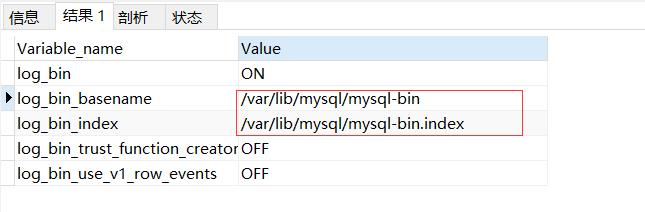

上边表示开启的二进制日志

### 开启二进制日志


打开my.cnf

```bash
[mysqld]
# 开启二进制日志
log-bin=mysql-bin
# 标识
server-id=131
```

然后重启mysql服务器，这时候查看发现二进制日志已经开启。

### 查看所有的binlog日志列表

```bash
 show master logs;
```

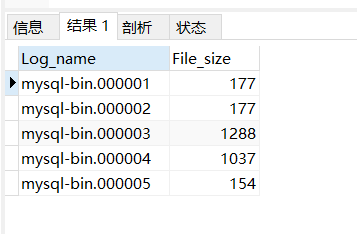

### 刷新二进制日志

刷新二进制日志其实也就是将当前日志截断，然后生成一张新的二进制日志文件

```bash
flush logs;
```

使用后，比上面多了一个06文件

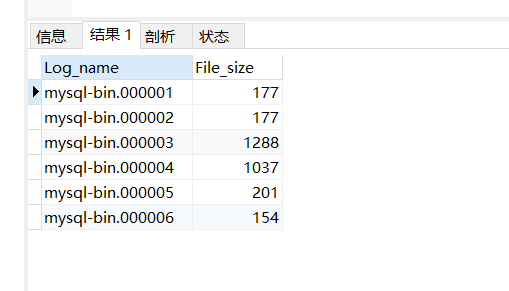

重启mysql服务也会重新生成一个binlog日志。

### 重置(清空）二进制日志文件

```bash
reset master
```

使用后，reset之后又重新生成了二进制文件，从头开始。

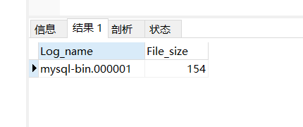


### 恢复数据

#### 备份数据

```bash
mysqldump -uroot -p123456 test T --single-transaction --master-data=1 --flush-logs > `date +%F`-test.sql;
# 备份 test数据库中的 T 表 
# --single-transaction 必须加（一个事务中导出数据，确保产生一致性的备份数据）
# --master-data=1 在备份文件中以注释的形式记录备份开始时binlog的position，默认值是1
# --flush-logs 刷新二级制日志
```

[mysqldump的简单使用参考这篇博客](https://www.jianshu.com/p/c5a7a702a9e9)

查看输出的文件

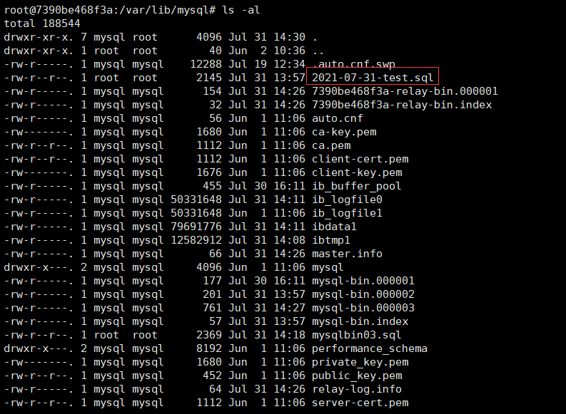

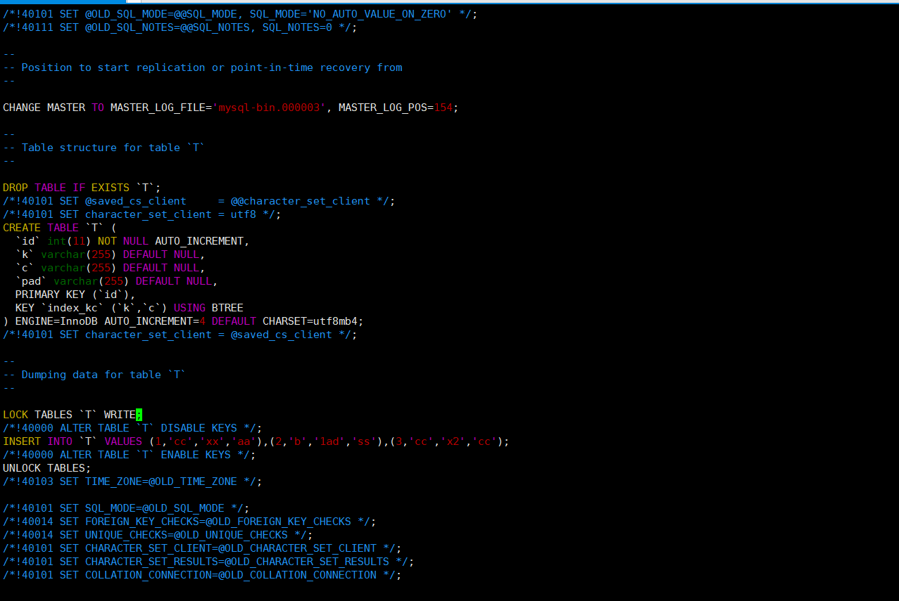

原来该表的数据

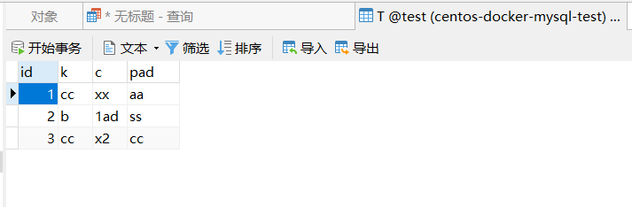

我们插入一条数据

```sql
insert into test.T (k,c,pad) values('ss','bb','2233');
```

然后删除整张表

```sql
DROP table test.T;
```

然后查看二进制日志

```sql
show master logs;
```


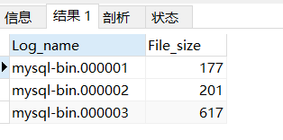

使用mysqlbinlog查看具体文件信息

我们使用`mysqlbinlog mysql-bin.000003` 时报错了，

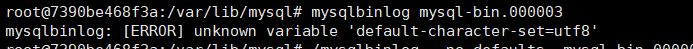

使用以下方法即可解决

1、在MySQL的配置/etc/my.cnf中将default-character-set=utf8 修改为 character-set-server = utf8，但是这需要重启MySQL服务

2、 输入以下命令

```bash
mysqlbinlog --no-defaults  mysql-bin.000003
```

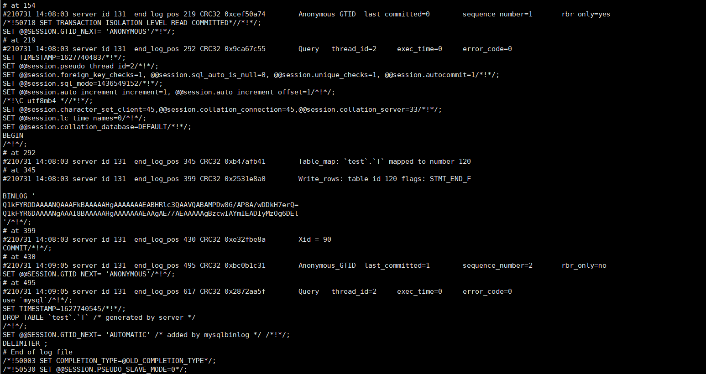

发现上边的这样看上去比较难受，我们可以把二进制日志文件导出成普通文件查看。

```bash
mysqlbinlog --no-defaults --base64-output=DECODE-ROWS -v mysql-bin.000003 >mysqlbin03.sql
```

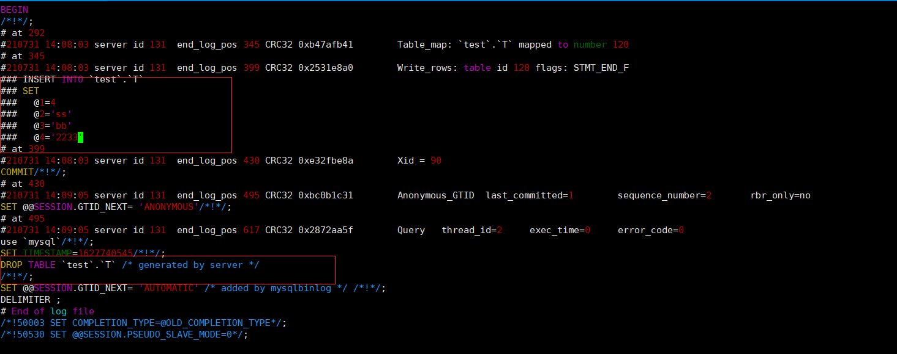

可以看到我们前面插入的操作 以及 删除表的操作。

#### 现在开始恢复数据

> 我们在使用mysqldump恢复的时候最好关闭binlog，因为恢复过程本身就是批量导入的过程，也会产生大量的binlog，其实这些binlog是无用的，会减慢恢复的速度。

登录到mysql中，临时关闭binlog

```bash
set sql_log_bin=0;
```

然后使用source 命令恢复数据 (ps:必须在mysql中执行恢复，因为这个关闭binlog是临时的，只在当前会话起作用)

```bash
# 首先得先进对应的数据库 不然会报错
use test;
source /var/lib/mysql/2021-07-31-test.sql;
```


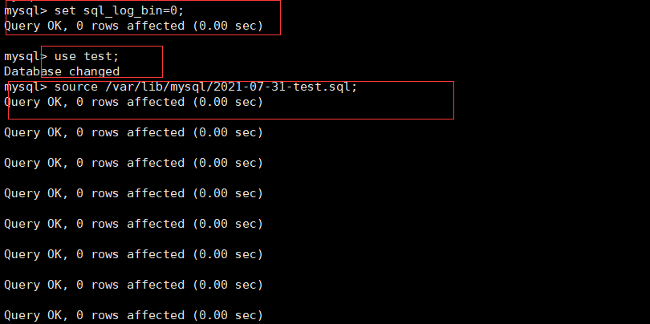

这时我们会发现，数据已经恢复，而且就是我们备份时的数据（备份后插入的数据不存在，备份之后的数据没恢复）

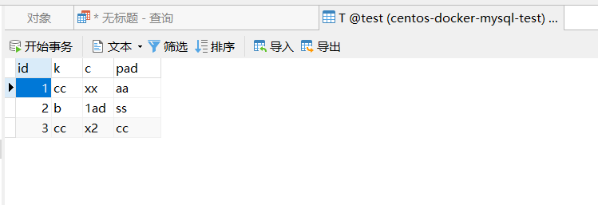

#### 恢复未备份的数据

我们现在需要恢复前面备份后我们插入的数据。

我们先查找 删除了这个表 的位置，然后截止到这个位置。

```bash
mysqlbinlog --no-defaults mysql-bin.000003 | cat -n | grep -iw 'drop'
```

可以看出在 第 51 行


然后查出drop语句的position

```bash
mysqlbinlog --no-defaults mysql-bin.000003 | cat -n | sed -n '30,51p';
# sed -n '30,51p' 列出30行到51行
```

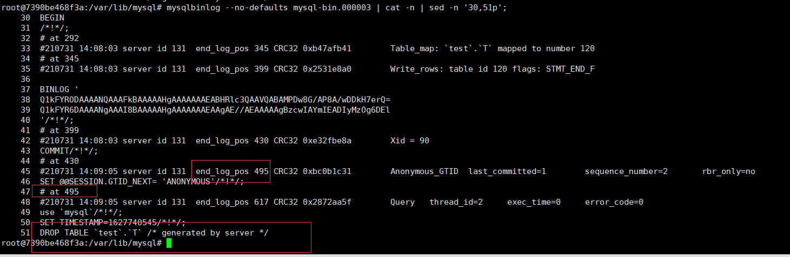

发现我们在495左右的位置删除了这个表，所以我们现在将 mysql-bin.000003 恢复到 495的位置。

```bash
mysqlbinlog --no-defaults --stop-position='495'   mysql-bin.000003 | mysql -uroot -p123456
# --start-position 和 --stop-position 一起使用可以恢复某一段的数据
```

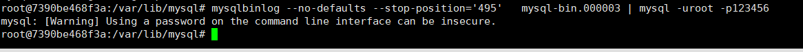

我们现在查看数据库，已经恢复了。

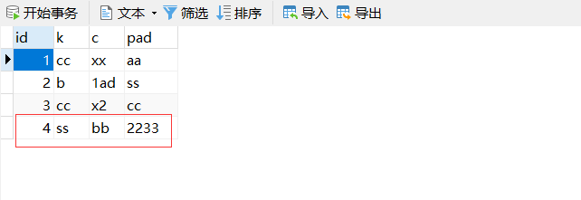

