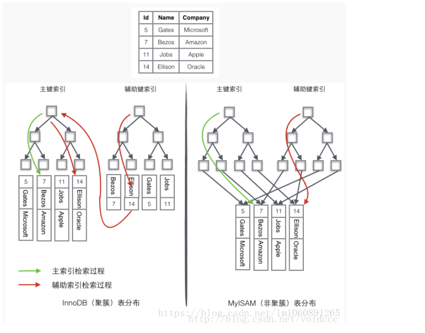

# 聚簇索引和非聚簇索引（辅助索引）

## 总结

**InnoDB中，表数据文件本身就是按B+Tree组织的一个索引结构，聚簇索引就是按照每张表的主键构造一颗B+树，同时叶子节点中存放的就是整张表的行记录数据，也将聚集索引的叶子节点称为数据页。这个特性决定了索引组织表中数据也是索引的一部分；**

　　**一般建表会用一个自增主键做聚簇索引，没有的话MySQL会默认创建，但是这个主键如果更改代价较高，故建表时要考虑自增ID不能频繁update这点。**

　　**我们日常工作中，根据实际情况自行添加的索引都是辅助索引，辅助索引就是一个为了需找主键索引的二级索引，现在找到主键索引再通过主键索引找数据；**

**聚簇索引和非聚簇索引的区别**

聚簇索引的叶子节点存放的是主键值和数据行，**支持覆盖索引**；二级索引的叶子节点存放的是主键值或指向数据行的指针。

由于节子节点(数据页)只能按照一颗B+树排序，故**一张表只能有一个聚簇索引**。辅助索引的存在不影响聚簇索引中数据的组织，所以一张表可以有多个辅助索引

注： 覆盖索引（covering index）指一个查询语句的执行只用从索引中就能够取得，不必从数据表中读取。也可以称之为实现了索引覆盖。 当一条查询语句符合覆盖索引条件时，MySQL只需要通过索引就可以返回查询所需要的数据，这样避免了查到索引后再返回表操作，减少I/O提高效率。 如，表covering_index_sample中有一个普通索引 idx_key1_key2(key1,key2)。当我们通过SQL语句：select key2 from covering_index_sample where key1 = ‘keytest’;的时候，就可以通过覆盖索引查询，无需回表。

## Innodb 的聚簇索引和辅助索引

### 聚簇索引

聚簇索引就是按照每张表的主键构造一颗B+树，同时**叶子节点**中存放的就是**整张表的行记录数据**，也将聚集索引的叶子节点称为数据页。这个特性决定了索引组织表中数据也是索引的一部分，每张表只能拥有一个聚簇索引。

Innodb通过主键聚集数据，如果没有定义主键，innodb会选择非空的唯一索引代替。如果没有这样的索引，innodb会隐式的定义一个主键来作为聚簇索引。

聚簇索引的优缺点

　　优点：

　　　　1.数据访问更快，因为聚簇索引将索引和数据保存在同一个B+树中，因此从聚簇索引中获取数据比非聚簇索引更快

　　　　2.聚簇索引对于主键的排序查找和范围查找速度非常快
　　缺点：

　　　　1.插入速度严重依赖于插入顺序，按照主键的**顺序插入**是最快的方式，否则将会出现页分裂，严重影响性能。因此，对于InnoDB表，我们一般都会定义一个**自增的ID列为主键**
　　　　2.**更新主键的代价很高**，因为将会导致被更新的行移动。因此，对于InnoDB表，我们一般定义主键为不可更新。
　　　　3.二级索引访问需要两次索引查找，第一次找到主键值，第二次根据主键值找到行数据。

### 辅助索引

在**聚簇索引之上创建的索引称之为辅助索引**，辅助索引访问数据总是需要**二次查找**。**辅助索引叶子节点存储的不再是行的物理位置，而是主键值**。**通过辅助索引首先找到的是主键值，再通过主键值找到数据行的数据页，再通过数据页中的Page Directory找到数据行。**

　　Innodb辅助索引的叶子节点并**不包含行记录的全部数据**，叶子节点除了包含键值外，还包含了相应行数据的**聚簇索引键**。

## Myisam 的非聚簇索引

**MyISAM索引文件和数据文件是分离的**，**索引文件仅保存数据记录的地址**。

而在**InnoDB中，表数据文件本身就是按B+Tree组织的一个索引结构**，这棵树的叶节点data域保存了完整的数据记录。这个索引的key是数据表的主键，因此InnoDB表数据文件本身就是主索引。

Myisam的主键索引 ：

　同样也是一颗B+Tree，data域保存数据记录的地址。因此，**MyISAM中索引检索的算法为首先按照B+Tree搜索算法搜索索引，如果指定的Key存在，则取出其data域的值，然后以data域的值为地址，读取相应数据记录。**

**MyISAM的索引方式也叫做“非聚集”的，之所以这么称呼是为了与InnoDB的聚集索引区分**

Myisam的辅助索引：

在MyISAM中，主索引和辅助索引（Secondary key）在结构上没有任何区别，**只是主索引要求key是唯一的，而辅助索引的key可以重复**。

