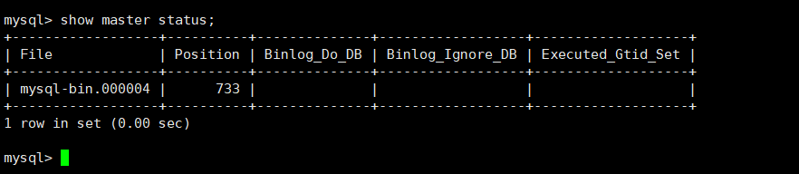
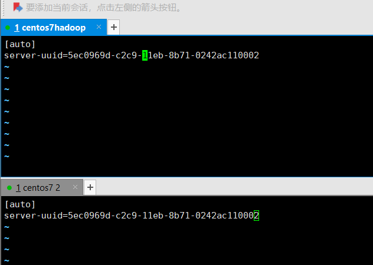
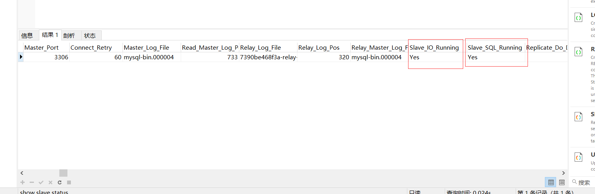
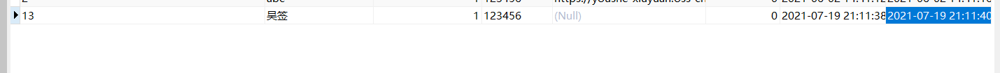
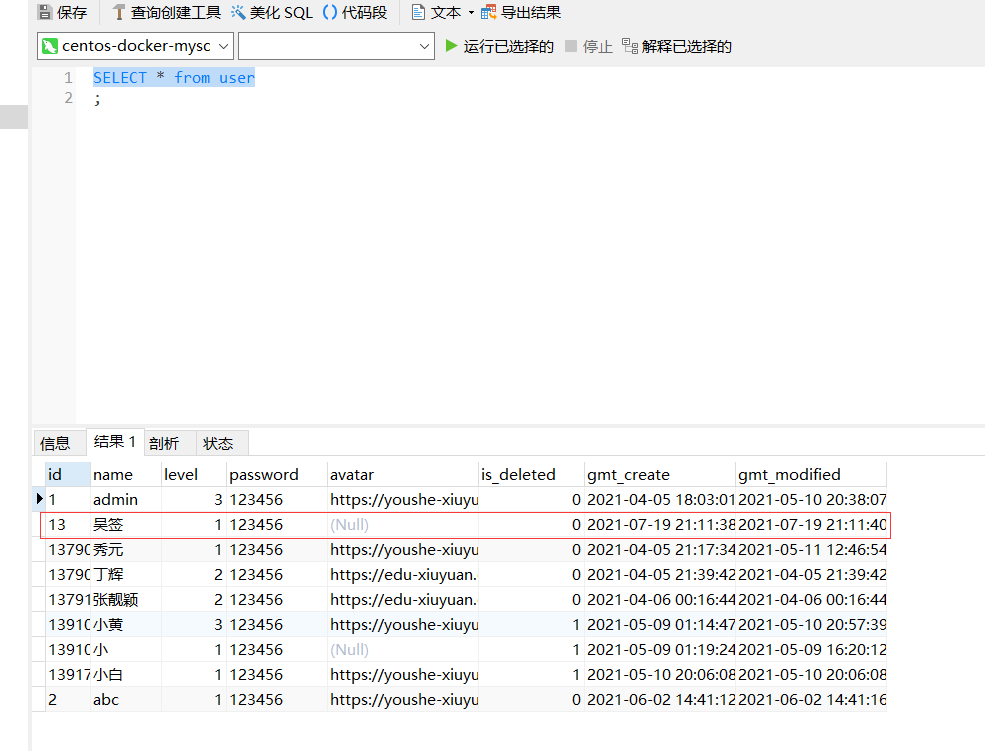

# mysql集群搭建

## my.cnf 配置文件配置

在 /etc/mysql/my.cnf 中  （拿一个举例）

（docker中需要先进入开启的容器，docker exec -it 容器名称  /bin/bash）

```bash

[mysqld]
#启用二进制日志
log-bin=mysql-bin
#服务器唯一ID，一般取IP最后一段
server-id=131

```

重启mysql ，这边我使用docker，所以先退出 容器 执行 `exit`

执行 `docker restart 容器名称 ` 重启容器


## mysql 经常遇到的问题
当遇到

我们需要 在 /etc/mysql/my.cnf 

```bash
[mysqld]
skip-grant-tables
```
重启
跳过密码认证

```bash

update user set authentication_string=password("123456") where user="root";

flush privileges;
```
然后讲 my.cnf 中的 skip-grant-tables 注释
重启mysql即可。


## 建立帐户并授权slave

先进入mysql 中，`mysql -uroot -p` ，输入密码。

```bash
# 创建用户
# '%' 表示所有客户端都可能连，只要帐号，密码正确，此处可用具体客户端IP代替
GRANT FILE ON *.* TO 'xiuyuan'@'%' IDENTIFIED BY '123456';
# 授予权限
GRANT REPLICATION SLAVE, REPLICATION CLIENT ON *.* to 'xiuyuan'@'%' identified by '123456';

# 刷新权限
FLUSH PRIVILEGES;
```

> REPLICATION CLIENT：授予此权限，复制用户可以使用 SHOW MASTER STATUS, SHOW SLAVE STATUS和 SHOW BINARY LOGS来确定复制状态。
>
> REPLICATION SLAVE：授予此权限，复制才能真正工作。

## 查询master的状态

```bash
show master status;
```



发现在/var/lib/mysql文件夹下，已经多出了mysql-bin开头的bin log日志文件


## 从服务器配置

首先也是一样，配置 my.cnf 

```bash
[mysqld]
server-id=130
```

在 /var/lib/mysql 中有个auto.cnf 文件，



我们发现两个服务的server-uuid 是一模一样的，因为我们是克隆过来的机器。但是两个auto.cnf文件的uuid是一样的，这样做主从时会有错误。

**解决办法就是将从服务器中的auto.cnf文件给删掉，然后重启服务**

配置

设置集群master

```bash
change master to master_host='192.168.118.131',master_port=3306,master_user='xiuyuan',master_password='123456',master_log_file='mysql-bin.000004',master_log_pos=733;

```

> 注意语句中间不要断开，master_port为主mysql服务器端口号(无引号)，master_user为执行同步操作的数据库账户，master_log_pos的值无单引号(此处的733就是show master status 中看到的position的值，这里的mysql-bin.000004就是file对应的值)。


## 启动从服务器复制功能

在从主机上使用

````bash
start slave;
````

## 检查从服务器复制功能状态

```bash
show slave status;
```



Slave_IO_Running及Slave_SQL_Running进程必须正常运行，即YES状态，否则都是错误的状态(如：其中一个NO均属错误)。

## 测试

配置好后发现，从服务器同步了主服务器的数据库


主库添加一条数据




从库查询

