# Nacos

Nacos 致力于帮助您发现、配置和管理微服务。Nacos 提供了一组简单易用的特性集，帮助您快速实现动态服务发现、服务配置、服务元数据及流量管理。

Nacos 帮助您更敏捷和容易地构建、交付和管理微服务平台。 Nacos 是构建以“服务”为中心的现代应用架构 (例如微服务范式、云原生范式) 的服务基础设施。


# Nacos官方文档

[官方文档](https://nacos.io/zh-cn/docs/what-is-nacos.html)


# 安装nacos

[下载地址](https://github.com/alibaba/nacos/releases)

解压后，打开 /bin/startup.cmd 即可启动nacos。

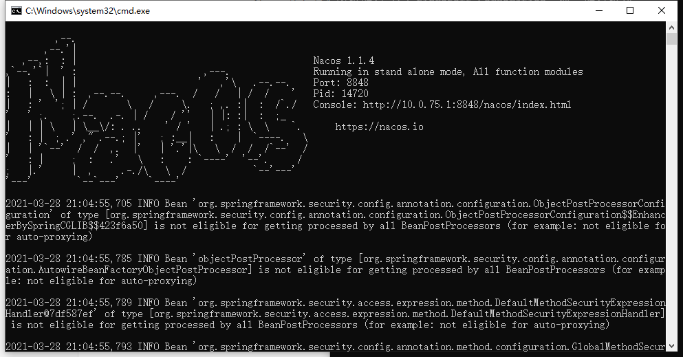

打开 localhost:8848/nacos/index.html 

使用 账号：nacos 密码：nacos 即可登录

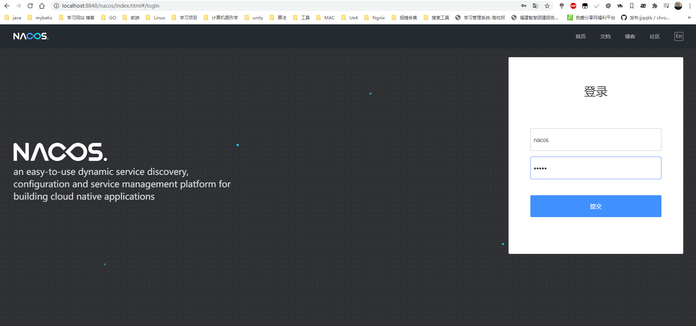

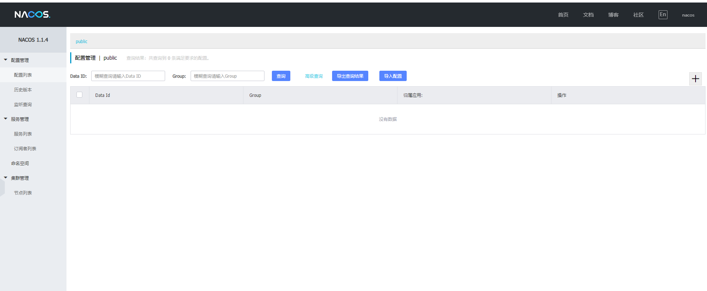


# 服务注册

## 依赖

在service-parent层导入 服务注册 的依赖,这样在该模块底下的子模块都可以用到（version在根模块中定义了版本）这里用的是

`<cloud-alibaba.version>2.1.0.RELEASE</cloud-alibaba.version>`

```xml
<!--    服务注册    -->
<dependency>
            <groupId>com.alibaba.cloud</groupId>
            <artifactId>spring-cloud-starter-alibaba-nacos-discovery</artifactId>
</dependency>
```

## 配置

在要使用nacos的service的application.yaml 中配置 服务发现的配置，这样该服务就可以找到 注册中心 的

```yaml
Spring:
  application:
    name: service-edu
  cloud:
    nacos:
      discovery:
        server-addr: localhost:8848 # nacos 服务地址
```


在要注册的服务的启动类上 添加 Spring Cloud 原生注解 @EnableDiscoveryClient 开启服务注册发现功能

```java
@SpringBootApplication
//这样她就会扫描有引入包的为com.zlf.* 的 组件 比如 common下的service-base的配置他的包前缀也是com.zlf 当他引入时就会扫描到
@ComponentScan(basePackages = {"com.zlf"}) //不加这个只能扫描 EduApplication 所在包以及之下的所有配置
@EnableDiscoveryClient // 这样就有了服务注册的能力了 通过 Spring Cloud 原生注解 @EnableDiscoveryClient 开启服务注册发现功能
public class EduApplication {
    public static void main(String[] args) {
        SpringApplication.run(EduApplication.class,args);
    }
}
```


然后启动该服务，即可载nacos网站上看到该服务了

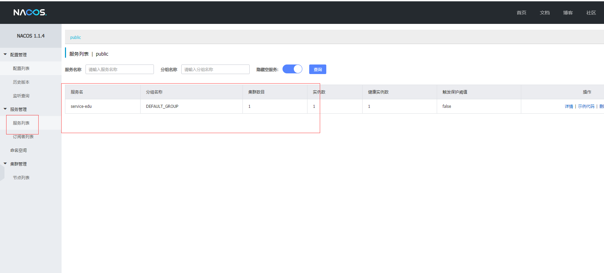

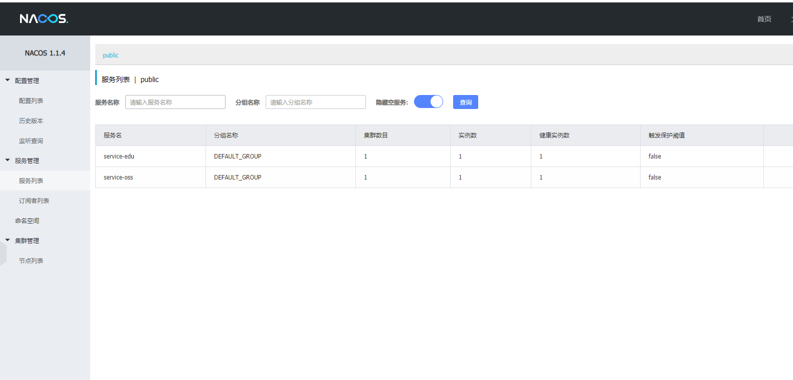

# OpenFeign 服务调用

## 简介

> OpenFeign是一种声明式、模板化的HTTP客户端。在Spring Cloud中使用OpenFeign，可以做到使用HTTP请求访问远程服务，就像调用本地方法一样的，开发者完全感知不到这是在调用远程方法，更感知不到在访问HTTP请求。

依赖

```xml
<!--        服务调用  主要是服务的消费者使用-->
        <dependency>
            <groupId>org.springframework.cloud</groupId>
            <artifactId>spring-cloud-starter-openfeign</artifactId>
        </dependency>
```

## 配置

启动类添加注解 `@EnableFeignClients`(谁用谁添加)

```java
... ...
@EnableFeignClients
public class EduApplication {... ...}
```

## 远程调用

我们需要在消费者中创建一个接口，该接口中定义生产者的Controller方法定义（返回值、参数要一致），并且请求的注解也得一致（请求的路径要全路径）,

并且在接口上要添加 `@FeignClient` 注解并指明调用的生产者服务名称（注册在nacos中的名称）

如下： 这是消费者需要定义的

```java
import com.zlf.commonutils.vo.ResultVo;
import org.springframework.cloud.openfeign.FeignClient;
import org.springframework.web.bind.annotation.GetMapping;

/**
 * Created with IntelliJ IDEA.
 *
 * @Auther: zlf
 * @Date: 2021/03/31/21:13
 * @Description: Oss 提供给edu的远程调用
 */
@FeignClient(name = "service-oss") // nacos 中注册的服务名称
public interface OssFileService {

    @GetMapping("/eduOss/fileOss/test")
    ResultVo test();
}

```


下边的生产者的controller

```java
import com.zlf.commonutils.vo.ResultVo;
import com.zlf.oss.service.OssService;
import io.swagger.annotations.Api;
import io.swagger.annotations.ApiModelProperty;
import io.swagger.annotations.ApiOperation;
import io.swagger.annotations.ApiParam;
import org.springframework.beans.factory.annotation.Autowired;
import org.springframework.web.bind.annotation.*;
import org.springframework.web.multipart.MultipartFile;

import java.io.IOException;

/**
 * Created with IntelliJ IDEA.
 *
 * @Auther: zlf
 * @Date: 2021/03/22/20:16
 * @Description: 阿里云oss  上传文件
 */
@RestController
@RequestMapping("/eduOss/fileOss")
@CrossOrigin
@Api(tags = "oss上传接口")
public class OssController {


    @Autowired
    private OssService ossService;

    /**
    * @Description: 上传头像
    * @Param: [file]
    * @return: com.zlf.commonutils.vo.ResultVo
    * @Author: zlf
    * @Date: 2021/3/22
    */
    @PostMapping("uploadFile")
    @ApiOperation("上传文件")
    public ResultVo uploadOssFile(@ApiParam(name = "file",value = "文件") MultipartFile file) throws IOException {
        //获取上传对象
        String url = null;
        // 在 uploadFileAvatar 中 已经做了异常处理
        url = ossService.uploadFileAvatar(file);
        //  这一步已经在  uploadFileAvatar 完成了
        if(url == null) return ResultVo.error().message("文件上传失败");
        return ResultVo.ok().message("文件上传成功").data("url",url);
    }
	
    // 消费者调用的就是这个接口
    @ApiOperation("测试远程调用接口(提供调用)")
    @GetMapping("test")
    public ResultVo test(){

        return ResultVo.ok().message("测试远程调用");
    }
}

```


消费者调用生产者接口:

```java
import com.baomidou.mybatisplus.extension.plugins.pagination.Page;

import com.zlf.commonutils.vo.ResultVo;
import com.zlf.edu.entity.Teacher;
import com.zlf.edu.entity.vo.TeacherQueryVo;
import com.zlf.edu.fegin.OssFileService;
import com.zlf.edu.service.TeacherService;
import com.zlf.servicebase.exceptionHandler.GlobalException;
import io.swagger.annotations.Api;
import io.swagger.annotations.ApiOperation;
import io.swagger.annotations.ApiParam;
import org.springframework.beans.factory.annotation.Autowired;
import org.springframework.web.bind.annotation.*;


import java.util.List;
import java.util.Map;

/**
 * <p>
 * 讲师 前端控制器
 * </p>
 *
 * @author zlf
 * @since 2021-03-11
 */
@Api(tags = "讲师管理")
@RestController
@RequestMapping("/edu/teacher")
@CrossOrigin
public class TeacherController {


    @Autowired
    private TeacherService teacherService;

    @Autowired
    private OssFileService ossFileService;

   	// ... ...
    
	//  这就是远程调用
    @ApiOperation("远程调用测试")
    @GetMapping("test")
    public ResultVo test(){

        return ossFileService.test();
    }
}
```

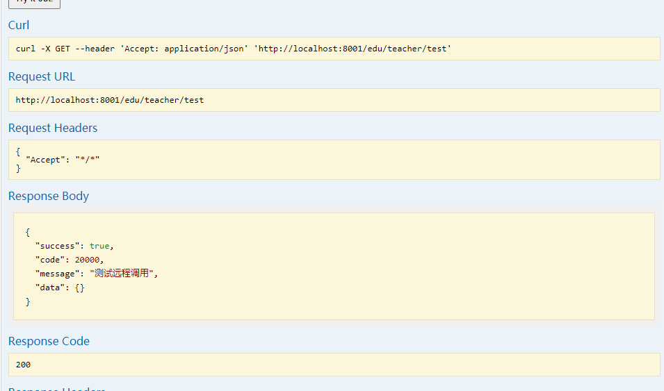

其实我们调用的是 http://localhost:8002/eduOss/fileOss/test 服务，但是用OpenFegin之后，url就变成了 http://localhost:8001/edu/teacher/test


# 负载均衡

我们先多开几个服务


```java
import com.baomidou.mybatisplus.extension.plugins.pagination.Page;

import com.zlf.commonutils.vo.ResultVo;
import com.zlf.edu.entity.Teacher;
import com.zlf.edu.entity.vo.TeacherQueryVo;
import com.zlf.edu.fegin.OssFileService;
import com.zlf.edu.service.TeacherService;
import com.zlf.servicebase.exceptionHandler.GlobalException;
import io.swagger.annotations.Api;
import io.swagger.annotations.ApiOperation;
import io.swagger.annotations.ApiParam;
import org.springframework.beans.factory.annotation.Autowired;
import org.springframework.web.bind.annotation.*;


import java.util.List;
import java.util.Map;

/**
 * <p>
 * 讲师 前端控制器
 * </p>
 *
 * @author zlf
 * @since 2021-03-11
 */
@Api(tags = "讲师管理")
@RestController
@RequestMapping("/edu/teacher")
@CrossOrigin
public class TeacherController {


    @Autowired
    private TeacherService teacherService;

    @Autowired
    private OssFileService ossFileService;

   	// ... ...
    
	//  这就是远程调用
    @ApiOperation("远程调用测试")
    @GetMapping("test")
    public ResultVo test(){

        return ossFileService.test();
    }
}
```

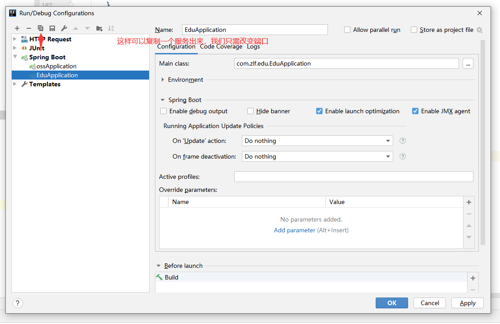


```java
import com.baomidou.mybatisplus.extension.plugins.pagination.Page;

import com.zlf.commonutils.vo.ResultVo;
import com.zlf.edu.entity.Teacher;
import com.zlf.edu.entity.vo.TeacherQueryVo;
import com.zlf.edu.fegin.OssFileService;
import com.zlf.edu.service.TeacherService;
import com.zlf.servicebase.exceptionHandler.GlobalException;
import io.swagger.annotations.Api;
import io.swagger.annotations.ApiOperation;
import io.swagger.annotations.ApiParam;
import org.springframework.beans.factory.annotation.Autowired;
import org.springframework.web.bind.annotation.*;


import java.util.List;
import java.util.Map;

/**
 * <p>
 * 讲师 前端控制器
 * </p>
 *
 * @author zlf
 * @since 2021-03-11
 */
@Api(tags = "讲师管理")
@RestController
@RequestMapping("/edu/teacher")
@CrossOrigin
public class TeacherController {


    @Autowired
    private TeacherService teacherService;

    @Autowired
    private OssFileService ossFileService;

   	// ... ...
    
	//  这就是远程调用
    @ApiOperation("远程调用测试")
    @GetMapping("test")
    public ResultVo test(){

        return ossFileService.test();
    }
}
```

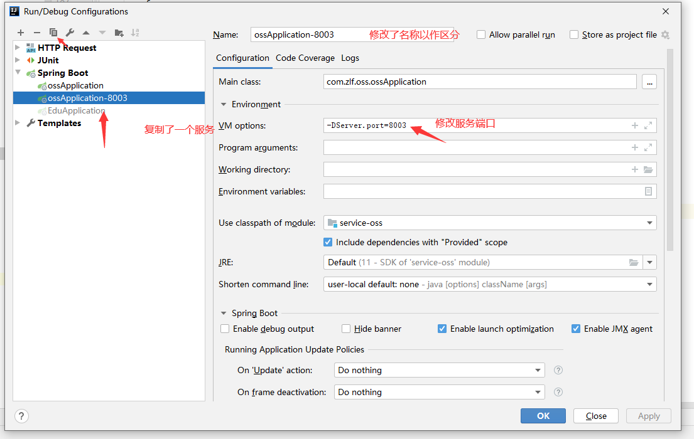


然后我们启动服务。

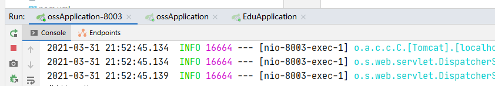

然后在 EduApplication这个消费者中访问 

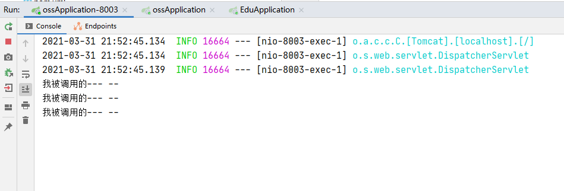

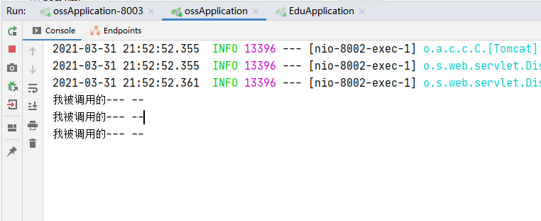

发现 8003 和 8002 是默认按照`轮询策略`来访问的（第一次访问你 第二次访问我，下一次是你，再下次。。）

我们在nacos中也看到两个集群的两个

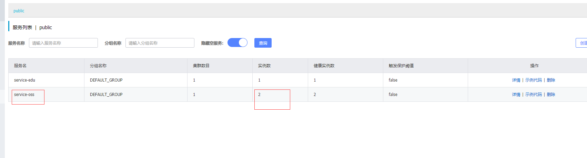