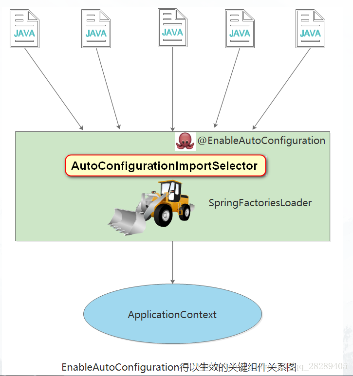

#  Spring Boot 自动装配原理初入

##  pom.xml

*  spring-boot-dependencies.xml:为pom.xml提供的版本控制，所以pom.xml中注入依赖时，不需要写版本号。


##  启动器

* ```xml
  <dependency>
      <groupId>org.springframework.boot</groupId>
      <artifactId>spring-boot-starter</artifactId>
  </dependency>
  ```

*  启动器：说白了就是springboot的启动场景。

  * 比如  

    ```xml
    <dependency>
        <groupId>org.springframework.boot</groupId>
        <artifactId>spring-boot-starter-web</artifactId>
    </dependency>
    ```

    就是 springbootWeb的启动器，她会自动帮助我们导入web环境的所有依赖。

* springboot会将所有的功能场景，都变成一个个的启动器。
* 如果我们需要使用什么功能，自需要在pom.xml加入对应的启动器就好了。
  
  *  [查看对应功能的启动器](https://docs.spring.io/spring-boot/docs/2.3.1.RELEASE/reference/html/using-spring-boot.html#using-boot-starter)


## 主程序

###  @SpringBootApplication

`@SpringBootApplication`该注解标注一个类为springboot的应用: 启动类下的所有资源被导入

```java
@SpringBootApplication
public class HellospringbootApplication {

    public static void main(String[] args) {
        //将springboot应用启动
        SpringApplication.run(HellospringbootApplication.class, args);
    }

}
```

###  @SpringBootApplication 的内部组成

`@SpringBootApplication`是个组合注解

```java
@Target({ElementType.TYPE})
@Retention(RetentionPolicy.RUNTIME)
@Documented
@Inherited
@SpringBootConfiguration
@EnableAutoConfiguration
@ComponentScan(
    excludeFilters = {@Filter(
    type = FilterType.CUSTOM,
    classes = {TypeExcludeFilter.class}
), @Filter(
    type = FilterType.CUSTOM,
    classes = {AutoConfigurationExcludeFilter.class}
)}
)
```

其中`@SpringBootConfiguration、@EnableAutoConfiguration`分别是

####  @SpringBootConfiguration

*  `@SpringBootConfiguration`字面意思是是springboot的配置

  * 内部

    ```java
    @Target({ElementType.TYPE})
    @Retention(RetentionPolicy.RUNTIME)
    @Documented
    @Configuration //说明是spring配置类
    ```

####  @EnableAutoConfiguration



*  `@EnableAutoConfiguration`字面意思就是启动自动配置

  * 内部

    ```java
    @Target({ElementType.TYPE})
    @Retention(RetentionPolicy.RUNTIME)
    @Documented
    @Inherited
    @AutoConfigurationPackage // 自动配置包
    @Import({AutoConfigurationImportSelector.class})//导入 自动配置导入选择器
    ```

    *  `@AutoConfigurationPackage`

      * 内部

        ```java
        @Target({ElementType.TYPE})
        @Retention(RetentionPolicy.RUNTIME)
        @Documented
        @Inherited
        @Import({Registrar.class}) //导入注册器
        ```

        ```java
        static class Registrar implements ImportBeanDefinitionRegistrar, DeterminableImports {
                Registrar() {
                }
        
                public void registerBeanDefinitions(AnnotationMetadata metadata, BeanDefinitionRegistry registry) {
                    AutoConfigurationPackages.register(registry, (String[])(new AutoConfigurationPackages.PackageImports(metadata)).getPackageNames().toArray(new String[0]));
                }
        
                public Set<Object> determineImports(AnnotationMetadata metadata) {
                    return Collections.singleton(new AutoConfigurationPackages.PackageImports(metadata));
                }
            }
        ```

    * `AutoConfigurationImportSelector.class` 自动配置导入选择器(由于类内容过多，少量介绍)

      ```java
      protected AutoConfigurationImportSelector.AutoConfigurationEntry getAutoConfigurationEntry(AnnotationMetadata annotationMetadata) {
              if (!this.isEnabled(annotationMetadata)) {
                  return EMPTY_ENTRY;
              } else {
                  AnnotationAttributes attributes = this.getAttributes(annotationMetadata);
                  //获取候选配置
                  List<String> configurations = this.getCandidateConfigurations(annotationMetadata, attributes);
                  configurations = this.removeDuplicates(configurations);
                  Set<String> exclusions = this.getExclusions(annotationMetadata, attributes);
                  this.checkExcludedClasses(configurations, exclusions);
                  configurations.removeAll(exclusions);
                  configurations = this.getConfigurationClassFilter().filter(configurations);
                  this.fireAutoConfigurationImportEvents(configurations, exclusions);
                  return new AutoConfigurationImportSelector.AutoConfigurationEntry(configurations, exclusions);
              }
          }
      ```

      ```java
      // 获取候选配置
      protected List<String> getCandidateConfigurations(AnnotationMetadata metadata, AnnotationAttributes attributes) {
              List<String> configurations = SpringFactoriesLoader.loadFactoryNames(this.getSpringFactoriesLoaderFactoryClass(), this.getBeanClassLoader());
              Assert.notEmpty(configurations, "No auto configuration classes found in META-INF/spring.factories. If you are using a custom packaging, make sure that file is correct.");
              return configurations;
          }
      ```

      META-INF/spring.factories：自动配置的核心文件

      

      ​	

      **spring.factories**

      

      ```properties
      # Initializers 初始化器
      org.springframework.context.ApplicationContextInitializer=\
      org.springframework.boot.autoconfigure.SharedMetadataReaderFactoryContextInitializer,\
      org.springframework.boot.autoconfigure.logging.ConditionEvaluationReportLoggingListener
      
      # Application Listeners 应用监听器
      org.springframework.context.ApplicationListener=\
      org.springframework.boot.autoconfigure.BackgroundPreinitializer
      
      # Auto Configuration Import Listeners 自动配置导入侦听器
      org.springframework.boot.autoconfigure.AutoConfigurationImportListener=\
      org.springframework.boot.autoconfigure.condition.ConditionEvaluationReportAutoConfigurationImportListener
      
      # Auto Configuration Import Filters 自动配置导入过滤器
      org.springframework.boot.autoconfigure.AutoConfigurationImportFilter=\
      org.springframework.boot.autoconfigure.condition.OnBeanCondition,\
      org.springframework.boot.autoconfigure.condition.OnClassCondition,\
      org.springframework.boot.autoconfigure.condition.OnWebApplicationCondition
      
      # Auto Configure 自动配置
      org.springframework.boot.autoconfigure.EnableAutoConfiguration=\
      org.springframework.boot.autoconfigure.admin.SpringApplicationAdminJmxAutoConfiguration,\
      org.springframework.boot.autoconfigure.aop.AopAutoConfiguration,\
      org.springframework.boot.autoconfigure.amqp.RabbitAutoConfiguration,\
      org.springframework.boot.autoconfigure.batch.BatchAutoConfiguration,\
      org.springframework.boot.autoconfigure.cache.CacheAutoConfiguration,\
      org.springframework.boot.autoconfigure.cassandra.CassandraAutoConfiguration,\
      org.springframework.boot.autoconfigure.context.ConfigurationPropertiesAutoConfiguration,\
      org.springframework.boot.autoconfigure.context.LifecycleAutoConfiguration,\
      org.springframework.boot.autoconfigure.context.MessageSourceAutoConfiguration,\
      org.springframework.boot.autoconfigure.context.PropertyPlaceholderAutoConfiguration,\
      org.springframework.boot.autoconfigure.couchbase.CouchbaseAutoConfiguration,\
      org.springframework.boot.autoconfigure.dao.PersistenceExceptionTranslationAutoConfiguration,\
      org.springframework.boot.autoconfigure.data.cassandra.CassandraDataAutoConfiguration,\
      org.springframework.boot.autoconfigure.data.cassandra.CassandraReactiveDataAutoConfiguration,\
      org.springframework.boot.autoconfigure.data.cassandra.CassandraReactiveRepositoriesAutoConfiguration,\
      org.springframework.boot.autoconfigure.data.cassandra.CassandraRepositoriesAutoConfiguration,\
      org.springframework.boot.autoconfigure.data.couchbase.CouchbaseDataAutoConfiguration,\
      org.springframework.boot.autoconfigure.data.couchbase.CouchbaseReactiveDataAutoConfiguration,\
      org.springframework.boot.autoconfigure.data.couchbase.CouchbaseReactiveRepositoriesAutoConfiguration,\
      org.springframework.boot.autoconfigure.data.couchbase.CouchbaseRepositoriesAutoConfiguration,\
      org.springframework.boot.autoconfigure.data.elasticsearch.ElasticsearchDataAutoConfiguration,\
      org.springframework.boot.autoconfigure.data.elasticsearch.ElasticsearchRepositoriesAutoConfiguration,\
      org.springframework.boot.autoconfigure.data.elasticsearch.ReactiveElasticsearchRepositoriesAutoConfiguration,\
      org.springframework.boot.autoconfigure.data.elasticsearch.ReactiveElasticsearchRestClientAutoConfiguration,\
      org.springframework.boot.autoconfigure.data.jdbc.JdbcRepositoriesAutoConfiguration,\
      org.springframework.boot.autoconfigure.data.jpa.JpaRepositoriesAutoConfiguration,\
      org.springframework.boot.autoconfigure.data.ldap.LdapRepositoriesAutoConfiguration,\
      org.springframework.boot.autoconfigure.data.mongo.MongoDataAutoConfiguration,\
      org.springframework.boot.autoconfigure.data.mongo.MongoReactiveDataAutoConfiguration,\
      org.springframework.boot.autoconfigure.data.mongo.MongoReactiveRepositoriesAutoConfiguration,\
      org.springframework.boot.autoconfigure.data.mongo.MongoRepositoriesAutoConfiguration,\
      org.springframework.boot.autoconfigure.data.neo4j.Neo4jDataAutoConfiguration,\
      org.springframework.boot.autoconfigure.data.neo4j.Neo4jRepositoriesAutoConfiguration,\
      org.springframework.boot.autoconfigure.data.solr.SolrRepositoriesAutoConfiguration,\
      org.springframework.boot.autoconfigure.data.r2dbc.R2dbcDataAutoConfiguration,\
      org.springframework.boot.autoconfigure.data.r2dbc.R2dbcRepositoriesAutoConfiguration,\
      org.springframework.boot.autoconfigure.data.r2dbc.R2dbcTransactionManagerAutoConfiguration,\
      org.springframework.boot.autoconfigure.data.redis.RedisAutoConfiguration,\
      org.springframework.boot.autoconfigure.data.redis.RedisReactiveAutoConfiguration,\
      org.springframework.boot.autoconfigure.data.redis.RedisRepositoriesAutoConfiguration,\
      org.springframework.boot.autoconfigure.data.rest.RepositoryRestMvcAutoConfiguration,\
      org.springframework.boot.autoconfigure.data.web.SpringDataWebAutoConfiguration,\
      org.springframework.boot.autoconfigure.elasticsearch.ElasticsearchRestClientAutoConfiguration,\
      org.springframework.boot.autoconfigure.flyway.FlywayAutoConfiguration,\
      org.springframework.boot.autoconfigure.freemarker.FreeMarkerAutoConfiguration,\
      org.springframework.boot.autoconfigure.groovy.template.GroovyTemplateAutoConfiguration,\
      org.springframework.boot.autoconfigure.gson.GsonAutoConfiguration,\
      org.springframework.boot.autoconfigure.h2.H2ConsoleAutoConfiguration,\
      org.springframework.boot.autoconfigure.hateoas.HypermediaAutoConfiguration,\
      org.springframework.boot.autoconfigure.hazelcast.HazelcastAutoConfiguration,\
      org.springframework.boot.autoconfigure.hazelcast.HazelcastJpaDependencyAutoConfiguration,\
      org.springframework.boot.autoconfigure.http.HttpMessageConvertersAutoConfiguration,\
      org.springframework.boot.autoconfigure.http.codec.CodecsAutoConfiguration,\
      org.springframework.boot.autoconfigure.influx.InfluxDbAutoConfiguration,\
      org.springframework.boot.autoconfigure.info.ProjectInfoAutoConfiguration,\
      org.springframework.boot.autoconfigure.integration.IntegrationAutoConfiguration,\
      org.springframework.boot.autoconfigure.jackson.JacksonAutoConfiguration,\
      org.springframework.boot.autoconfigure.jdbc.DataSourceAutoConfiguration,\
      org.springframework.boot.autoconfigure.jdbc.JdbcTemplateAutoConfiguration,\
      org.springframework.boot.autoconfigure.jdbc.JndiDataSourceAutoConfiguration,\
      org.springframework.boot.autoconfigure.jdbc.XADataSourceAutoConfiguration,\
      org.springframework.boot.autoconfigure.jdbc.DataSourceTransactionManagerAutoConfiguration,\
      org.springframework.boot.autoconfigure.jms.JmsAutoConfiguration,\
      org.springframework.boot.autoconfigure.jmx.JmxAutoConfiguration,\
      org.springframework.boot.autoconfigure.jms.JndiConnectionFactoryAutoConfiguration,\
      org.springframework.boot.autoconfigure.jms.activemq.ActiveMQAutoConfiguration,\
      org.springframework.boot.autoconfigure.jms.artemis.ArtemisAutoConfiguration,\
      org.springframework.boot.autoconfigure.jersey.JerseyAutoConfiguration,\
      org.springframework.boot.autoconfigure.jooq.JooqAutoConfiguration,\
      org.springframework.boot.autoconfigure.jsonb.JsonbAutoConfiguration,\
      org.springframework.boot.autoconfigure.kafka.KafkaAutoConfiguration,\
      org.springframework.boot.autoconfigure.availability.ApplicationAvailabilityAutoConfiguration,\
      org.springframework.boot.autoconfigure.ldap.embedded.EmbeddedLdapAutoConfiguration,\
      org.springframework.boot.autoconfigure.ldap.LdapAutoConfiguration,\
      org.springframework.boot.autoconfigure.liquibase.LiquibaseAutoConfiguration,\
      org.springframework.boot.autoconfigure.mail.MailSenderAutoConfiguration,\
      org.springframework.boot.autoconfigure.mail.MailSenderValidatorAutoConfiguration,\
      org.springframework.boot.autoconfigure.mongo.embedded.EmbeddedMongoAutoConfiguration,\
      org.springframework.boot.autoconfigure.mongo.MongoAutoConfiguration,\
      org.springframework.boot.autoconfigure.mongo.MongoReactiveAutoConfiguration,\
      org.springframework.boot.autoconfigure.mustache.MustacheAutoConfiguration,\
      org.springframework.boot.autoconfigure.orm.jpa.HibernateJpaAutoConfiguration,\
      org.springframework.boot.autoconfigure.quartz.QuartzAutoConfiguration,\
      org.springframework.boot.autoconfigure.r2dbc.R2dbcAutoConfiguration,\
      org.springframework.boot.autoconfigure.rsocket.RSocketMessagingAutoConfiguration,\
      org.springframework.boot.autoconfigure.rsocket.RSocketRequesterAutoConfiguration,\
      org.springframework.boot.autoconfigure.rsocket.RSocketServerAutoConfiguration,\
      org.springframework.boot.autoconfigure.rsocket.RSocketStrategiesAutoConfiguration,\
      org.springframework.boot.autoconfigure.security.servlet.SecurityAutoConfiguration,\
      org.springframework.boot.autoconfigure.security.servlet.UserDetailsServiceAutoConfiguration,\
      org.springframework.boot.autoconfigure.security.servlet.SecurityFilterAutoConfiguration,\
      org.springframework.boot.autoconfigure.security.reactive.ReactiveSecurityAutoConfiguration,\
      org.springframework.boot.autoconfigure.security.reactive.ReactiveUserDetailsServiceAutoConfiguration,\
      org.springframework.boot.autoconfigure.security.rsocket.RSocketSecurityAutoConfiguration,\
      org.springframework.boot.autoconfigure.security.saml2.Saml2RelyingPartyAutoConfiguration,\
      org.springframework.boot.autoconfigure.sendgrid.SendGridAutoConfiguration,\
      org.springframework.boot.autoconfigure.session.SessionAutoConfiguration,\
      org.springframework.boot.autoconfigure.security.oauth2.client.servlet.OAuth2ClientAutoConfiguration,\
      org.springframework.boot.autoconfigure.security.oauth2.client.reactive.ReactiveOAuth2ClientAutoConfiguration,\
      org.springframework.boot.autoconfigure.security.oauth2.resource.servlet.OAuth2ResourceServerAutoConfiguration,\
      org.springframework.boot.autoconfigure.security.oauth2.resource.reactive.ReactiveOAuth2ResourceServerAutoConfiguration,\
      org.springframework.boot.autoconfigure.solr.SolrAutoConfiguration,\
      org.springframework.boot.autoconfigure.task.TaskExecutionAutoConfiguration,\
      org.springframework.boot.autoconfigure.task.TaskSchedulingAutoConfiguration,\
      org.springframework.boot.autoconfigure.thymeleaf.ThymeleafAutoConfiguration,\
      org.springframework.boot.autoconfigure.transaction.TransactionAutoConfiguration,\
      org.springframework.boot.autoconfigure.transaction.jta.JtaAutoConfiguration,\
      org.springframework.boot.autoconfigure.validation.ValidationAutoConfiguration,\
      org.springframework.boot.autoconfigure.web.client.RestTemplateAutoConfiguration,\
      org.springframework.boot.autoconfigure.web.embedded.EmbeddedWebServerFactoryCustomizerAutoConfiguration,\
      org.springframework.boot.autoconfigure.web.reactive.HttpHandlerAutoConfiguration,\
      org.springframework.boot.autoconfigure.web.reactive.ReactiveWebServerFactoryAutoConfiguration,\
      org.springframework.boot.autoconfigure.web.reactive.WebFluxAutoConfiguration,\
      org.springframework.boot.autoconfigure.web.reactive.error.ErrorWebFluxAutoConfiguration,\
      org.springframework.boot.autoconfigure.web.reactive.function.client.ClientHttpConnectorAutoConfiguration,\
      org.springframework.boot.autoconfigure.web.reactive.function.client.WebClientAutoConfiguration,\
      org.springframework.boot.autoconfigure.web.servlet.DispatcherServletAutoConfiguration,\
      org.springframework.boot.autoconfigure.web.servlet.ServletWebServerFactoryAutoConfiguration,\
      org.springframework.boot.autoconfigure.web.servlet.error.ErrorMvcAutoConfiguration,\
      org.springframework.boot.autoconfigure.web.servlet.HttpEncodingAutoConfiguration,\
      org.springframework.boot.autoconfigure.web.servlet.MultipartAutoConfiguration,\
      org.springframework.boot.autoconfigure.web.servlet.WebMvcAutoConfiguration,\
      org.springframework.boot.autoconfigure.websocket.reactive.WebSocketReactiveAutoConfiguration,\
      org.springframework.boot.autoconfigure.websocket.servlet.WebSocketServletAutoConfiguration,\
      org.springframework.boot.autoconfigure.websocket.servlet.WebSocketMessagingAutoConfiguration,\
      org.springframework.boot.autoconfigure.webservices.WebServicesAutoConfiguration,\
      org.springframework.boot.autoconfigure.webservices.client.WebServiceTemplateAutoConfiguration
      
      # Failure analyzers 故障分析仪
      org.springframework.boot.diagnostics.FailureAnalyzer=\
      org.springframework.boot.autoconfigure.diagnostics.analyzer.NoSuchBeanDefinitionFailureAnalyzer,\
      org.springframework.boot.autoconfigure.flyway.FlywayMigrationScriptMissingFailureAnalyzer,\
      org.springframework.boot.autoconfigure.jdbc.DataSourceBeanCreationFailureAnalyzer,\
      org.springframework.boot.autoconfigure.jdbc.HikariDriverConfigurationFailureAnalyzer,\
      org.springframework.boot.autoconfigure.r2dbc.ConnectionFactoryBeanCreationFailureAnalyzer,\
      org.springframework.boot.autoconfigure.session.NonUniqueSessionRepositoryFailureAnalyzer
      
      # Template availability providers 模板可用性提供者
      org.springframework.boot.autoconfigure.template.TemplateAvailabilityProvider=\
      org.springframework.boot.autoconfigure.freemarker.FreeMarkerTemplateAvailabilityProvider,\
      org.springframework.boot.autoconfigure.mustache.MustacheTemplateAvailabilityProvider,\
      org.springframework.boot.autoconfigure.groovy.template.GroovyTemplateAvailabilityProvider,\
      org.springframework.boot.autoconfigure.thymeleaf.ThymeleafTemplateAvailabilityProvider,\
      org.springframework.boot.autoconfigure.web.servlet.JspTemplateAvailabilityProvider
      ```

      SpringFactoriesLoader spring工厂装载器

      ```java
      private static Map<String, List<String>> loadSpringFactories(@Nullable ClassLoader classLoader) {
          MultiValueMap<String, String> result = (MultiValueMap)cache.get(classLoader);
          if (result != null) {
              return result;
          } else {
              try {
                  Enumeration<URL> urls = classLoader != null ? classLoader.getResources("META-INF/spring.factories") : ClassLoader.getSystemResources("META-INF/spring.factories");
                  LinkedMultiValueMap result = new LinkedMultiValueMap();
      
                  while(urls.hasMoreElements()) {
                      URL url = (URL)urls.nextElement();
                      UrlResource resource = new UrlResource(url);
                      Properties properties = PropertiesLoaderUtils.loadProperties(resource);
                      Iterator var6 = properties.entrySet().iterator();
      
                      while(var6.hasNext()) {
                          Entry<?, ?> entry = (Entry)var6.next();
                          String factoryTypeName = ((String)entry.getKey()).trim();
                          String[] var9 = StringUtils.commaDelimitedListToStringArray((String)entry.getValue());
                          int var10 = var9.length;
      
                          for(int var11 = 0; var11 < var10; ++var11) {
                              String factoryImplementationName = var9[var11];
                              result.add(factoryTypeName, factoryImplementationName.trim());
                          }
                      }
                  }
      
                  cache.put(classLoader, result);
                  return result;
              } catch (IOException var13) {
                  throw new IllegalArgumentException("Unable to load factories from location [META-INF/spring.factories]", var13);
              }
          }
      }
      ```

      ```java
      //所有的资源加载到配置类中
      Properties properties = PropertiesLoaderUtils.loadProperties(resource);
      ```

      

##  总结

> @EnableAutoConfiguration作用就是从classpath中搜寻所有的META-INF/spring.factories配置文件，并将其中org.springframework.boot.autoconfigure.EnableAutoConfiguration对应的配置项通过反射（Java Refletion）实例化为对应的标注了@Configuration的JavaConfig形式的IoC容器配置类，然后汇总为一个并加载到IoC容器。这些功能配置类要生效的话，会去classpath中找是否有该类的依赖类（也就是pom.xml必须有对应功能的jar包才行）并且配置类里面注入了默认属性值类，功能类可以引用并赋默认值。生成功能类的原则是自定义优先，没有自定义时才会使用自动装配类。

所有的自动配置和解决方案都在


