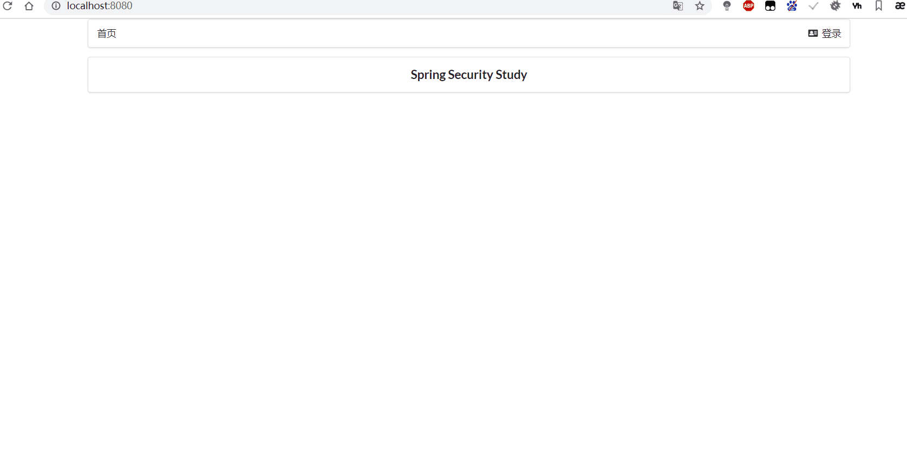

# Spring Security（安全）

## 概念

Spring Security是一个功能强大且高度可定制的身份验证和访问控制框架。它是用于保护基于Spring的应用程序的实际标准。 Spring Security是一个框架，致力于为Java应用程序提供身份验证和授权。与所有Spring项目一样，Spring Security的真正强大之处在于可以轻松扩展以满足自定义要求。

Spring Security 是 Spring 家族中的一个安全管理框架，实际上，在 Spring Boot 出现之前，Spring Security 就已经发展了多年了，但是使用的并不多，安全管理这个领域，一直是 Shiro 的天下。

相对于 Shiro，在 SSM/SSH 中整合 Spring Security 都是比较麻烦的操作，所以，Spring Security 虽然功能比 Shiro 强大，但是使用反而没有 Shiro 多（Shiro 虽然功能没有 Spring Security 多，但是对于大部分项目而言，Shiro 也够用了）。

自从有了 Spring Boot 之后，Spring Boot 对于 Spring Security 提供了 自动化配置方案，可以零配置使用 Spring Security。

因此，一般来说，常见的安全管理技术栈的组合是这样的：

- SSM + Shiro
- Spring Boot/Spring Cloud + Spring Security

**注意，这只是一个推荐的组合而已，如果单纯从技术上来说，无论怎么组合，都是可以运行的。**

记住下面的几个类

* WebSecurityConfigurerAdapter Web安全配置适配器
* AuthenticationManagerBuilder 身份验证管理器生成器
* @EnableWebSecurity：开启WebSecurity模式

Spring Security 的两个主要的目标是“认证”和“授权” （访问控制）

“认证” （Authentication）

”授权“ （Authorization）

这个概念是通用的，而不是只存在Spring Security 中

[官方文档](https://spring.io/projects/spring-security)

## 依赖

```xml
<dependency>
    <groupId>org.springframework.boot</groupId>
    <artifactId>spring-boot-starter-security</artifactId>
</dependency>
```


 ##  授权、注销和认证配置

```java
@Configuration
@EnableWebSecurity
public class  SecurityConfig  extends WebSecurityConfigurerAdapter {

    //链式编程  授权
    @Override
    protected void configure(HttpSecurity http) throws Exception {
        
        // 授权请求 authorizeRequests  什么页面什么人才能访问
        // http.authorizeRequests.antMatchers("/admin/**").hasRole("admin") 该配置要求对每个URL进行身份验证，并将			仅授予“ admin”用户对以/admin /开头的URL的访问权限。
        http.authorizeRequests()
                .antMatchers("/").permitAll()
                .antMatchers("/level1/**").hasRole("vip1")
                .antMatchers("/level2/**").hasRole("vip2")
                .antMatchers("/level3/**").hasRole("vip3");
        
        //没有权限会默认跳到登录页面 /login  如果没有设置登录页面 则默认会生成登录页面
        //loginPage 设置登录页面
        //loginProcessingUrl("/Login") 设置表单处理网址
        //usernameParameter("username") 设置表单绑定的参数  “” 里的值对应表单的name属性值
        //passwordParameter("password") 设置表单绑定的参数  “” 里的值对应表单的name属性值
        		http.formLogin().loginPage("/toLogin")
                    .loginProcessingUrl("/Login") //表单必须是post请求提交
                    .usernameParameter("username")
                    .passwordParameter("password");
        //关闭  CSRF disable() 禁用
        http.csrf().disable();
        //注销的默认url为 /logout  logoutSuccessUrl 设置注销成功跳转页面
        http.logout().logoutSuccessUrl("/");
        //rememberMe() 记住我功能
        //rememberMeParameter("remember") 设置 记住我 单选框绑定的name属性值为 remember
        http.rememberMe().rememberMeParameter("remember");
    }

    //认证
    //在认证中密码需要设置 密码编码器 PasswordEncoder 不然会报错 500
    //
    @Override
    protected void configure(AuthenticationManagerBuilder auth) throws Exception {        
        // inMemoryAuthentication() 在内存身份验证中
        //  withUser 允许将用户添加到正在创建的{@link UserDetailsManager 用户详细信息管理器}中。可以多次调用此方法以添加					多个用户。
        // password 填充密码。此属性是必需的。
        // roles 填充角色
        //  withUser password roles 都在 UserDetailsManagerConfigurer 用户详细信息管理器配置器类中定义的方法
        //passwordEncoder 密码编码器 加密用的 
        auth.inMemoryAuthentication().passwordEncoder(new BCryptPasswordEncoder()).
                withUser("xiuyuandashen").
                password(new BCryptPasswordEncoder().encode("123456")).
                roles("vip2","vip3")
                .and().withUser("root").password(new BCryptPasswordEncoder().encode("123456")).roles("vip1","vip2","vip3");
    }
}
```

上边的配置的具体方法可以在`WebSecurityConfigurerAdapter`或者 `HttpSecurity`查看默认配置步骤

如： 这是 `HttpSecurity`中的一段注释 

```java
/**
	 重写此方法以配置{@link HttpSecurity}。通常，子类不应通过调用super来调用此方法，因为它可能会覆盖其配置。默认配置为：
	 *
	 * 
	 * http.authorizeRequests().anyRequest().authenticated().and().formLogin().and().httpBasic();
	 * 
	 *
	 * @param http the {@link HttpSecurity} to modify
	 * @throws Exception if an error occurs
	 */
	// @formatter:off
	protected void configure(HttpSecurity http) throws Exception {
		logger.debug("Using default configure(HttpSecurity). If subclassed this will potentially override subclass configure(HttpSecurity).");

		http
			.authorizeRequests()
				.anyRequest().authenticated()
				.and()
			.formLogin().and()
			.httpBasic();
	}
```

下面是密码编码器的 的种类


##  Spring Security 整合 Thymeleaf 

使用**Spring Security 整合 Thymeleaf **可以实现不同的权限可以显示不同的页面效果（权限管理登录）。

导入依赖

```xml
<dependency>
    <groupId>org.springframework.boot</groupId>
    <artifactId>spring-boot-starter-thymeleaf</artifactId>
</dependency>
```

```html
<!DOCTYPE html>
<html lang="en" xmlns:th="http://www.thymeleaf.org"
      xmlns:sec="http://www.thymeleaf.org/thymeleaf-extras-springsecurity5"> <!--Spring Security 整合 Thymeleaf 依赖 -->
<head>
    <meta charset="UTF-8">
    <meta name="viewport" content="width=device-width, initial-scale=1, maximum-scale=1">
    <title>首页</title>
    <!--semantic-ui-->
    <link href="https://cdn.bootcss.com/semantic-ui/2.4.1/semantic.min.css" rel="stylesheet">
    <link th:href="@{/css/qinstyle.css}" rel="stylesheet">
</head>
<body>

<!--主容器-->
<div class="ui container">

    <div class="ui segment" id="index-header-nav" th:fragment="nav-menu">
        <div class="ui secondary menu">
            <a class="item"  th:href="@{/index}">首页</a>

            <!--注销 isAuthenticated() 授权(authorize) 判断是否已认证  -->
            <div class="right menu" sec:authorize="!isAuthenticated()">
                <!--未登录-->
                <a class="item" th:href="@{/login}">
                    <i class="address card icon"></i> 登录
                </a>
            </div>
			<!--注销-->
            <div class="right menu" sec:authorize="isAuthenticated()">
                <!--  已登录-->
                <a class="item" th:href="@{/logout}">
                    <i class="address card icon"></i> 注销
                </a>
            </div>
        </div>
    </div>

    <div class="ui segment" style="text-align: center">
        <h3>Spring Security Study</h3>
    </div>

    <div>
        <br>
        <div class="ui three column stackable grid">
            <!--授权(authorize)  hasRole('vip1') 权限角色-->
            <div class="column" sec:authorize="hasRole('vip1')">
                <div class="ui raised segment">
                    <div class="ui">
                        <div class="content">
                            <h5 class="content">Level 1</h5>
                            <hr>
                            <div><a th:href="@{/level1/1}"><i class="bullhorn icon"></i> Level-1-1</a></div>
                            <div><a th:href="@{/level1/2}"><i class="bullhorn icon"></i> Level-1-2</a></div>
                            <div><a th:href="@{/level1/3}"><i class="bullhorn icon"></i> Level-1-3</a></div>
                        </div>
                    </div>
                </div>
            </div>

            <div class="column" sec:authorize="hasRole('vip2')">
                <div class="ui raised segment">
                    <div class="ui">
                        <div class="content">
                            <h5 class="content">Level 2</h5>
                            <hr>
                            <div><a th:href="@{/level2/1}"><i class="bullhorn icon"></i> Level-2-1</a></div>
                            <div><a th:href="@{/level2/2}"><i class="bullhorn icon"></i> Level-2-2</a></div>
                            <div><a th:href="@{/level2/3}"><i class="bullhorn icon"></i> Level-2-3</a></div>
                        </div>
                    </div>
                </div>
            </div>

            <div class="column" sec:authorize="hasRole('vip3')">
                <div class="ui raised segment">
                    <div class="ui">
                        <div class="content">
                            <h5 class="content">Level 3</h5>
                            <hr>
                            <div><a th:href="@{/level3/1}"><i class="bullhorn icon"></i> Level-3-1</a></div>
                            <div><a th:href="@{/level3/2}"><i class="bullhorn icon"></i> Level-3-2</a></div>
                            <div><a th:href="@{/level3/3}"><i class="bullhorn icon"></i> Level-3-3</a></div>
                        </div>
                    </div>
                </div>
            </div>
        </div>
    </div>
    
</div>


<script th:src="@{/js/jquery-3.1.1.min.js}"></script>
<script th:src="@{/js/semantic.min.js}"></script>

</body>
</html>
```

```html
<!DOCTYPE html>
<html lang="en" xmlns:th="http://www.thymeleaf.org">
<head>
    <meta charset="UTF-8">
    <meta name="viewport" content="width=device-width, initial-scale=1, maximum-scale=1">
    <title>登录</title>
    <!--semantic-ui-->
    <link href="https://cdn.bootcss.com/semantic-ui/2.4.1/semantic.min.css" rel="stylesheet">
</head>
<body>

<!--主容器-->
<div class="ui container">

    <div class="ui segment">

        <div style="text-align: center">
            <h1 class="header">登录</h1>
        </div>

        <div class="ui placeholder segment">
            <div class="ui column very relaxed stackable grid">
                <div class="column">
                    <div class="ui form">
                        <!--这边设置的请求路径是 后台Security 授权配置的中的 loginProcessingUrl("/Login")-->
                        <form th:action="@{/Login}" method="post">
                            <div class="field">
                                <label>Username</label>
                                <div class="ui left icon input">
                                    <!--后台Security 授权配置的中的 usernameParameter("username")-->
                                    <input type="text" placeholder="Username" name="username">
                                    <i class="user icon"></i>
                                </div>
                            </div>
                            <div class="field">
                                <label>Password</label>
                                <div class="ui left icon input">
                                    <!--后台Security 授权配置的中的 passwordParameter("password")-->
                                    <input type="password" name="password">
                                    <i class="lock icon"></i>
                                </div>
                            </div>
                            <div class="field">
                                <!--后台Security 授权配置的中的 rememberMeParameter("remember")-->
                                <input type="checkbox" name="remember"> 记住我
                            </div>
                            <input type="submit" class="ui blue submit button"/>
                        </form>
                    </div>
                </div>
            </div>
        </div>

        <div style="text-align: center">
            <div class="ui label">
                </i>注册
            </div>
            <br><br>
            <small>blog.kuangstudy.com</small>
        </div>
        <div class="ui segment" style="text-align: center">
            <h3>Spring Security Study </h3>
        </div>
    </div>


</div>

<script th:src="@{/js/jquery-3.1.1.min.js}"></script>
<script th:src="@{/js/semantic.min.js}"></script>

</body>
</html>
```

后端的授权、注销、认证配置与上一小节一致



