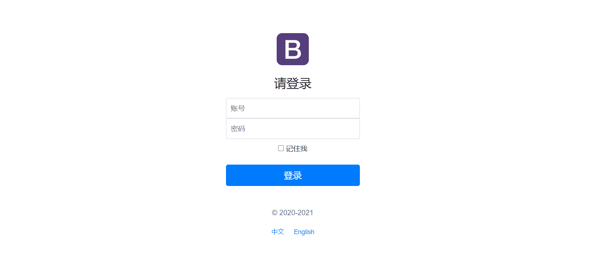
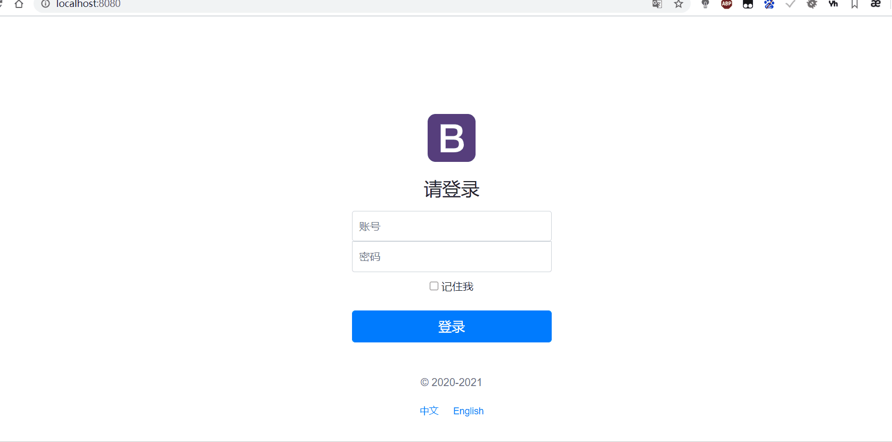

# SpringBoot Web

要解决的问题：

* 导入静态资源
* 首页
* 模板引擎 Thymeleaf
* 装配扩展SpringMVC
* CRUD
* 拦截器
* 国际化

SpringMVC的自动配置类为`WebMvcAutoConfiguration` ，对应的properties类为`WebMvcProperties`

```java
//WebMvcProperties部分代码
//在application配置文件中设置SpringMVC配置的属性在spring.mvc下
@ConfigurationProperties(
    prefix = "spring.mvc"
)
public class WebMvcProperties {
    private org.springframework.validation.DefaultMessageCodesResolver.Format messageCodesResolverFormat;
    private Locale locale;
    private WebMvcProperties.LocaleResolver localeResolver;
    private final WebMvcProperties.Format format;
    private boolean dispatchTraceRequest;
    private boolean dispatchOptionsRequest;
    private boolean ignoreDefaultModelOnRedirect;
    private boolean publishRequestHandledEvents;
    private boolean throwExceptionIfNoHandlerFound;
    private boolean logRequestDetails;
    private boolean logResolvedException;
    private String staticPathPattern;
    private final WebMvcProperties.Async async;
    private final WebMvcProperties.Servlet servlet;
    private final WebMvcProperties.View view;
    private final WebMvcProperties.Contentnegotiation contentnegotiation;
    private final WebMvcProperties.Pathmatch pathmatch;
//... ...
```

 下面这是`WebMvcAutoConfiguration`中的**添加资源处理程序**

```java
public void addResourceHandlers(ResourceHandlerRegistry registry) {
    if (!this.resourceProperties.isAddMappings()) {
        logger.debug("Default resource handling disabled");
    } else {
        Duration cachePeriod = this.resourceProperties.getCache().getPeriod();
        CacheControl cacheControl = this.resourceProperties.getCache().getCachecontrol().toHttpCacheControl();
        //1、第一种获取静态资源的方式 webjars 
        //静态资源查找的路径 意思访问服务器路径/webjars/** 就可以映射访问到 classpath:/META-INF/resources/webjars/ 的			静态资源
        if (!registry.hasMappingForPattern("/webjars/**")) {
            this.customizeResourceHandlerRegistration(registry.addResourceHandler(new String[]{"/webjars/**"}).addResourceLocations(new String[]{"classpath:/META-INF/resources/webjars/"}).setCachePeriod(this.getSeconds(cachePeriod)).setCacheControl(cacheControl));
        }
		//第二种获取静态资源的方式
        String staticPathPattern = this.mvcProperties.getStaticPathPattern();
        if (!registry.hasMappingForPattern(staticPathPattern)) {
            this.customizeResourceHandlerRegistration(registry.addResourceHandler(new String[]{staticPathPattern}).addResourceLocations(WebMvcAutoConfiguration.getResourceLocations(this.resourceProperties.getStaticLocations())).setCachePeriod(this.getSeconds(cachePeriod)).setCacheControl(cacheControl));
        }

    }
}
```

##  静态资源

### 第一种获取静态资源的方式使用webjars统一管理静态资源

[webjars的官网](https://www.webjars.org/)

webjars的优点：

* 将静态资源版本化，更利于升级和维护。
* 剥离静态资源，提高编译速度和打包效率。
* 实现资源共享，有利于统一前端开发。

可以在webjars的官网中引入

例如：

```xml
<dependency>
    <groupId>org.webjars</groupId>
    <artifactId>jquery</artifactId>
    <version>3.5.1</version>
</dependency>
```


访问`http://localhost:8080/webjars/jquery/3.5.1/jquery.js `即可访问到静态资源`jquery.js`


### 第二种获取静态资源的方式

在`WebMvcAutoConfiguration`中的`addResourceHandlers(ResourceHandlerRegistry registry)`方法中

```java
//第二种获取静态资源的方式
        String staticPathPattern = this.mvcProperties.getStaticPathPattern();// staticPathPattern = /**
        if (!registry.hasMappingForPattern(staticPathPattern)) {
            //映射到下边四个资源路径下
            //1、classpath:/META-INF/resources/, 
            //2、classpath:/resources/, 
            //3、classpath:/static/, 
            //4、classpath:/public/
            this.customizeResourceHandlerRegistration(registry.addResourceHandler(new String[]{staticPathPattern}).addResourceLocations(WebMvcAutoConfiguration.getResourceLocations(this.resourceProperties.getStaticLocations())).setCachePeriod(this.getSeconds(cachePeriod)).setCacheControl(cacheControl));
        }
```

而`staticPathPattern `的值默认为`/**`,

```java
//WebMvcProperties的构造函数
public WebMvcProperties() {
        this.localeResolver = WebMvcProperties.LocaleResolver.ACCEPT_HEADER;
        this.format = new WebMvcProperties.Format();
        this.dispatchTraceRequest = false;
        this.dispatchOptionsRequest = true;
        this.ignoreDefaultModelOnRedirect = true;
        this.publishRequestHandledEvents = true;
        this.throwExceptionIfNoHandlerFound = false;
        this.logResolvedException = false;
    	//设置静态资源访问路径
        this.staticPathPattern = "/**";
        this.async = new WebMvcProperties.Async();
        this.servlet = new WebMvcProperties.Servlet();
        this.view = new WebMvcProperties.View();
        this.contentnegotiation = new WebMvcProperties.Contentnegotiation();
        this.pathmatch = new WebMvcProperties.Pathmatch();
    }
```


代表着`http://localhost:8080/**`可以直接访问静态资源，但是访问的却是，以下四个目录下的内容：

这四个目录优先级由高到底依次为

1. `classpath:/META-INF/resources/`
2. `classpath:/resources/`
3. `classpath:/static/`
4. `classpath:/public/`

原因在下面代码中

```java
public class ResourceProperties {
    private static final String[] CLASSPATH_RESOURCE_LOCATIONS = new String[]
    {"classpath:/META-INF/resources/", "classpath:/resources/", "classpath:/static/", "classpath:/public/"};
    private String[] staticLocations;
    private boolean addMappings;
    private final ResourceProperties.Chain chain;
    private final ResourceProperties.Cache cache;

    public ResourceProperties() {
        //静态资源路径
        this.staticLocations = CLASSPATH_RESOURCE_LOCATIONS;
        this.addMappings = true;
        this.chain = new ResourceProperties.Chain();
        this.cache = new ResourceProperties.Cache();
    }
    ... ...
```

###  实践


我们可以修改`staticPathPattern`来实现修改静态资源访问路径

```yaml
spring:
  mvc:
    static-path-pattern: /abc/**
```


### 静态资源总结

在springboot中，我们可以使用以下方式处理静态资源

1. webjars

2. `classpath:/META-INF/resources/`、`classpath:/resources/`、`classpath:/static/`、`classpath:/public/`

   默认映射的访问路径为`localhost:8080/**`

   路径优先级： resources > static > public


## 首页如何定制

在`WebMvcAutoConfiguration`自动配置类中

```java

@Bean //欢迎页的处理映射
public WelcomePageHandlerMapping welcomePageHandlerMapping(ApplicationContext applicationContext, FormattingConversionService mvcConversionService, ResourceUrlProvider mvcResourceUrlProvider) {
            WelcomePageHandlerMapping welcomePageHandlerMapping = new WelcomePageHandlerMapping(new TemplateAvailabilityProviders(applicationContext), applicationContext, this.getWelcomePage(), this.mvcProperties.getStaticPathPattern());
            welcomePageHandlerMapping.setInterceptors(this.getInterceptors(mvcConversionService, mvcResourceUrlProvider));
            welcomePageHandlerMapping.setCorsConfigurations(this.getCorsConfigurations());
            return welcomePageHandlerMapping;
        }
		
        private Optional<Resource> getWelcomePage() {
            
            String[] locations = WebMvcAutoConfiguration.getResourceLocations(this.resourceProperties.getStaticLocations());//去静态资源路径(之前的四个目录)中查找 index.html 
            return Arrays.stream(locations).map(this::getIndexHtml).filter(this::isReadable).findFirst();
        }
		
        private Resource getIndexHtml(String location) {
            //在静态资源路径下查找 index.html
            return this.resourceLoader.getResource(location + "index.html");
        }
```

所以spring会去`classpath:/META-INF/resources/`、`classpath:/resources/`、`classpath:/static/`、`classpath:/public/`下查找`index.html`主页

所以我们只需要在静态资源路径下创建`index.html`即可在`http://localhost:8080/`访问到主页


##  Thymeleaf模板引擎

1. [Thymeleaf官网](https://www.thymeleaf.org/)

```xml
<!-- thtmeleaf 依赖-->
<dependency>
    <groupId>org.springframework.boot</groupId>
    <artifactId>spring-boot-starter-thymeleaf</artifactId>
</dependency>
```

**ThymeleafProperties**的部分代码

```java
package org.springframework.boot.autoconfigure.thymeleaf;

@ConfigurationProperties(
    prefix = "spring.thymeleaf"
)
public class ThymeleafProperties {
    private static final Charset DEFAULT_ENCODING;
    //前缀  类似springMVC中视图解析器的配置
    public static final String DEFAULT_PREFIX = "classpath:/templates/";
    //后缀
    public static final String DEFAULT_SUFFIX = ".html";
    private boolean checkTemplate = true;
    private boolean checkTemplateLocation = true;
    private String prefix = "classpath:/templates/";
    private String suffix = ".html";
    private String mode = "HTML";
    private Charset encoding;
    private boolean cache;
    private Integer templateResolverOrder;
    private String[] viewNames;
    private String[] excludedViewNames;
    private boolean enableSpringElCompiler;
    private boolean renderHiddenMarkersBeforeCheckboxes;
    private boolean enabled;
    private final ThymeleafProperties.Servlet servlet;
    private final ThymeleafProperties.Reactive reactive;

    public ThymeleafProperties() {
        this.encoding = DEFAULT_ENCODING;
        this.cache = true;
        this.renderHiddenMarkersBeforeCheckboxes = false;
        this.enabled = true;
        this.servlet = new ThymeleafProperties.Servlet();
        this.reactive = new ThymeleafProperties.Reactive();
    }
... ...
```

所有在`classpath:/templates/`路径下的html文件都可以Controller中访问！

[Thymeleaf语法文档](https://fanlychie.github.io/post/thymeleaf.html)

###  Thymeleaf语法

所有的html元素都可以被thymeleaf替换接管， th:属性名 :

`<div th:text="${msg}"></div>`

遍历

```html
<!--<h4  th:each="user:${users}" >[[ ${user} ]]</h4>-->
<h4 th:each="user:${users}" th:text="${user}"></h4>
```


##  SpringMvc配置原理

在`WebMvcAutoConfiguration`自动配置类中有个内部类是`WebMvcAutoConfigurationAdapter`是springMvc自动配置适配器

`WebMvcAutoConfigurationAdapter`这个类实现了`WebMvcConfigurer`SpringMvc配置接口。SpringMvc的默认配置就是由`WebMvcAutoConfigurationAdapter`来完成的。

```java
@Configuration(
        proxyBeanMethods = false
    )
    @Import({WebMvcAutoConfiguration.EnableWebMvcConfiguration.class})
    @EnableConfigurationProperties({WebMvcProperties.class, ResourceProperties.class})
    @Order(0)
    public static class WebMvcAutoConfigurationAdapter implements WebMvcConfigurer {
        private static final Log logger = LogFactory.getLog(WebMvcConfigurer.class);
        private final ResourceProperties resourceProperties;
        private final WebMvcProperties mvcProperties;
        private final ListableBeanFactory beanFactory;
        private final ObjectProvider<HttpMessageConverters> messageConvertersProvider;
        private final ObjectProvider<DispatcherServletPath> dispatcherServletPath;
        final WebMvcAutoConfiguration.ResourceHandlerRegistrationCustomizer resourceHandlerRegistrationCustomizer;

        public WebMvcAutoConfigurationAdapter(ResourceProperties resourceProperties, WebMvcProperties mvcProperties, ListableBeanFactory beanFactory, ObjectProvider<HttpMessageConverters> messageConvertersProvider, ObjectProvider<WebMvcAutoConfiguration.ResourceHandlerRegistrationCustomizer> resourceHandlerRegistrationCustomizerProvider, ObjectProvider<DispatcherServletPath> dispatcherServletPath) {
            this.resourceProperties = resourceProperties;
            this.mvcProperties = mvcProperties;
            this.beanFactory = beanFactory;
            this.messageConvertersProvider = messageConvertersProvider;
            this.resourceHandlerRegistrationCustomizer = (WebMvcAutoConfiguration.ResourceHandlerRegistrationCustomizer)resourceHandlerRegistrationCustomizerProvider.getIfAvailable();
            this.dispatcherServletPath = dispatcherServletPath;
        }

        public void configureMessageConverters(List<HttpMessageConverter<?>> converters) {
            this.messageConvertersProvider.ifAvailable((customConverters) -> {
                converters.addAll(customConverters.getConverters());
            });
        }

        public void configureAsyncSupport(AsyncSupportConfigurer configurer) {
            if (this.beanFactory.containsBean("applicationTaskExecutor")) {
                Object taskExecutor = this.beanFactory.getBean("applicationTaskExecutor");
                if (taskExecutor instanceof AsyncTaskExecutor) {
                    configurer.setTaskExecutor((AsyncTaskExecutor)taskExecutor);
                }
            }

            Duration timeout = this.mvcProperties.getAsync().getRequestTimeout();
            if (timeout != null) {
                configurer.setDefaultTimeout(timeout.toMillis());
            }

        }

```


如果我们需要自己设置SpringMvc的配置我们只需要,编写一个配置类重写`WebMvcConfigurer`中的方法即可。

该类有个要求需要`@Configuration`表示一个配置类，并且实现`WebMvcConfigurer`接口。如下图所示，可以重写很多的配置。


```java
/**
 * 定义一个WebMvcConfigurer 的实现类，可以重写SpringMvc的配置
 * 在这个类中 定义的组件，然后将它交给springboot，springboot就会自动装配
 */
@Configuration
public class MyMvcConfig implements WebMvcConfigurer {

    @Bean
    public ViewResolver myViewResolver(){
        return new MyViewResolver();
    }


    //自定义视图解析器
    public static class MyViewResolver implements ViewResolver{

        @Override
        public View resolveViewName(String s, Locale locale) throws Exception {
            return null;
        }
    }
}
```


##  扩展SpringMvc配置

自定义配置类不能添加`@EnableWebMvc`,如果添加了 `@EnableWebMvc`，则`WebMvcAutoConfiguration`springMvc自动配置类将会失效！！原因是`@EnableWebMvc`中导入了`DelegatingWebMvcConfiguration`类，而这个类继承了`WebMvcConfigurationSupport`。

而在`WebMvcAutoConfiguration`的注解中有个注解是`@ConditionalOnMissingBean({WebMvcConfigurationSupport.class})`,

表示不能存在`WebMvcConfigurationSupport`，而自定义配置类如果添加`@EnableWebMvc`，就会导致`WebMvcConfigurationSupport`产生。所以自定义配置类不能添加`@EnableWebMvc`注解。

部分源码如下：

```java
@Retention(RetentionPolicy.RUNTIME)
@Target({ElementType.TYPE})
@Documented
@Import({DelegatingWebMvcConfiguration.class}) //!!!
public @interface EnableWebMvc {
}

```

```java
@Configuration(
    proxyBeanMethods = false
)
public class DelegatingWebMvcConfiguration extends WebMvcConfigurationSupport {//!!!!
```

```java
@Configuration(
    proxyBeanMethods = false
)
@ConditionalOnWebApplication(
    type = Type.SERVLET
)
@ConditionalOnClass({Servlet.class, DispatcherServlet.class, WebMvcConfigurer.class})
@ConditionalOnMissingBean({WebMvcConfigurationSupport.class})///!!!!!
@AutoConfigureOrder(-2147483638)
@AutoConfigureAfter({DispatcherServletAutoConfiguration.class, TaskExecutionAutoConfiguration.class, ValidationAutoConfiguration.class})
public class WebMvcAutoConfiguration {
```

##  Lombok使用

Lombok可以帮助我们生成POJO的getter/setter/toString，异常处理，I/O流的关闭操作等等

```xml
<!--        lombok -->
<dependency>
    <groupId>org.projectlombok</groupId>
    <artifactId>lombok</artifactId>
</dependency>
```

[lombok使用博客](https://www.jianshu.com/p/2543c71a8e45)


## 国际化

###  原理

通过Properties文件配置，配置完后通过Thymeleaf中的`#{}` 来取代原来的静态资源。例如：


```yaml

spring:
  # 关闭模板引擎的缓存
  thymeleaf:
    cache: false
  messages:
    encoding: UTF-8
    ## 配置国际化绑定的文件 不绑定会乱码
    basename: i18n.login

```

#### **语言环境解析器接口**

```java
package org.springframework.web.servlet;

import java.util.Locale;
import javax.servlet.http.HttpServletRequest;
import javax.servlet.http.HttpServletResponse;
import org.springframework.lang.Nullable;

public interface LocaleResolver {
    //解析语言环境
    Locale resolveLocale(HttpServletRequest var1);

    void setLocale(HttpServletRequest var1, @Nullable HttpServletResponse var2, @Nullable Locale var3);
}
```


####  在SpringMvc自动配置类中**语言环境解析器**代码如下

```java

public class WebMvcAutoConfiguration {
    //**语言环境解析器**
    public LocaleResolver localeResolver() {
        if (this.mvcProperties.getLocaleResolver() == org.springframework.boot.autoconfigure.web.servlet.WebMvcProperties.LocaleResolver.FIXED) {
            return new FixedLocaleResolver(this.mvcProperties.getLocale());
        } else { 
            //  AcceptHeaderLocaleResolver 默认的**语言环境解析器**
            AcceptHeaderLocaleResolver localeResolver = new AcceptHeaderLocaleResolver();
            localeResolver.setDefaultLocale(this.mvcProperties.getLocale());
            return localeResolver;
        }
    }
}
```

####  默认使用的**语言环境解析器**

```java
package org.springframework.web.servlet.i18n;

import java.util.ArrayList;
import java.util.Enumeration;
import java.util.Iterator;
import java.util.List;
import java.util.Locale;
import javax.servlet.http.HttpServletRequest;
import javax.servlet.http.HttpServletResponse;
import org.springframework.lang.Nullable;
import org.springframework.util.StringUtils;
import org.springframework.web.servlet.LocaleResolver;

public class AcceptHeaderLocaleResolver implements LocaleResolver {
    private final List<Locale> supportedLocales = new ArrayList(4);
    @Nullable
    private Locale defaultLocale;

    public AcceptHeaderLocaleResolver() {
    }

    public void setSupportedLocales(List<Locale> locales) {
        this.supportedLocales.clear();
        this.supportedLocales.addAll(locales);
    }

    public List<Locale> getSupportedLocales() {
        return this.supportedLocales;
    }

    public void setDefaultLocale(@Nullable Locale defaultLocale) {
        this.defaultLocale = defaultLocale;
    }

    @Nullable
    public Locale getDefaultLocale() {
        return this.defaultLocale;
    }
	//!!!
    public Locale resolveLocale(HttpServletRequest request) {
        Locale defaultLocale = this.getDefaultLocale();
        if (defaultLocale != null && request.getHeader("Accept-Language") == null) {
            return defaultLocale;
        } else {
            Locale requestLocale = request.getLocale();
            List<Locale> supportedLocales = this.getSupportedLocales();
            if (!supportedLocales.isEmpty() && !supportedLocales.contains(requestLocale)) {
                Locale supportedLocale = this.findSupportedLocale(request, supportedLocales);
                if (supportedLocale != null) {
                    return supportedLocale;
                } else {
                    return defaultLocale != null ? defaultLocale : requestLocale;
                }
            } else {
                return requestLocale;
            }
        }
    }

    @Nullable
    private Locale findSupportedLocale(HttpServletRequest request, List<Locale> supportedLocales) {
        Enumeration<Locale> requestLocales = request.getLocales();
        Locale languageMatch = null;

        Locale locale;
        label38:
        do {
            while(requestLocales.hasMoreElements()) {
                locale = (Locale)requestLocales.nextElement();
                if (supportedLocales.contains(locale)) {
                    continue label38;
                }

                if (languageMatch == null) {
                    Iterator var6 = supportedLocales.iterator();

                    while(var6.hasNext()) {
                        Locale candidate = (Locale)var6.next();
                        if (!StringUtils.hasLength(candidate.getCountry()) && candidate.getLanguage().equals(locale.getLanguage())) {
                            languageMatch = candidate;
                            break;
                        }
                    }
                }
            }

            return languageMatch;
        } while(languageMatch != null && !languageMatch.getLanguage().equals(locale.getLanguage()));

        return locale;
    }
	//!!!
    public void setLocale(HttpServletRequest request, @Nullable HttpServletResponse response, @Nullable Locale locale) {
        throw new UnsupportedOperationException("Cannot change HTTP accept header - use a different locale resolution strategy");
    }
}
```

####  自定义语言环境解析器

**我们自定义语言环境解析器，然后在引入到WebMvc配置类中，来替代原有的语言环境解析器。**

我们只需要实现`LocaleResolver`接口即可

```java
/**
 * 自定义 语言环境解析器
 */
public class MyLocaleResolver implements LocaleResolver {
  //解析请求
    @Override
    public Locale resolveLocale(HttpServletRequest httpServletRequest) {
        //获取请求中的语言参数
        Locale locale = null;
        final String language = httpServletRequest.getParameter("Language"); //例如 zh_CN  en_US
        System.out.println("------->"+language);
        if(!StringUtils.isEmpty(language)){ // return target == null || target.length() == 0;
            final String[] s = language.split("_");
            // s[0]:国家 s[1]:地区
            locale = new Locale(s[0],s[1]);
            return locale;
        }
        locale = Locale.getDefault(); // 如果没有请求参数就是默认的
        return locale;
    }

    @Override
    public void setLocale(HttpServletRequest httpServletRequest, HttpServletResponse httpServletResponse, Locale locale) {

    }
}
```

#### 将自定义的语言环境解析器，加入SpringMvc自动配置类中

在自动配置类中需要将自定义的`MyLocaleResolver`类取代`WebMvcAutoConfiguration`中对应的方法

```java
/**
 * 定义一个WebMvcConfigurer 的实现类，可以重写SpringMvc的配置
 * 在这个类中 定义的组件，然后将它交给springboot，springboot就会自动装配
 */
@Configuration
public class MyMvcConfig implements WebMvcConfigurer {

    //自定义国际化组件  重写了 WebMvcAutoConfiguration 类中的  localeResolver 方法 
    @Bean
    public LocaleResolver localeResolver(){
        return new MyLocaleResolver();
    }

}
```

### 效果图展示




##  拦截器

**配置拦截器需要实现`HandlerInterceptor`处理程序拦截器接口。**

```java
package org.springframework.web.servlet;

import javax.servlet.http.HttpServletRequest;
import javax.servlet.http.HttpServletResponse;
import org.springframework.lang.Nullable;

public interface HandlerInterceptor {
    //预先处理
    default boolean preHandle(HttpServletRequest request, HttpServletResponse response, Object handler) throws Exception {
        return true;
    }
	//后期处理
    default void postHandle(HttpServletRequest request, HttpServletResponse response, Object handler, @Nullable ModelAndView modelAndView) throws Exception {
    }
	//完成后
    default void afterCompletion(HttpServletRequest request, HttpServletResponse response, Object handler, @Nullable Exception ex) throws Exception {
    }
}
```

**实现一个登录拦截器**

```java
/**
 * 实现 HandlerInterceptor 处理程序拦截器 接口
 */
public class LoginInterceptor implements HandlerInterceptor {

    //预先处理
    @Override
    public boolean preHandle(HttpServletRequest request, HttpServletResponse response, Object handler) throws Exception {
        final Object user = request.getSession().getAttribute("user");
        if(user == null){
            request.setAttribute("msg","您没有权限，请先登录");
            request.getRequestDispatcher("/").forward(request,response);
            //拦截
            return false;
        }else{
            //放行
            return  true;
        }

    }
}
```

**将拦截器加入SpringMvc配置，并设置该拦截器拦截以及放行的路径**

```java
@Configuration
public class MyMvcConfig implements WebMvcConfigurer {

    //我们写好的拦截器需要在这边添加。
    //添加拦截器
    @Override
    public void addInterceptors(InterceptorRegistry registry) {
        // addPathPatterns 拦截的路径
        // excludePathPatterns 排除拦截的路径
        registry.addInterceptor(new LoginInterceptor()).
            addPathPatterns("/**").
            excludePathPatterns("/index.html", "/", "/index", "/static/**","/login");
    }
}
```

**`addInterceptors`方法是实现`WebMvcConfigurer`接口的方法，该方法是用来添加一个拦截器的。**

下面是`WebMvcConfigurer`SpringMvc配置类接口中的方法

```java
//
// Source code recreated from a .class file by IntelliJ IDEA
// (powered by Fernflower decompiler)
//

package org.springframework.web.servlet.config.annotation;

import java.util.List;
import org.springframework.format.FormatterRegistry;
import org.springframework.http.converter.HttpMessageConverter;
import org.springframework.lang.Nullable;
import org.springframework.validation.MessageCodesResolver;
import org.springframework.validation.Validator;
import org.springframework.web.method.support.HandlerMethodArgumentResolver;
import org.springframework.web.method.support.HandlerMethodReturnValueHandler;
import org.springframework.web.servlet.HandlerExceptionResolver;

public interface WebMvcConfigurer {
    default void configurePathMatch(PathMatchConfigurer configurer) {
    }

    default void configureContentNegotiation(ContentNegotiationConfigurer configurer) {
    }

    default void configureAsyncSupport(AsyncSupportConfigurer configurer) {
    }

    default void configureDefaultServletHandling(DefaultServletHandlerConfigurer configurer) {
    }

    default void addFormatters(FormatterRegistry registry) {
    }
	//添加一个拦截器
    default void addInterceptors(InterceptorRegistry registry) {
    }

    default void addResourceHandlers(ResourceHandlerRegistry registry) {
    }

    default void addCorsMappings(CorsRegistry registry) {
    }

    default void addViewControllers(ViewControllerRegistry registry) {
    }

    default void configureViewResolvers(ViewResolverRegistry registry) {
    }

    default void addArgumentResolvers(List<HandlerMethodArgumentResolver> resolvers) {
    }

    default void addReturnValueHandlers(List<HandlerMethodReturnValueHandler> handlers) {
    }

    default void configureMessageConverters(List<HttpMessageConverter<?>> converters) {
    }

    default void extendMessageConverters(List<HttpMessageConverter<?>> converters) {
    }

    default void configureHandlerExceptionResolvers(List<HandlerExceptionResolver> resolvers) {
    }

    default void extendHandlerExceptionResolvers(List<HandlerExceptionResolver> resolvers) {
    }

    @Nullable
    default Validator getValidator() {
        return null;
    }

    @Nullable
    default MessageCodesResolver getMessageCodesResolver() {
        return null;
    }
}

```

下面是模拟登录，来使用登录拦截器：

```java
@Controller
public class UserController {

    @RequestMapping("/login")
    public String Login(@RequestParam("username") String username ,
                        @RequestParam("password") String password ,
                        HttpServletRequest request ,
                        HttpServletResponse response,
                        Model model){
        if(!StringUtils.isEmpty(username) && "123456".equals(password)){
            request.getSession().setAttribute("user",username);
            return "dashboard";
        }else{
            model.addAttribute("msg","账号或密码错误");
            return "index";
        }

    }
}
```

效果展示





## 报错页面（404

只需要在`templates`目录下新建文件夹`error`,将`404.html`放置其中即可。(500也是如此)。


##  返回Json的处理

给实体类添加相关注解：

@JsonIgnore：指定字段不返回。

@JsonInclude(JsonInclude.Include.NON_NULL) ：空字段不返回

@JsonFormat(pattern = "yyyy-MM-dd HH:mm:ss",timezone = "GMT+8")：设置响应时间格式

###  关于响应时间格式，可以统一在application文件中配置

```yaml
spring:
  jackson:
    date-format: yyyy-MM-dd HH:mm:ss # 对输出时间格式化
    time-zone: GMT+8 # 北京时间相对伦敦有8小时的时差，使用GTM+8，这样才能正常显示时间
    
```

### 设置接收的日期格式

```yaml
spring:
  mvc:
    format:
      date: yyyy-MM-dd  # 设置对输入参数格式化，这样后台就可以接收Date类型
```

