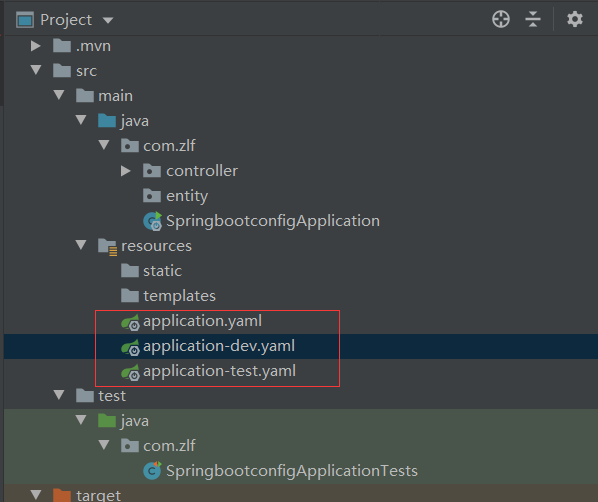

#  SpringBoot配置

##  配置文件及yaml语法

springboot使用一个全局配置文件，配置文件的名称是固定的

* **application.properties**

  * 语法结构：key = value

* **application.yaml**

  * 语法结构：key：空格 value  

    可以使用el表达式，还有占位符

    例如 占位符：`name: ${f:xiuyuandashen}` 但f不存在时，name的默认值为xiuyuandashen，f存在时，则name值为f的值。

    * 例如

      ```yaml
      # yaml 对空格的要求非常高，有很严格的层次关系
      
      # 对象
      server:
        #属性
        port: 1314
      
      #key - value
      key: 89
      
      # 对象
      student:
        name: xiuyuandashen${random.uuid}
        age: 18
      
      # 行内写法
      student2: {name: xiaohong,age: 19}
      
      # 数组
      arr:
        - cat
        - dog
        - pig
      
      # 数组行内写法
      arr2: [cat,dog,pig]
      
      ```

      

**配置文件的作用**：修改springboot自动配置的默认值，因为springboot在底层都给我们默认配置好了。

**yaml**

> **YAML**（/ˈjæməl/，尾音类似*camel*骆驼）是一个可读性高，用来表达数据[序列化](https://baike.baidu.com/item/序列化)的格式。YAML参考了其他多种语言，包括：[C语言](https://baike.baidu.com/item/C语言)、[Python](https://baike.baidu.com/item/Python)、[Perl](https://baike.baidu.com/item/Perl)，并从[XML](https://baike.baidu.com/item/XML)、电子邮件的数据格式（RFC 2822）中获得灵感。Clark Evans在2001年首次发表了这种语言，另外Ingy döt Net与Oren Ben-Kiki也是这语言的共同设计者。当前已经有数种编程语言或脚本语言支持（或者说解析）这种语言。

> *YAML*是"YAML Ain't a Markup Language"（YAML不是一种[标记语言](https://baike.baidu.com/item/标记语言)）的[递归缩写](https://baike.baidu.com/item/递归缩写)。在开发的这种语言时，*YAML* 的意思其实是："Yet Another Markup Language"（仍是一种[标记语言](https://baike.baidu.com/item/标记语言)），但为了强调这种语言以数据做为中心，而不是以标记语言为重点，而用反向缩略语重命名。
>
>  -------百度百科


## 使用**yaml**给实体类赋值

### @ConfigurationProperties

```java
@Target({ElementType.TYPE, ElementType.METHOD})
@Retention(RetentionPolicy.RUNTIME)
@Documented
public @interface ConfigurationProperties {
    @AliasFor("prefix")
    String value() default "";

    @AliasFor("value")
    String prefix() default "";

    boolean ignoreInvalidFields() default false;

    boolean ignoreUnknownFields() default true;
}
```


**@ConfigurationProperties的作用**

* 将配置文件中配置的每一个属性的值，映射到标注了@ConfigurationProperties的**组件**中。
* 告诉springboot将本类中所有的属性和配置文件中相关的配置进行绑定
* 参数`prefix = "xxx"`将配置文件中的xxx与**组件**的所有属性一一对应
* 只有这个组件是spring容器中的组件，才可以使用容器提供的@ConfigurationProperties功能

**.yaml中的属性名要与实体类中的属性名一一对应，且实体类必须有set方法**


例如：

```yaml
person:
  name: 小明
  age: 18
  happy: true
  birth: 2000/10/10
  maps: {m1: v1,m2: v2}
  lists:
    - a
    - v
    - c
    - s
  dog:
    name: 旺财
    age: 3
```

```java
@Component
@ConfigurationProperties(prefix = "person")
public class person {

    private String name;
    private Integer age;
    private Boolean happy;
    private Date birth;
    private Map<String,Object> maps;
    private List<Object> lists;
    private Dog dog;

    public person() {
    }

    public person(String name, Integer age, Boolean happy, Date birth, Map<String, Object> maps, List<Object> lists, Dog dog) {
        this.name = name;
        this.age = age;
        this.happy = happy;
        this.birth = birth;
        this.maps = maps;
        this.lists = lists;
        this.dog = dog;
    }

    @Override
    public String toString() {
        return "person{" +
                "name='" + name + '\'' +
                ", age=" + age +
                ", happy=" + happy +
                ", birth=" + birth +
                ", maps=" + maps +
                ", lists=" + lists +
                ", dog=" + dog +
                '}';
    }

    public String getName() {
        return name;
    }

    public void setName(String name) {
        this.name = name;
    }

    public Integer getAge() {
        return age;
    }

    public void setAge(Integer age) {
        this.age = age;
    }

    public Boolean getHappy() {
        return happy;
    }

    public void setHappy(Boolean happy) {
        this.happy = happy;
    }

    public Date getBirth() {
        return birth;
    }

    public void setBirth(Date birth) {
        this.birth = birth;
    }

    public Map<String, Object> getMaps() {
        return maps;
    }

    public void setMaps(Map<String, Object> maps) {
        this.maps = maps;
    }

    public List<Object> getLists() {
        return lists;
    }

    public void setLists(List<Object> lists) {
        this.lists = lists;
    }

    public Dog getDog() {
        return dog;
    }

    public void setDog(Dog dog) {
        this.dog = dog;
    }
}
```


```java
@SpringBootTest
class SpringbootconfigApplicationTests {

    @Autowired
    private person person;
    @Test
    void contextLoads() {
        System.out.println(person);
        //person{name='小明', 
        //age=18, 
        //happy=true,
        //birth=Tue Oct 10 00:00:00 CST 2000,
        //maps={m1=v1, m2=v2}, 
        //lists=[a, v, c, s], 
        //dog=Dog{name='旺财', age=3}}
    }

}
```

##  @ConfigurationProperties 和 @Value的对比

|                    | @ConfigurationProperties | @Value     |
| ------------------ | ------------------------ | ---------- |
| 功能               | 批量注入配置文件中的属性 | 一个个指定 |
| 松散绑定(松散语法) | 支持                     | 不支持     |
| SpEL               | 不支持                   | 支持       |
| JSR303数据校验     | 支持                     | 不支持     |
| 复杂类型封装       | 支持                     | 不支持     |


## JSR303 校验

```java
@Validated //数据校验
public class person {
	@NotNull
    private String name;
    private Integer age;
    private Boolean happy;
    private Date birth;
    private Map<String,Object> maps;
    private List<Object> lists;
    private Dog dog;

    public person() {
    }
    ...
```

### 表 1. Bean Validation 中内置的 constraint

| **Constraint**                | **详细信息**                                             |
| :---------------------------- | :------------------------------------------------------- |
| `@Null`                       | 被注释的元素必须为 `null`                                |
| `@NotNull`                    | 被注释的元素必须不为 `null`                              |
| `@AssertTrue`                 | 被注释的元素必须为 `true`                                |
| `@AssertFalse`                | 被注释的元素必须为 `false`                               |
| `@Min(value)`                 | 被注释的元素必须是一个数字，其值必须大于等于指定的最小值 |
| `@Max(value)`                 | 被注释的元素必须是一个数字，其值必须小于等于指定的最大值 |
| `@DecimalMin(value)`          | 被注释的元素必须是一个数字，其值必须大于等于指定的最小值 |
| `@DecimalMax(value)`          | 被注释的元素必须是一个数字，其值必须小于等于指定的最大值 |
| `@Size(max, min)`             | 被注释的元素的大小必须在指定的范围内                     |
| `@Digits (integer, fraction)` | 被注释的元素必须是一个数字，其值必须在可接受的范围内     |
| `@Past`                       | 被注释的元素必须是一个过去的日期                         |
| `@Future`                     | 被注释的元素必须是一个将来的日期                         |
| `@Pattern(value)`             | 被注释的元素必须符合指定的正则表达式                     |

###  表 2. Hibernate Validator 附加的 constraint

| **Constraint** | **详细信息**                           |
| :------------- | :------------------------------------- |
| `@Email`       | 被注释的元素必须是电子邮箱地址         |
| `@Length`      | 被注释的字符串的大小必须在指定的范围内 |
| `@NotEmpty`    | 被注释的字符串的必须非空               |
| `@Range`       | 被注释的元素必须在合适的范围内         |

## spring配置文件位置的优先级

当`application.yaml`的位置不同时，优先级也是不同的。

`application.yaml`可以放在四个位置，按优先级从高到底是：

1. 项目路径：./config/
2. 项目路径：./
3. classpath：/config/
4. classpath：/

默认创建的`application.yaml`配置文件位于`classpath：/`下是优先级最低的！


## spring多环境配置

当我们有多个`application-xxx.yaml`配置文件时，spring会默认执行的是`application.yaml`，当我们需要不同的配置环境时，我们需要选择激活哪一个配置文件。

```yaml
#springboot的多环境配置，可以选择激活哪一个配置文件
server:
  port: 1314
spring:
  profiles:
    active: dev #激活的配置文件是application-dev.yaml
```

例如：




```yaml
#application
#springboot的多环境配置，可以选择激活哪一个配置文件
server:
  port: 1314
spring:
  profiles:
    active: dev

# application-test
server:
  port: 8080


# application-dev
server:
  port: 8081

```

由于在`application.yaml`中设置了选择激活的配置文件为`dev` 所有，这时spring加载的配置文件为`application-dev.yaml`

不难发现，这样写配置文件会写很多个，这个时候`.yaml`的优势就开了，`.yaml`可以使用多文档模块，来取代多个配置文件。

###  yaml的多文档模块

yaml文档可以使用`---`来分割多文档

```yaml
server:
  port: 1314
spring:
  profiles:
    active: dev
---
server:
  port: 8081
## 设置该模块的名字
spring:
  profiles: dev

---
server:
  port: 8082
## 设置该模块的名字
spring:
  profiles: test
```

这时启动springboot项目，服务器端口号为8081

