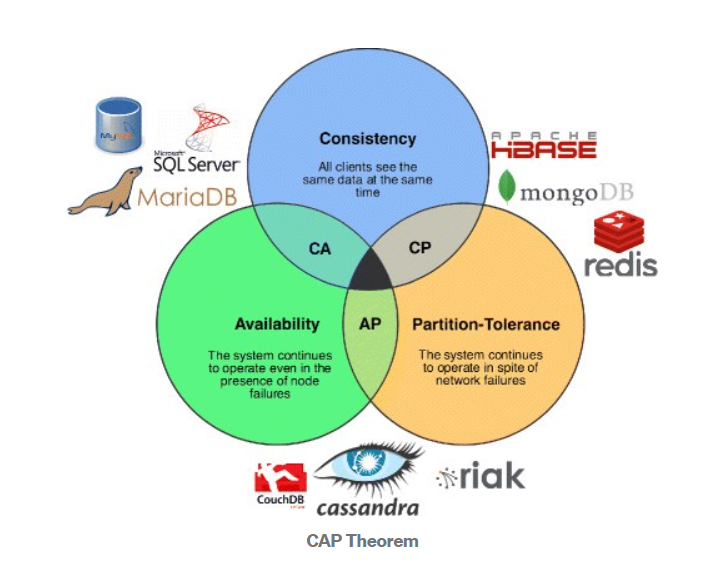

# 什么是CAP

CAP理论：一个分布式系统最多只能同时满足`一致性（Consistency）`、`可用性（Availability）`和`分区容错性（Partition tolerance）`这三项中的**两项**。

# CAP的定义

## 一致性（Consistency）

> 所有节点在同一时间的数据完全一致，一致性说的就是分布式数据一致性。

- 强一致性：对于关系型数据库，要求更新过的数据能被后续的访问都能看到
- 弱一致性：容忍后续的部分或者全部访问不到
- 最终一致性：如果经过一段时间后要求能访问到更新后的数据

在CAP中，不可能同时满足的一致性就是就是 强一致性。

**核心思想：**即使无法做到强一致性（Strong consistency），但每个应用都可以根据自身的业务特点，采用适当的方式来使系统达到最终一致性（Eventual consistency）。

## 可用性 （Availability）

> 在集群中一部分节点故障后，集群整体是否还能响应客户端的读写请求。

对于一个可用性的分布式系统，每一个非故障的节点必须对每一个请求作出响应。所以，一般我们在衡量一个系统的可用性的时候，都是通过停机时间来计算的。

##  分区容错性（Partition tolerance）

> 分区容错性指分布式系统在遇到某节点或网络分区故障的时候，仍然能够对外提供满足一致性和可用性的服务。

分区容错性和扩展性紧密相关。在分布式应用中，可能因为一些分布式的原因导致系统无法正常运转。好的分区容错性要求能够使应用虽然是一个分布式系统，而看上去却好像是在一个可以运转正常的整体。比如现在的分布式系统中有某一个或者几个机器宕掉了，其他剩下的机器还能够正常运转满足系统需求，或者是机器之间有网络异常，将分布式系统分隔未独立的几个部分，各个部分还能维持分布式系统的运作，这样就具有好的分区容错性。简单点说，就是**在网络中断，消息丢失的情况下，系统如果还能正常工作，就是有比较好的分区容错性**。

## CAP权衡

通过CAP理论及前面的证明，我们知道无法同时满足一致性、可用性和分区容错性这三个特性，那要舍弃哪个呢？我们分三种情况来阐述一下。

- CA without P

这种情况在分布式系统中几乎是不存在的。首先在分布式环境下，网络分区是一个自然的事实。因为分区是必然的，所以如果舍弃P，意味着要舍弃分布式系统。那也就没有必要再讨论CAP理论了。这也是为什么在前面的CAP证明中，我们以系统满足P为前提论述了无法同时满足C和A。
比如我们熟知的关系型数据库，如My Sql和Oracle就是保证了可用性和数据一致性，但是他并不是个分布式系统。一旦关系型数据库要考虑主备同步、集群部署等就必须要把P也考虑进来。对于一个分布式系统来说。P是一个基本要求，CAP三者中，只能在CA两者之间做权衡，并且要想尽办法提升P。

- CP without A

如果一个分布式系统不要求强的可用性，即容许系统停机或者长时间无响应的话，就可以在CAP三者中保障CP而舍弃A。一个保证了CP而一个舍弃了A的分布式系统，一旦发生网络故障或者消息丢失等情况，就要牺牲用户的体验，等待所有数据全部一致了之后再让用户访问系统。设计成CP的系统其实也不少，其中最典型的就是很多分布式数据库，他们都是设计成CP的。在发生极端情况时，优先保证数据的强一致性，代价就是舍弃系统的可用性。如Redis、HBase等，还有分布式系统中常用的Zookeeper也是在CAP三者之中选择优先保证CP的。
无论是像Redis、HBase这种分布式存储系统，还是像Zookeeper这种分布式协调组件。数据的一致性是他们最最基本的要求。一个连数据一致性都保证不了的分布式存储要他有何用？ZooKeeper是个CP（一致性+分区容错性）的，即任何时刻对ZooKeeper的访问请求能得到一致的数据结果，同时系统对网络分割具备容错性。但是它不能保证每次服务请求的可用性，也就是在极端环境下，ZooKeeper可能会丢弃一些请求，消费者程序需要重新请求才能获得结果。ZooKeeper是分布式协调服务，它的职责是保证数据在其管辖下的所有服务之间保持同步、一致。所以就不难理解为什么ZooKeeper被设计成CP而不是AP特性的了。

- AP wihtout C

要高可用并允许分区，则需放弃一致性。一旦网络问题发生，节点之间可能会失去联系。为了保证高可用，需要在用户访问时可以马上得到返回，则每个节点只能用本地数据提供服务，而这样会导致全局数据的不一致性。
这种舍弃强一致性而保证系统的分区容错性和可用性的场景和案例非常多。前面我们介绍可用性的时候说到过，很多系统在可用性方面会做很多事情来保证系统的全年可用性可以达到N个9，所以，对于很多业务系统来说，比如淘宝的购物，或者网上火车购票。都是在可用性和一致性之间舍弃了一致性而选择可用性。你在12306买票的时候肯定遇到过这种场景，当你购买的时候提示你是有票的（但是可能实际已经没票了），你也正常的去输入验证码，下单了。但是过了一会系统提示你下单失败，余票不足。这其实就是先在可用性方面保证系统可以正常的服务，然后在数据的一致性方面做了些牺牲，会影响一些用户体验，但是也不至于造成用户流程的严重阻塞。
但是，我们说很多网站牺牲了一致性，选择了可用性，这其实也不准确的。就比如上面的买票的例子，其实舍弃的只是强一致性。退而求其次保证了最终一致性。也就是说，虽然下单的瞬间，关于车票的库存可能存在数据不一致的情况，但是过了一段时间，还是要保证最终一致性的。
对于多数大型互联网应用的场景，主机众多、部署分散，而且现在的集群规模越来越大，所以节点故障、网络故障是常态，而且要保证服务可用性达到N个9，即保证P和A，舍弃C（退而求其次保证最终一致性）。虽然某些地方会影响客户体验，但没达到造成用户流程的严重程度。