# 什么是分布式事务

分布式事务，就是指不是在单个服务或者单个数据库架构下，产生的事务：

- 跨数据源的分布式事务
- 跨服务的分布式事务
- 综合情况


## 1）跨数据库

随着业务数据规模的快速发展，数据量越来越大，单库单表逐渐成为瓶颈。所以我们对数据库进行了**水平拆分**（比如按照日期拆分、固定分片hash算法等），将原单库单表拆分成数据库分片，于是产生了跨数据库事务的问题。

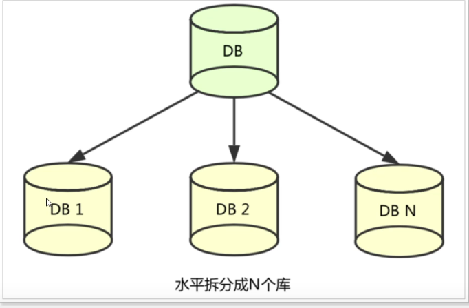


## 2）跨服务

将单业务进行**垂直拆分**，拆分成多个业务系统，降低了各系统间的耦合度，使不同的业务系统专注于自生的业务，更利于业务的发展和系统容量的伸缩。

下面这张图就是综合的，跨了数据库也跨了服务。

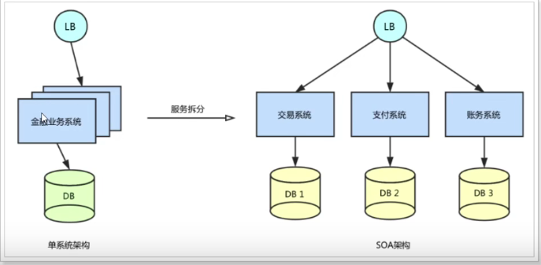


## 3）综合情况


下面的操作需要跨越三个不同的微服务和三个不同的数据库

- 创建新订单
- 扣减商品库存
- 从用户账户余额扣除金额

当出现部分业务操作成功，部分业务操作失败时，业务数据就会出现不一致

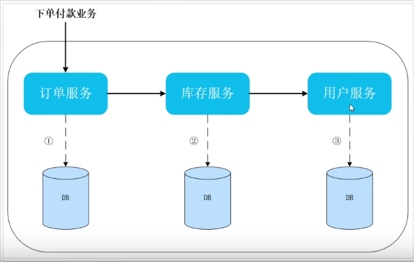


# 解决分布式事务的思路


## CAP定理

查看其他博客

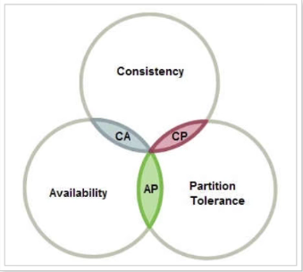

分区容错性（不同地区的服务网络不畅通等）是无法避免的，所以只能在一致性（Consistency）和可用性（Availability）中选取一个与分区容错性搭配

强一致性会导致失去高可用性 CP

高可用会失去强一致性 AP

## BASE 理论

BASE是三个单词的缩写

- **Basically Available （基本可用，（等一段时间可用））**
- Soft state （软状态）
- **Eventually consistent （最终一致性，（等一段时间一致））**

用来解决CAP 一致性和可用性矛盾的问题，我们解决分布式问题就是依据该理论


**基于 CAP 和 BASE 两种思想**，延伸出很多的分布式事务解决方案：

- **XA**
- **TCC**
- **可靠消息最终一致**
- **AT**

## 分阶段提交

分布式事务的解决手段之一，就是两阶段提交协议  （2PC: Two-Phase Commit）

[2PC和3PC原理](https://www.cnblogs.com/qdhxhz/p/11167025.html)


### DTP 模型

1994年，  X/Open DTP(X/Open Distributed Transaction Processing Reference Model) 是X/Open 这个组织定义的一套分布式事务的标准，也就是了定义了规范和API接口，由厂商进行具体的实现

该 模型包含一下几个角色

- **应用程序（AP）：我们的微服务**
- **事务管理器（TM）：全局事务管理者**
- **资源管理器 （RM）：一般是数据库**
- **通信资源管理器（CRM）：是TM和RM的通信中间件**

在这个模型中，一个分布式事务（全局事务）可以被拆分成许多个本地事务，运行在不同的AP和RM上。每个本地事务的ACID很好实现，但是**全局事务必须保证其中包含的每一个本地事务都能同时成功**，**若有一个本地事务失败，则所有其他事务都必须回滚。**但问题是，本地事务处理过程中，并不知道其他事务的运行状态。**因此，就需要CRM来通知各个本地事务，同步事务执行的状态**。

#### XA

因此，各个本地事务的通信必须有一个统一的标准，否则不同的数据库间就无法通信。**XA就是X/Open  DTP 中通信中间件与TM间联系的接口规范，定义了用于通知事务开始、提交、终止、回滚等接口，各个数据库厂商都必须实现这些接口。**


### 两阶段提交（2PC）

两阶段提交又称**2PC**,2PC是一个非常经典的`强一致、中心化的原子提交协议`。

这里所说的中心化是指协议中有两类节点：一个是中心化`协调者节点`（coordinator）和`N个参与者节点`（partcipant）。

`两个阶段`：第一阶段：**投票阶段** 和第二阶段：**提交/执行阶段**。

`举例` **订单服务A**，需要调用 **支付服务B** 去支付，支付成功则处理购物订单为待发货状态，否则就需要将购物订单处理为失败状态。

那么看2PC阶段是如何处理的

#### 1、第一阶段：投票阶段

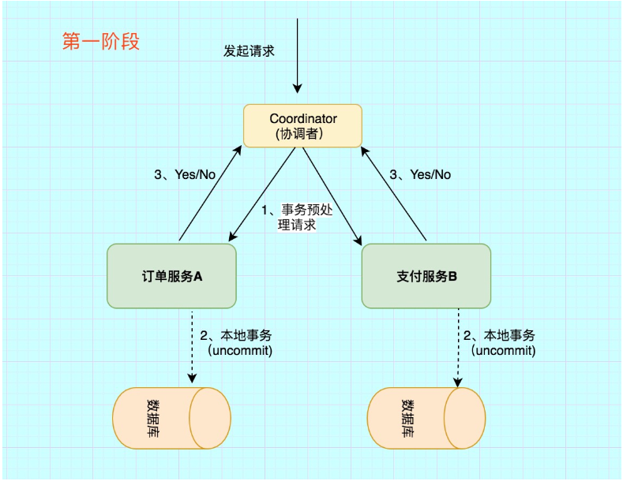

第一阶段主要分为3步

1）`事务询问`

**协调者** 向所有的 **参与者** 发送**事务预处理请求**，称之为**Prepare**，并开始等待各 **参与者** 的响应。

2）`执行本地事务`

各个 **参与者** 节点执行本地事务操作,但在执行完成后并**不会真正提交数据库本地事务**，而是先向 **协调者** 报告说：“我这边可以处理了/我这边不能处理”。.

3）`各参与者向协调者反馈事务询问的响应`

如果 **参与者** 成功执行了事务操作,那么就反馈给协调者 **Yes** 响应,表示事务可以执行,如果没有 **参与者** 成功执行事务,那么就反馈给协调者 **No** 响应,表示事务不可以执行。

第一阶段执行完后，会有两种可能。1、所有都返回Yes. 2、有一个或者多个返回No。

#### 2、第二阶段：提交/执行阶段（成功流程）

`成功条件`：所有参与者都返回Yes。

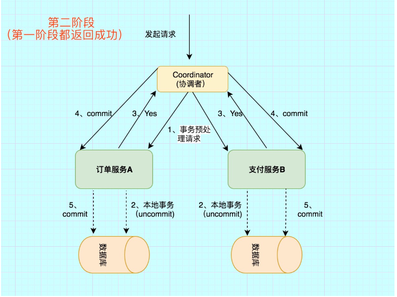

第二阶段主要分为两步

 1)`所有的参与者反馈给协调者的信息都是Yes,那么就会执行事务提交`

 **协调者** 向 **所有参与者** 节点发出Commit请求.

 2)`事务提交`

 **参与者** 收到Commit请求之后,就会正式执行本地事务Commit操作,并在完成提交之后释放整个事务执行期间占用的事务资源。

#### 3、第二阶段：提交/执行阶段（异常流程）

`异常条件`：任何一个 **参与者** 向 **协调者** 反馈了 **No** 响应,或者等待超时之后,协调者尚未收到所有参与者的反馈响应。

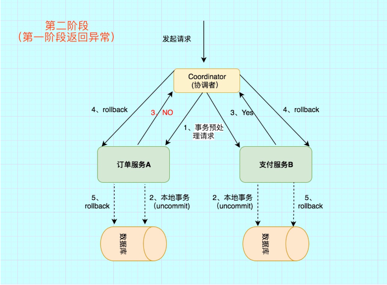

异常流程第二阶段也分为两步

1)`发送回滚请求`

 **协调者** 向所有参与者节点发出 **RoollBack** 请求.

 2)`事务回滚`

 **参与者** 接收到RoollBack请求后,会回滚本地事务。

#### 4、2PC缺点

通过上面的演示，很容易想到2pc所带来的缺陷

1）`性能问题`

无论是在第一阶段的过程中,还是在第二阶段,**所有的参与者资源和协调者资源都是被锁住的**,只有当所有节点准备完毕，事务 **协调者** 才会通知进行全局提交，

**参与者** 进行本地事务提交后才会释放资源。这样的**过程会比较漫长，对性能影响比较大**。

2）`单节点故障`

由于**协调者**的重要性，一旦 **协调者** 发生故障。**参与者** 会一直阻塞下去。尤其在第二阶段，**协调者** 发生故障，那么所有的 **参与者** 还都处于锁定事务资源的状态中，而无法继续完成事务操作。（虽然协调者挂掉，可以重新选举一个协调者，但是无法解决因为协调者宕机导致的参与者处于阻塞状态的问题）

**2PC出现单点问题的三种情况**

(1)`协调者正常,参与者宕机`

 由于 **协调者** 无法收集到所有 **参与者** 的反馈，会陷入阻塞情况。

 **解决方案**:引入超时机制,如果协调者在超过指定的时间还没有收到参与者的反馈,事务就失败,向所有节点发送终止事务请求。

(2)`协调者宕机,参与者正常`

 无论处于哪个阶段，由于**协调者宕机**，无法发送提交请求，所有处于执行了操作但是未提交状态的参与者都会陷入阻塞情况.

 **解决方案**:引入协调者备份,同时协调者需记录操作日志.当检测到协调者宕机一段时间后，协调者备份取代协调者，并读取操作日志，向所有参与者询问状态。

(3)`协调者和参与者都宕机`

1. **发生在第一阶段**： 因为第一阶段，所有参与者都没有真正执行commit，所以只需重新在剩余的参与者中重新选出一个协调者，新的协调者在重新执行第一阶段和第二阶段就可以了。

2)**发生在第二阶段 并且 挂了的参与者在挂掉之前没有收到协调者的指令**。也就是上面的第4步挂了，这是可能协调者还没有发送第4步就挂了。这种情形下，新的协调者重新执行第一阶段和第二阶段操作。

3)**发生在第二阶段 并且 有部分参与者已经执行完commit操作**。就好比这里订单服务A和支付服务B都收到**协调者** 发送的commit信息，开始真正执行本地事务commit,但突发情况，Acommit成功，B确挂了。这个时候目前来讲数据是不一致的。虽然这个时候可以再通过手段让他和协调者通信，再想办法把数据搞成一致的，但是，这段时间内他的数据状态已经是不一致的了！ 2PC 无法解决这个问题。

### 三阶段提交(3PC)

三阶段提交协议（3PC）主要是为了解决两阶段提交协议的阻塞问题，2pc存在的问题是当协作者崩溃时，参与者不能做出最后的选择。因此参与者可能在协作者恢复之前保持阻塞。三阶段提交（Three-phase commit），是二阶段提交（2PC）的改进版本。

与两阶段提交不同的是，三阶段提交有两个改动点。

```
1、 引入超时机制。同时在协调者和参与者中都引入超时机制。
2、在第一阶段和第二阶段中插入一个准备阶段。保证了在最后提交阶段之前各参与节点的状态是一致的。
```

也就是说，除了引入超时机制之外，**3PC把2PC的准备阶段再次一分为二**，这样三阶段提交就有`CanCommit`、`PreCommit`、`DoCommit`三个阶段。

#### 1、CanCommit阶段

之前2PC的一阶段是本地事务执行结束后，最后不Commit,等其它服务都执行结束并返回Yes，由协调者发生commit才真正执行commit。而这里的CanCommit指的是 **尝试获取数据库锁** 如果可以，就返回Yes。

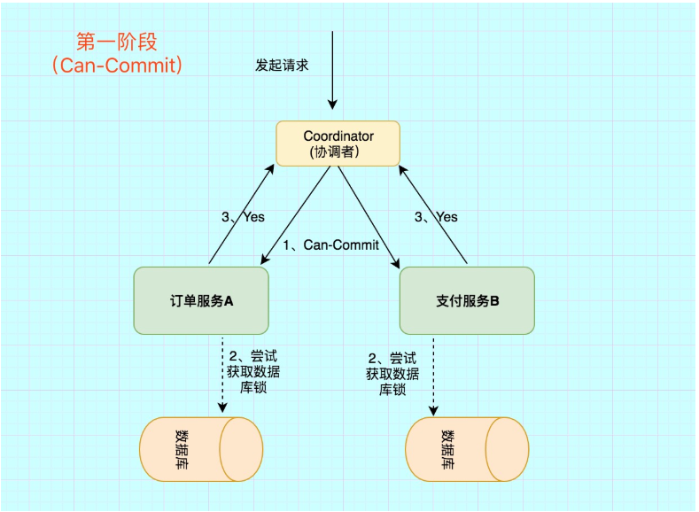

这阶段主要分为2步

`事务询问` **协调者** 向 **参与者** 发送CanCommit请求。询问是否可以执行事务提交操作。然后开始等待 **参与者** 的响应。
`响应反馈` **参与者** 接到CanCommit请求之后，正常情况下，如果其自身认为可以顺利执行事务，则返回Yes响应，并进入预备状态。否则反馈No

#### 2、PreCommit阶段

在阶段一中，如果所有的参与者都返回Yes的话，那么就会进入PreCommit阶段进行事务预提交。这里的**PreCommit阶段** 跟上面的第一阶段是差不多的，只不过这里 **协调者和参与者都引入了超时机制** （2PC中只有协调者可以超时，参与者没有超时机制）。

#### 3、DoCommit阶段

这里跟2pc的阶段二是差不多的。

```
总结
```

相比较2PC而言，3PC对于协调者（**Coordinator**）和参与者（**Partcipant**）都设置了超时时间，而2PC只有协调者才拥有超时机制。这解决了一个什么问题呢？

这个优化点，主要是避免了参与者在长时间无法与协调者节点通讯（协调者挂掉了）的情况下，无法释放资源的问题，因为参与者自身拥有超时机制会在超时后，

自动进行本地commit从而进行释放资源。而这种机制也侧面降低了整个事务的阻塞时间和范围。

另外，通过**CanCommit、PreCommit、DoCommit**三个阶段的设计，相较于2PC而言，多设置了一个**缓冲阶段**保证了在最后提交阶段之前各参与节点的状态是一致的。

以上就是3PC相对于2PC的一个提高（相对缓解了2PC中的前两个问题），但是3PC依然没有完全解决数据不一致的问题。


## TCC

TCC模式可以解决2PC中资源锁定和阻塞的问题，减少资源锁定的时间。

#### 基本原理


它本质是一种**补偿**的思路。事务运行过程包括三个方法，

- Try：资源的检测和预留；
- Confirm：执行的业务操作提交；要求Try成功 Confirm 一定要能成功；
- Cancel： 预留资源释放；


执行分两个阶段：

- 准备阶段（Try）：资源的检测和预留
- 执行阶段（Confirm/Cancel）：根据上一步的结果，判断下面的执行方法。如果上一步中所有事务参与者都成功，则这里执行Confirm。反之，执行Cancel。

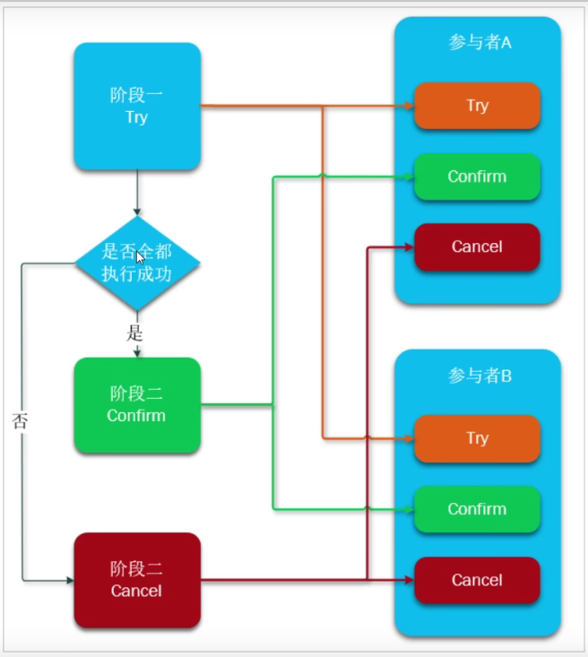

比如前面的订单、库存、支付的流程，Try阶段就是库存预留（冻结），账户金额预留（冻结）的操作等，这些流程都成功了进入Confirm阶段进行提交（事务提交，真正做到减库存和减钱），否则就Cancel 回滚，将前面做的所有操作复原。

注意：

- Try、Confirm、Cancel 都是**独立的事务**，不受其他参与者的影响（直接commit），不会阻塞等待其他人（和2PC不一样，2PC是要等协调者收到所有通知才会进入下一步）

- Try、Confirm、Cancel 由程序员在业务层编写，锁粒度由代码控制。


#### 实例


假设账户A原来余额100元，需要余额扣除30元。如图：

每个阶段执行完就会直接commit

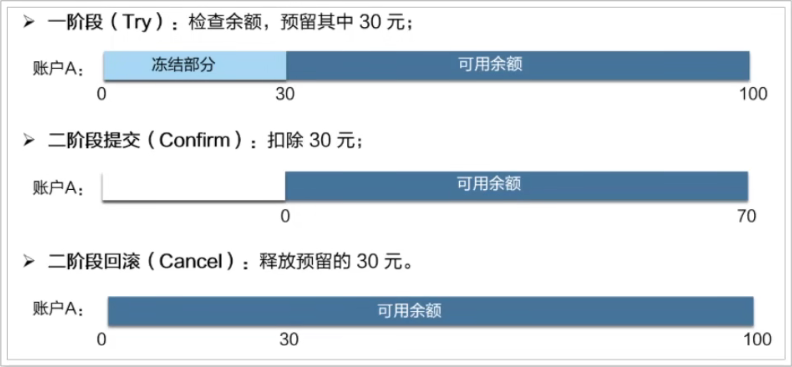


- 一阶段（Try）：余额检查，并冻结用户部分金额，此阶段执行完毕，事务已经提交
  -  检查用户余额是否充足，如果充足，冻结部分余额。
  - 在账户表中添加冻结金额字段，值为30，余额不变。

- 二阶段
  - 提交（Confirm）：真正的扣款，把冻结金额从余额中扣除，冻结金额清空
    - 修改冻结金额为0，修改金额为100-30 = 70元
  - 补偿（Cancel）：释放之前冻结的金额，并非回滚
    - 余额不变，修改账户冻结金额为0

#### 优势和缺点

- 优势

  TCC执行的每个阶段都会提交本地事务并释放锁，并不需要等待其他事务的执行结果。而如果其他事务执行失败，最后不是回滚，而是执行补偿操作。这样就避免了资源的长期锁定和阻塞等待，执行效率比较高，属于性能比较好的分布式事务方式。

- 缺点

  - 代码侵入：需要人为的编写代码实现Try、Confirm、Cancel ，代码入侵较多
  - 开发成本高：一个业务需要拆分成三个布置，分别编写业务实现，业务编写比较复杂
  - 安全性考虑：cancel动作如果执行失败，资源就无法释放，需要引入重试机制，而重试可能导致重复执行，还要考虑重试时的幂等性问题。

#### 使用场景

- 对事务有一定的一致性要求（最终一致性）
- 对性能要求比较高
- 开发人员具备较高的编码能力和幂等性处理经验

## 可靠消息服务

这种实现方式的思路，其实就是来源于ebay，其基本的设计思想就是将远程分布式事务拆分成一系列的本地事务。

### 基本原理

一般分为事务的发起者A和事务的其他参与者B：

- 事务发起者A执行本地事务
- 事务发起者B通过MQ将需要执行的事务信息发送给事务参与者B
- 事务参与者B接收到消息后执行本地事务

如图

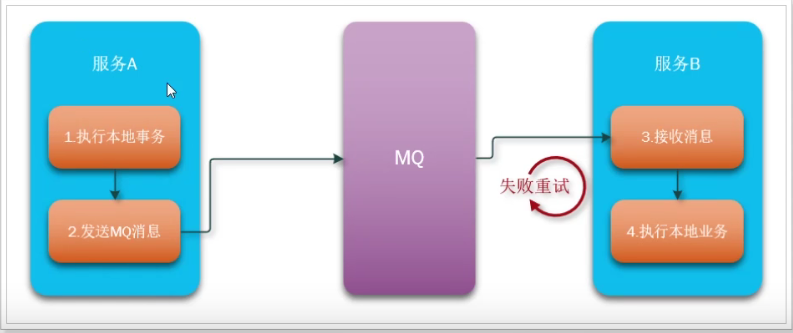

这个也是保证最终一致性，只要MQ中的消息还在，就可以一直重试，直到成功。但是从业务不能导致主业务的回滚。


### 本地消息表

为了避免消息发送失败或者丢失，我们可以把消息持久化到数据库中。实现时有简化版本和解耦合版本两种消息、