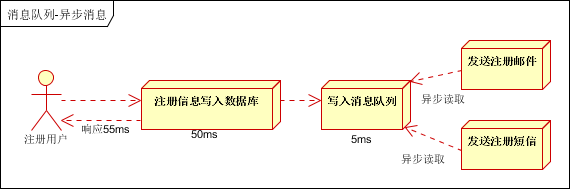

# 什么是消息队列

## 消息队列

- 消息队列----用于存储消息的组件
- 程序员可以将消息放入消息队列，也可以从消息队列里获取消息
- 很多时候消息队列不是一个永久性的存储，是作为临时存储存在的（设定一个期限：设置消息在MQ中保存的10天）
- 消息队列中间件：消息队列的组件，例如：Kafka、Active MQ、RabbitMQ、RocketMQ、ZeroMQ 等

# 消息队列的应用场景

## 异步处理

场景说明：用户注册后，需要发注册邮件和注册短信。传统的做法有两种 1.串行的方式；2.并行方式

（1）串行方式：将注册信息写入[数据库](http://lib.csdn.net/base/mysql)成功后，发送注册邮件，再发送注册短信。以上三个任务全部完成后，返回给客户端

 

（2）并行方式：将注册信息写入数据库成功后，发送注册邮件的同时，发送注册短信。以上三个任务完成后，返回给客户端。与串行的差别是，并行的方式可以提高处理的时间

假设三个业务节点每个使用50毫秒钟，不考虑网络等其他开销，则串行方式的时间是150毫秒，并行的时间可能是100毫秒。

因为CPU在单位时间内处理的请求数是一定的，假设CPU1秒内吞吐量是100次。则串行方式1秒内CPU可处理的请求量是7次（1000/150）。并行方式处理的请求量是10次（1000/100）

> 小结：如以上案例描述，传统的方式系统的性能（并发量，吞吐量，响应时间）会有瓶颈。如何解决这个问题呢？

引入消息队列，将不是必须的业务逻辑，异步处理。改造后的架构如下：

 

按照以上约定，用户的响应时间相当于是注册信息写入数据库的时间，也就是50毫秒。注册邮件，发送短信写入消息队列后，直接返回，因此写入消息队列的速度很快，基本可以忽略，因此用户的响应时间可能是50毫秒。因此架构改变后，系统的吞吐量提高到每秒20 QPS。比串行提高了3倍，比并行提高了两倍

## 系统解耦

场景说明：用户下单后，订单系统需要通知库存系统。传统的做法是，订单系统调用库存系统的接口。如下图

传统模式的缺点：

- 假如库存系统无法访问，则订单减库存将失败，从而导致订单失败
- 订单系统与库存系统耦合

> 如何解决以上问题呢？引入应用消息队列后的方案，如下图：

- 订单系统：用户下单后，订单系统完成持久化处理，将消息写入消息队列，返回用户订单下单成功
- 库存系统：订阅下单的消息，采用拉/推的方式，获取下单信息，库存系统根据下单信息，进行库存操作
- 假如：在下单时库存系统不能正常使用。也不影响正常下单，因为下单后，订单系统写入消息队列就不再关心其他的后续操作了。实现订单系统与库存系统的应用解耦

## 流量削峰

流量削锋也是消息队列中的常用场景，一般在秒杀或团抢活动中使用广泛

应用场景：秒杀活动，一般会因为流量过大，导致流量暴增，应用挂掉。为解决这个问题，一般需要在应用前端加入消息队列。

- 可以控制活动的人数
- 可以缓解短时间内高流量压垮应用

## 日志处理

大型电商网站（淘宝、京东、国美、苏宁... ...）、App（抖音、美团、滴滴）等需要分析用户行为，要根据用户的访问行为来发现用户的喜好以及活跃情况，需要在页面上收集大量的用户访问信息。

# 生产者、消费者模型

# 消息队列的两种模式

## 点对点模式

消息发送者生产消息发送的消息队列中，然后消息接收者从消息队列中取出并且消费消息。消息被消费后，消息队列中不再存储，所以消息接收者不可能消费的已经被消费的消息。

点对点模式特点：

- 每个消息只有一个接收者（Cosumer）（即一旦被消费，消息就不再在消息队列中）
- 发送者和接收者之间没有依赖性，发送者发送消息后，不管有没有接收者在运行，都不会影响到发送者下次发送消息。
- 接收者在成功接受消息之后需要向队列应答成功，以便于消息队列删除当前接收的消息。

## 发布订阅模式

发布/订阅模式特点：

- 每个消息可以有多个订阅者
- 发布者和订阅者之间有时间上的依赖性。针对某个主题（Topic）的订阅者，它必须创建一个订阅者之后，才能消费发布者的消息。
- 为了消费消息，订阅者需要提前订阅该角色主题，并保持在线运行。

# kafka简介

