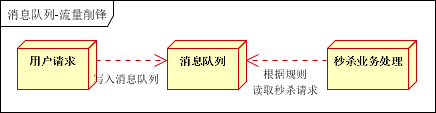

# 什么是消息队列

## 消息队列

- 消息队列----用于存储消息的组件
- 程序员可以将消息放入消息队列，也可以从消息队列里获取消息
- 很多时候消息队列不是一个永久性的存储，是作为临时存储存在的（设定一个期限：设置消息在MQ中保存的10天）
- 消息队列中间件：消息队列的组件，例如：Kafka、Active MQ、RabbitMQ、RocketMQ、ZeroMQ 等


# 消息队列的应用场景

## 异步处理

场景说明：用户注册后，需要发注册邮件和注册短信。传统的做法有两种 1.串行的方式；2.并行方式

（1）串行方式：将注册信息写入[数据库](http://lib.csdn.net/base/mysql)成功后，发送注册邮件，再发送注册短信。以上三个任务全部完成后，返回给客户端

 

（2）并行方式：将注册信息写入数据库成功后，发送注册邮件的同时，发送注册短信。以上三个任务完成后，返回给客户端。与串行的差别是，并行的方式可以提高处理的时间


假设三个业务节点每个使用50毫秒钟，不考虑网络等其他开销，则串行方式的时间是150毫秒，并行的时间可能是100毫秒。

因为CPU在单位时间内处理的请求数是一定的，假设CPU1秒内吞吐量是100次。则串行方式1秒内CPU可处理的请求量是7次（1000/150）。并行方式处理的请求量是10次（1000/100）

> 小结：如以上案例描述，传统的方式系统的性能（并发量，吞吐量，响应时间）会有瓶颈。如何解决这个问题呢？

引入消息队列，将不是必须的业务逻辑，异步处理。改造后的架构如下：

 

按照以上约定，用户的响应时间相当于是注册信息写入数据库的时间，也就是50毫秒。注册邮件，发送短信写入消息队列后，直接返回，因此写入消息队列的速度很快，基本可以忽略，因此用户的响应时间可能是50毫秒。因此架构改变后，系统的吞吐量提高到每秒20 QPS。比串行提高了3倍，比并行提高了两倍

## 系统解耦

场景说明：用户下单后，订单系统需要通知库存系统。传统的做法是，订单系统调用库存系统的接口。如下图


传统模式的缺点：

- 假如库存系统无法访问，则订单减库存将失败，从而导致订单失败
- 订单系统与库存系统耦合

> 如何解决以上问题呢？引入应用消息队列后的方案，如下图：


- 订单系统：用户下单后，订单系统完成持久化处理，将消息写入消息队列，返回用户订单下单成功
- 库存系统：订阅下单的消息，采用拉/推的方式，获取下单信息，库存系统根据下单信息，进行库存操作
- 假如：在下单时库存系统不能正常使用。也不影响正常下单，因为下单后，订单系统写入消息队列就不再关心其他的后续操作了。实现订单系统与库存系统的应用解耦

## 流量削峰

流量削锋也是消息队列中的常用场景，一般在秒杀或团抢活动中使用广泛

应用场景：秒杀活动，一般会因为流量过大，导致流量暴增，应用挂掉。为解决这个问题，一般需要在应用前端加入消息队列。

- 可以控制活动的人数
- 可以缓解短时间内高流量压垮应用



## 日志处理


大型电商网站（淘宝、京东、国美、苏宁... ...）、App（抖音、美团、滴滴）等需要分析用户行为，要根据用户的访问行为来发现用户的喜好以及活跃情况，需要在页面上收集大量的用户访问信息。


# 生产者、消费者模型


# 消息队列的两种模式

## 点对点模式


消息发送者生产消息发送的消息队列中，然后消息接收者从消息队列中取出并且消费消息。消息被消费后，消息队列中不再存储，所以消息接收者不可能消费的已经被消费的消息。

点对点模式特点：

- 每个消息只有一个接收者（Cosumer）（即一旦被消费，消息就不再在消息队列中）
- 发送者和接收者之间没有依赖性，发送者发送消息后，不管有没有接收者在运行，都不会影响到发送者下次发送消息。
- 接收者在成功接受消息之后需要向队列应答成功，以便于消息队列删除当前接收的消息。

## 发布订阅模式


发布/订阅模式特点：

- 每个消息可以有多个订阅者
- 发布者和订阅者之间有时间上的依赖性。针对某个主题（Topic）的订阅者，它必须创建一个订阅者之后，才能消费发布者的消息。
- 为了消费消息，订阅者需要提前订阅该角色主题，并保持在线运行。


# kafka简介

## 简介                 

Kafka是最初由Linkedin公司开发，是一个分布式、分区的、多副本的、多订阅者，基于zookeeper协调的分布式日志系统（也可以当做MQ系统），常见可以用于web/nginx日志、访问日志，消息服务等等，Linkedin于2010年贡献给了Apache基金会并成为顶级开源项目。

主要应用场景是：日志收集系统和消息系统。

Kafka主要设计目标如下：

- 以时间复杂度为O(1)的方式提供消息持久化能力，即使对TB级以上数据也能保证常数时间的访问性能。
- 高吞吐率。即使在非常廉价的商用机器上也能做到单机支持每秒100K条消息的传输。
- 支持Kafka Server间的消息分区，及分布式消费，同时保证每个partition内的消息顺序传输。
- 同时支持离线数据处理和实时数据处理。
- Scale out:支持在线水平扩展

重点关键三个关键词

- Publish and subscribe：发布与订阅
- Store：存储
- Process：处理

## Kafka的应用场景

我们通常将 Apache Kafka用在两类程序：

- 建立实时数据管道，以可靠地在系统或应用程序之间获取数据

- 构建实时流应用程序，以转换或响应数据流

  

  上图，我们可以看到

  1、Producers ：可以有很多的应用程序，将消息数据放入到kafka集群中。

  2、Consumers ：可以有很多的应用程序，对消息数据从kafka集群中拉取出来。

  3、Connectors ：Kafka的连接器可以将数据库中的数据导入到kafka，也可以将kafka的数据导入到数据库中。

  4、Stream Processors ： 流处理器可以从kafka中拉取数据，也可以将数据写入到kafka。

  

## kafka的优势

​	**高吞吐量、低延迟：**kafka每秒可以处理几十万条消息，它的延迟最低只有几毫秒；

​    **可扩展性：**kafka集群支持热扩展；

​    **持久性、可靠性：**消息被持久化到本地磁盘，并且支持数据备份防止数据丢失；

​    **容错性：**允许集群中节点故障（若副本数量为n,则允许n-1个节点故障）；

​    **高并发：**支持数千个客户端同时读写。


## kafka基础架构


1. **Producer** ： 消息生产者，就是向 Kafka ；
2. **Consumer** ： 消息消费者，向 Kafka broker 取消息的客户端；
3. **Consumer Group （CG）**： 消费者组，由多个 consumer 组成。 消费者组内每个消费者负责消费不同分区的数据，一个分区只能由一个组内消费者消费；消费者组之间互不影响。 所有的消费者都属于某个消费者组，即消费者组是逻辑上的一个订阅者。
4. **Broker** ：经纪人 一台 Kafka 服务器就是一个 broker。一个集群由多个 broker 组成。一个 broker可以容纳多个 topic。
5. **Topic** ： 话题，可以理解为一个队列， 生产者和消费者面向的都是一个 topic；
6. **Partition**： 为了实现扩展性，一个非常大的 topic 可以分布到多个 broker（即服务器）上，一个 topic 可以分为多个 partition，每个 partition 是一个有序的队列；
7. **Replica**： 副本（Replication），为保证集群中的某个节点发生故障时， 该节点上的 partition 数据不丢失，且 Kafka仍然能够继续工作， Kafka 提供了副本机制，一个 topic 的每个分区都有若干个副本，一个 leader 和若干个 follower。
8. **Leader**： 每个分区多个副本的“主”，生产者发送数据的对象，以及消费者消费数据的对象都是 leader。
9. **Follower**： 每个分区多个副本中的“从”，实时从 leader 中同步数据，保持和 leader 数据的同步。 leader 发生故障时，某个 Follower 会成为新的 leader。

# kafka安装和集群

## 安装

首先去官网下载安装包

http://kafka.apache.org/downloads

这边我们用的是2.4.1的

由于kafka是需要zookeeper的支持，所以在此之前需要自行安装zookeeper。

## 配置zookeeper 集群

首先启动三台虚拟机，并且关闭防火墙

`systemctl stop firewalld.service`

分别配置三台虚拟机的zookeeper的conf目录下的zoo.cfg

```bash
# The number of milliseconds of each tick
tickTime=2000
# The number of ticks that the initial 
# synchronization phase can take
initLimit=10
# The number of ticks that can pass between 
# sending a request and getting an acknowledgement
syncLimit=5
# the directory where the snapshot is stored.
# do not use /tmp for storage, /tmp here is just 
# example sakes.
dataDir=/tmp/zookeeper
# the port at which the clients will connect
clientPort=2181
# the maximum number of client connections.
# increase this if you need to handle more clients
#maxClientCnxns=60
#
# Be sure to read the maintenance section of the 
# administrator guide before turning on autopurge.
#
# http://zookeeper.apache.org/doc/current/zookeeperAdmin.html#sc_maintenance
#
# The number of snapshots to retain in dataDir
#autopurge.snapRetainCount=3
# Purge task interval in hours
# Set to "0" to disable auto purge feature
#autopurge.purgeInterval=1

## Metrics Providers
#
# https://prometheus.io Metrics Exporter
#metricsProvider.className=org.apache.zookeeper.metrics.prometheus.PrometheusMetricsProvider
#metricsProvider.httpPort=7000
#metricsProvider.exportJvmInfo=true
# 重点 三个虚拟机的配置都是一样的 server.id = ip:服务端内部通信的端口（默认2888）A:选举端口（默认是3888） #B 
server.1=192.168.118.131:2888:3888
server.2=192.168.118.130:2888:3888
server.3=192.168.118.129:2888:3888

```

然后在 dataDir 所在的目录中创建 myid文件

内容就是 id ，id就是配置文件中对应的server.id

比如：


启动zookeeper ，并查看状态


## 配置kafka集群


在centos 中 解压该安装包，在config中进行配置。

配置 server.properties 

集群节点1

```bash
# kafka 节点id 要唯一的
broker.id=0
# kafka数据存放的地址
log.dirs=/usr/local/java/kafka_2.13-2.4.1/data
```

集群节点2

```bash
# kafka 节点id 要唯一的
broker.id=1
# kafka数据存放的地址
log.dirs=/usr/local/java/kafka_2.13-2.4.1/data
```

集群节点3

```bash
# kafka 节点id 要唯一的
broker.id=2
# kafka数据存放的地址
log.dirs=/usr/local/java/kafka_2.13-2.4.1/data
```

注意:

日志目录下的 meta.properties 中的 broker.id 要与 配置文件的一致，否则启动会报错。


配置kafka环境变量

在 /etc/profile 中

```bash
KAFKA_HOME=/usr/local/java/kafka_2.13-2.4.1
export JAVA_HOME HADOOP_HOME ARM_LINUX_GCC_HOME KAFKA_HOME  PATH
```

`source /etc/profile` 重新读取执行一下

启动kafka

先启动zookeeper

`./zkServer.sh start` 

在启动 kafka

`nohup bin/kafka-server-start.sh config/server.properties &`

使用jps查看


测试kafka集群是否启动成功(没报错就是成功)


# kafka基础操作

## 创建 topic (主题)

```bash
# 创建名为 test的kafka主题
bin/kafka-topics.sh --create --bootstrap-server zlf1:9092 --topic test
# 查看当前kafka中的主题
bin/kafka-topics.sh --list --bootstrap-server zlf1:9092 
```

## 生产消息到kafka


