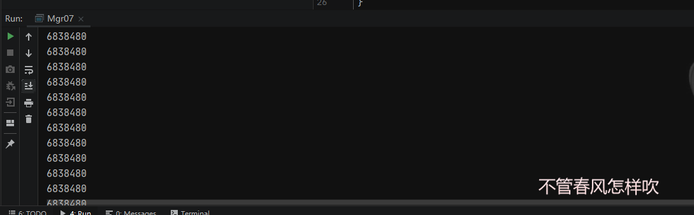

# Singleton 单例模式

> 单例模式（Singleton Pattern）是 Java 中最简单的设计模式之一。这种类型的设计模式属于创建型模式，它提供了一种创建对象的最佳方式。这种模式涉及到一个单一的类，该类负责创建自己的对象，同时确保`只有单个对象被创建`。这个类提供了一种访问其唯一的对象的方式，可以直接访问，不需要实例化该类的对象。

## 饿汉式 **创建单例模式**

```java
/**
 * Created with IntelliJ IDEA.
 *
 * @Auther: zlf
 * @Date: 2021/03/26/23:29
 * @Description: 饿汉式 创建单例模式
 *  类加载到内存后，就实例化一个单例，JVM保证线程安全
 *  简单实用，推荐使用！
 *  唯一缺点，不管用到与否，类加载时就完成实例化
 */
public class Mgr01 {

    private static final Mgr01 INSTANCE = new Mgr01();

    // 私有化构造函数 不让其他类创建
    private Mgr01(){}

    public static Mgr01 getInstance(){
        return INSTANCE;
    }

    public void m(){
        System.out.println("m");
    }

    public static void main(String[] args) {
        Mgr01 instance = Mgr01.getInstance();
        Mgr01 instance1 = Mgr01.getInstance();
        System.out.println(instance == instance1); //true
    }

}
```

```java

/**
 * Created with IntelliJ IDEA.
 *
 * @Auther: zlf
 * @Date: 2021/03/29/15:37
 * @Description: 与Mgr01 没有区别
 */
public class Mgr02 {

    private static final Mgr02 INSTANCE;

    static {
        INSTANCE  = new Mgr02();
    }

    public static Mgr02 getInstance(){
        return INSTANCE;
    }
    public void m2(){
        System.out.println("m");
    }

    public static void main(String[] args) {
        Mgr02 m1 = Mgr02.getInstance();
        Mgr02 m2 = Mgr02.getInstance();
        System.out.println(m1 == m2);
    }

}
```

## 懒汉式 创建单例对象 

### 线程不安全版本

```java
/**
 * Created with IntelliJ IDEA.
 *
 * @Auther: zlf
 * @Date: 2021/03/29/15:48
 * @Description: lazy loading 懒汉式 创建单例对象，用到创建 没用到不创建
 * 缺点：虽然达到了按需初始化的目的，但却带来了线程不安全的问题（多线程）
 */
public class Mgr03 {
    private static  Mgr03 INSTANCE;

    private Mgr03(){}

    public static Mgr03 getInstance(){
        if( INSTANCE == null){

            INSTANCE = new Mgr03();
        }
        return INSTANCE;
    }

    public void m2(){
        System.out.println("m");
    }


}
```

### 线程安全版本（加锁影响效率

```java
/**
 * Created with IntelliJ IDEA.
 *
 * @Auther: zlf
 * @Date: 2021/03/29/16:06
 * @Description: 懒汉式 线程安全版 创建单例对象，用到创建 没用到不创建
 * 缺点：虽然达到了按需初始化的目的，但是为了解决线程不安全的问题，加了锁，影响了效率
 */
public class Mgr04 {

    private static  Mgr04 INSTANCE;

    private Mgr04(){}

    public static synchronized Mgr04 getInstance(){
        if( INSTANCE == null){

            INSTANCE = new Mgr04();
        }
        return INSTANCE;
    }

    public void m(){
        System.out.println("m");
    }
}
```

#### 双重检查方式

```java
/**
 * Created with IntelliJ IDEA.
 *
 * @Auther: zlf
 * @Date: 2021/03/29/16:13
 * @Description: 懒汉式 线程安全版 创建单例对象，用到创建 没用到不创建 与 Mgr04一致，双重检查
 */
public class Mgr05 {

    private static volatile Mgr05 INSTANCE; // volatile 防止指令重排

    public static Mgr05 getInstance(){
        if(INSTANCE == null){
            // 双重检查
            synchronized (Mgr05.class){
                if(INSTANCE == null){
                    INSTANCE = new Mgr05();
                }
            }
        }
        return INSTANCE;
    }

    public void m(){
        System.out.println("m");
    }
}
```


## 静态内部类方式创建单例对象（完美写法之一）

```java
/**
 * Created with IntelliJ IDEA.
 *
 * @Auther: zlf
 * @Date: 2021/03/29/16:20
 * @Description: 静态内部类方式 创建单例对象 完美
 *  JVM保证单例（线程安全），加载外部类时不会加载内部类，这样就可以懒加载（只有使用内部类的时候才加载）。
 */
public class Mgr06 {

    private Mgr06(){

    }

    private static class Mgr06Holder{
        private final static Mgr06 INSTANCE = new Mgr06();
    }

    public static Mgr06 getInstance(){
        return Mgr06Holder.INSTANCE;
    }

    public void m(){
        System.out.println("m");
    }

}
```


## 枚举实现单例对象 （完美中的完美）

```java
/**
 * Created with IntelliJ IDEA.
 *
 * @Auther: zlf
 * @Date: 2021/03/29/16:29
 * @Description: 枚举实现单例对象 完美
 *  不仅可以解决线程同步，还可以防止反序列化。(因为枚举没有构造方法，可以防止反序列化)
 */
public enum  Mgr07 {

    INSTANCE;

    public void m(){
        System.out.println("m");
    }

    public static void main(String[] args) {
        for(int i=0;i<100;i++){
            new Thread(()->{
                System.out.println(Mgr07.INSTANCE.hashCode());
            }).start();
        }
    }
}
```




# Strategy 策略模式

>在策略模式（Strategy Pattern）中，一个类的行为或其算法可以在运行时更改。这种类型的设计模式属于行为型模式。
>
>在策略模式中，我们创建表示各种策略的对象和一个行为随着策略对象改变而改变的 context 对象。策略对象改变 context 对象的执行算法。

类似` java.util.Comparator `接口 中的 `compare(T o1,T o2)`  、或 `java.lang.Comparable`接口中的 `compareTo(T o)`(Comparable不是策略模式)，可以使用这些方法进行各种操作行为。


举个例子，我们排序一个数组，需要制定排序规则，我们可以通过comparator比较器制定不同的compare比较方法。采取不同的策略。这就是策略模式。

又比如：一个游戏中，一把枪的子弹发射，我们可以通过制定对应的策略，来发射子弹，比如一次发一发子弹、一次10发、一次一个弹夹、一次一发核弹等等。

我们需要将不同的策略作用于其他事物上，产生不同的效果。


