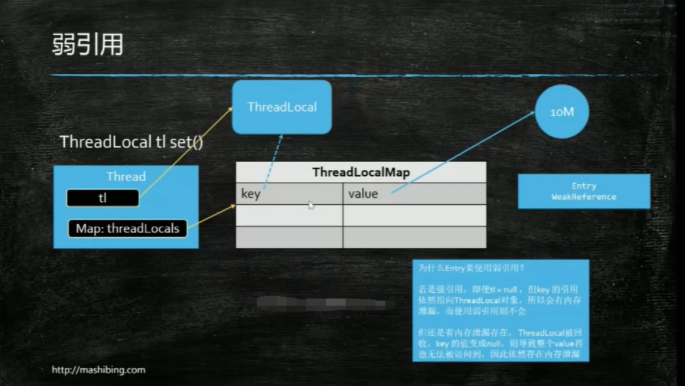
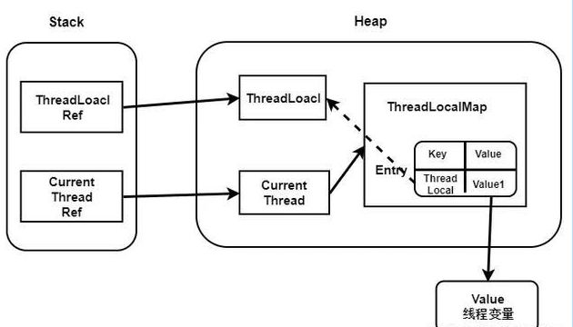

# ThreadLocal 内存泄漏问题

## 什么是内存泄漏

内存泄露为程序在申请内存后，无法释放已申请的内存空间，一次内存泄露危害可以忽略，但内存泄露堆积后果很严重，无论多少内存,迟早会被占光，简单来说：不再会被使用的对象或者变量占用的内存不能被回收，就是内存泄露。

## 什么是弱引用

JVM进行垃圾回收时，无论内存是否充足，都会回收被弱引用关联的对象。在java中，用java.lang.ref.WeakReference类来表示。可以在缓存中使用弱引用。

**所以我们使用弱引用可以防止ThreadLocal内存泄漏！**

## ThreadLocal问题

> ThreadLocal 结构






**Thread Local的实现原理**

```java
static class ThreadLocalMap {

    static class Entry extends WeakReference<ThreadLocal<?>> {
        /** The value associated with this ThreadLocal. */
        Object value;

        Entry(ThreadLocal<?> k, Object v) {
            super(k);
            value = v;
        }
    }
    ...
   }
```

ThreadLocal的实现原理，每一个Thread维护一个ThreadLocalMap，key为使用**弱引用**的ThreadLocal实例，value为线程变量的副本。这些对象之间的引用关系如上图。

## ThreadLocal 内存泄漏的原因

从上图中可以看出，TreadLocalMap使用ThreadLocal的弱引用作为key，如果一个ThreadLocal不存在外部**强引用**时，Key(ThreadLocal)势必会被GC回收，这样就会导致ThreadLocalMap中key为null， 而value还存在着强引用，只有thead线程退出以后,value的强引用链条才会断掉。

但如果当前线程再迟迟不结束的话，这些key为null的Entry的value就会一直存在一条强引用链：

> Thread Ref -> Thread -> ThreaLocalMap -> Entry -> value

永远无法回收，造成内存泄漏。

当ThreadLocalMap的key为弱引用回收ThreadLocal时，由于ThreadLocalMap持有ThreadLocal的弱引用，即使没有手动删除，ThreadLocal也会被回收。当key为null，在下一次ThreadLocalMap调用set(),get()，remove()方法的时候会被清除value值。

在使用线程池时，慎用ThreadLocal 因为当我们重用该线程时如果在上次使用时没有将ThreadLocal remove 这将使我们访问到上次的值。


解决：

在不使用某个ThreadLocal时，可以调用 tl.remove() 方法进行删除，可以防止内存泄漏。

栗子：

```java
import java.util.concurrent.TimeUnit;

public class ThreadLocal1 {

    static ThreadLocal<String> tl = new ThreadLocal<>();

    public static void main(String[] args) {
        new Thread(()->{
            try{
                // 沉睡一秒
                TimeUnit.SECONDS.sleep(2);

            }catch (InterruptedException e){
                e.printStackTrace();
            }
            //  获取不到 ，因为 ThreadLocal 每个线程私有的
            System.out.println(tl.get());

        }).start();

        new Thread(()->{
            try {
                TimeUnit.SECONDS.sleep(1);
            } catch (InterruptedException e) {
                e.printStackTrace();
            }
            tl.set("hello world");
            System.out.println(tl.get());
            // 用完删除防止内存泄漏
            tl.remove();
        }).start();
    }
}


```

## 总结

由于Thread中包含变量ThreadLocalMap，因此ThreadLocalMap与Thread的生命周期是一样长，如果都没有手动删除对应key，都会导致内存泄漏。

但是使用**弱引用**可以多一层保障：弱引用ThreadLocal不会内存泄漏，对应的value在下一次ThreadLocalMap调用set(),get(),remove()的时候会被清除。

因此，ThreadLocal内存泄漏的根源是：由于ThreadLocalMap的生命周期跟Thread一样长，如果没有手动删除对应key就会导致内存泄漏，而不是因为弱引用。

# Java 和 GO中的用户线程

JVM的java线程 和 操作系统内核线程的比例是1:1，一个java线程对应着一个 内核线程。

GO语言的协程 和 操作系统内核线程的比例是M:N，而且M远远大于N。


# 锁

## 什么是锁

为了独占资源，将某种资源私有化的一种物品

## 不持有锁的线程怎么办

1、忙等待

2、进队列等待，由操作系统调度


## 轻量级锁 和 重量级锁

比如：当有人在马桶上时，如果后面的人提着裤子一直在门外转圈子的忙等待，这就是自旋锁，也就是轻量级锁。

当有人在马桶上时，如果后面的人在门口排着队（队列），且依靠操作系统调度的就是重量级锁。

##  轻量级锁效率一定比重量级锁效率高吗？

结论：不一定。因为当一个人在马桶上拉稀了，在门口忙等待的人多了起来(几万个人)，他们都在自旋（循环），会消耗非常的的cpu资源。而重量级锁只是放在队列中，由操作系统调度，并不会花费太多的性能。


## Synchronized 

[一篇讲的比较好的博客]([synchronized详解 - 三分恶 - 博客园 (cnblogs.com)](https://www.cnblogs.com/three-fighter/p/14396208.html))

在Java中，`synchronized`锁可能是我们最早接触的锁了，在 **JDK1.5之前synchronized是一个重量级锁，相对于juc包中的Lock，`synchronized`显得比较笨重**。

庆幸的是在 Java 6 之后 Java 官⽅对从 JVM 层⾯对`synchronized`进行⼤优化，所以现在的 synchronized 锁效率也优化得很不错。

